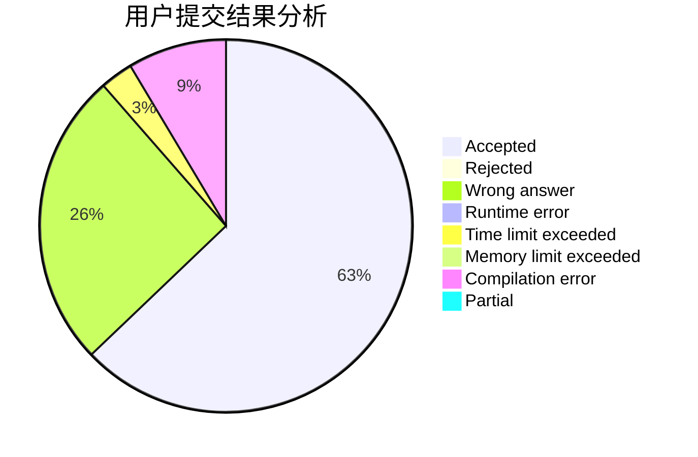
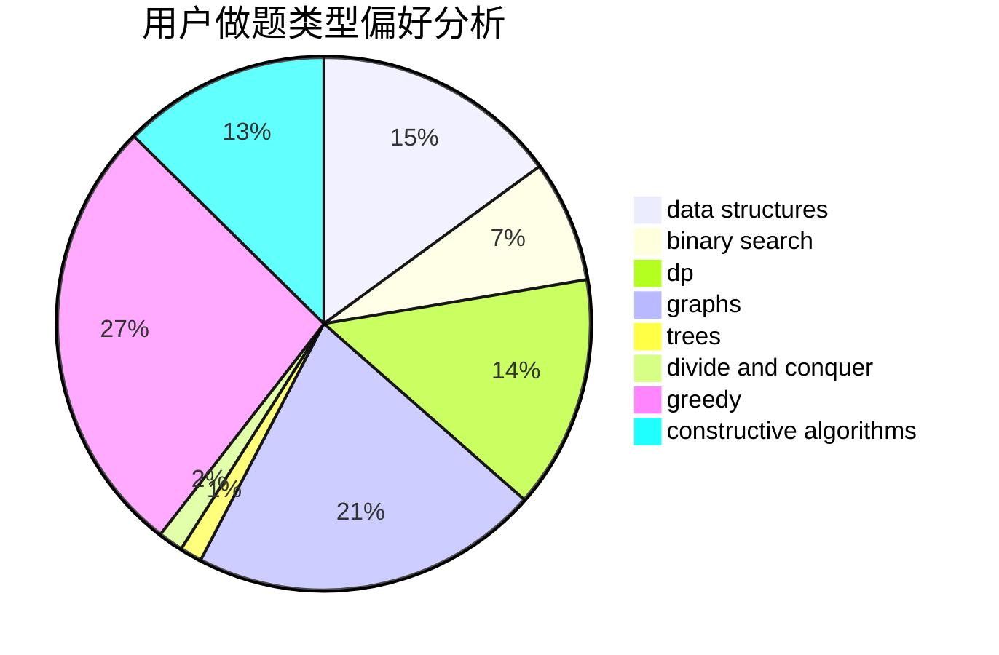
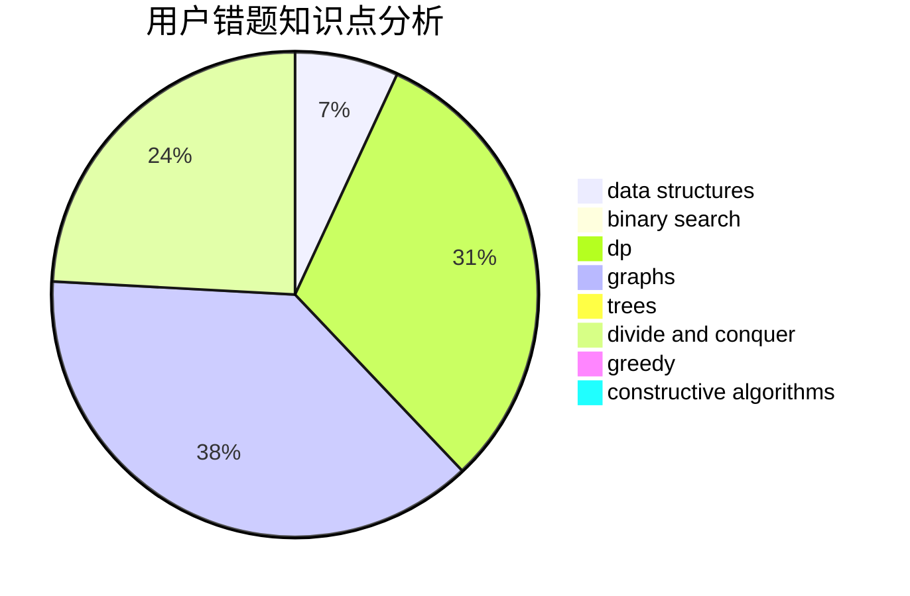

# Kuuki_rikigaku

<!-- tabs:start -->

#### **用户提交结果分析**

#### **用户做题类型偏好分析**

#### **用户错题知识点分析**

<!-- tabs:end -->
# 推荐题目
[1365A](https://codeforces.com/contest/1365/problem/A)		games,
                        greedy,
                        implementation		  
[1092E](https://codeforces.com/contest/1092/problem/E)		constructive algorithms,
                        dfs and similar,
                        greedy,
                        trees		  
[792E](https://codeforces.com/contest/792/problem/E)		greedy,
                        math,
                        number theory		  
[734D](https://codeforces.com/contest/734/problem/D)		implementation		  
[1073D](https://codeforces.com/contest/1073/problem/D)		binary search,
                        brute force,
                        data structures,
                        greedy		  
[916B](https://codeforces.com/contest/916/problem/B)		bitmasks,
                        greedy,
                        math		  
[901A](https://codeforces.com/contest/901/problem/A)		constructive algorithms,
                        trees		  
[303B](https://codeforces.com/contest/303/problem/B)		implementation,
                        math		  
[1066F](https://codeforces.com/contest/1066/problem/F)		dp		  
[1150C](https://codeforces.com/contest/1150/problem/C)		dsu,graphs,sortings,trees		  
