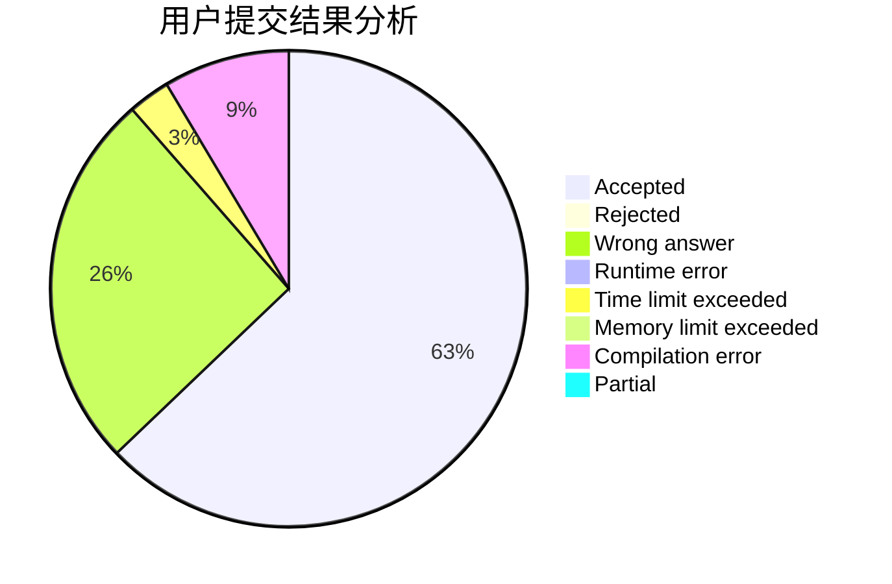
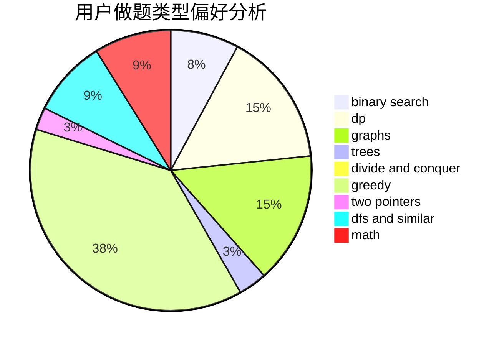

# Kuuki_rikigaku

<!-- tabs:start -->

#### **用户提交结果分析**

#### **用户做题类型偏好分析**

<!-- tabs:end -->
# 推荐题目
[1365A](https://codeforces.com/contest/1365/problem/A)
[1092E](https://codeforces.com/contest/1092/problem/E)
[792E](https://codeforces.com/contest/792/problem/E)
[734D](https://codeforces.com/contest/734/problem/D)
[1073D](https://codeforces.com/contest/1073/problem/D)
[916B](https://codeforces.com/contest/916/problem/B)
[901A](https://codeforces.com/contest/901/problem/A)
[303B](https://codeforces.com/contest/303/problem/B)
[1066F](https://codeforces.com/contest/1066/problem/F)
[1150C](https://codeforces.com/contest/1150/problem/C)
