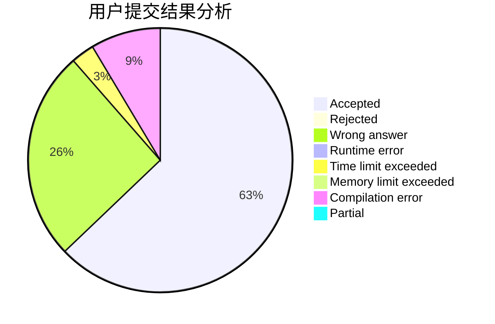
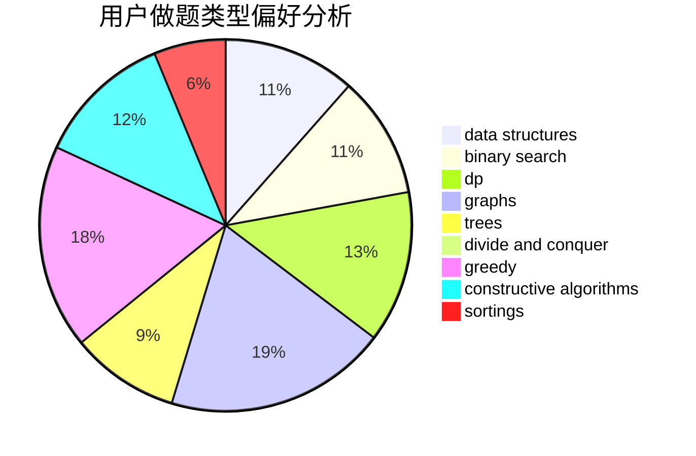
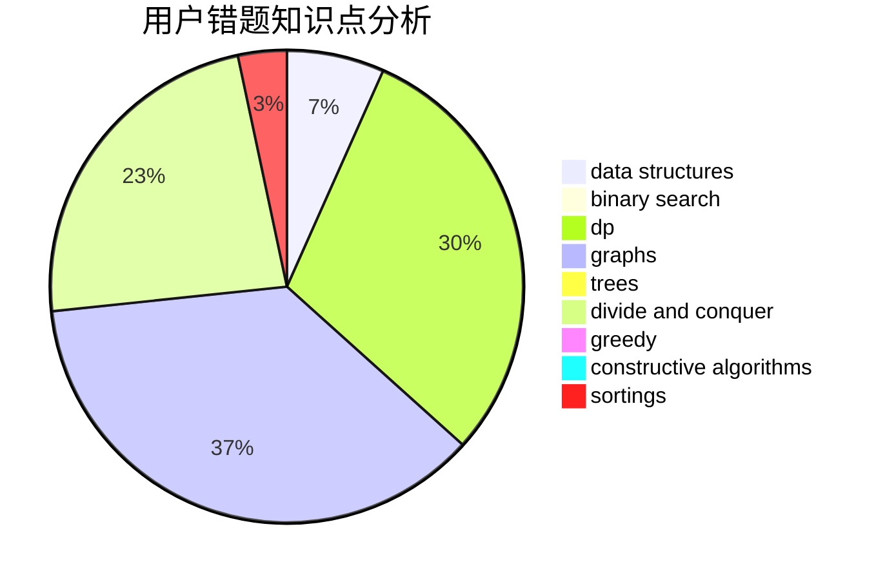

# Kuuki_rikigaku
<!-- tabs:start -->
#### **用户提交结果分析**

#### **用户做题类型偏好分析**

#### **用户错题知识点分析**

<!-- tabs:end -->
# 推荐题目
[486B](http://codeforces.com/problemset/problem/486/B)		greedy,
                        hashing,
                        implementation		  
[1148H](http://codeforces.com/problemset/problem/1148/H)		data structures		  
[1328E](http://codeforces.com/problemset/problem/1328/E)		dfs and similar,
                        graphs,
                        trees		  
[717A](http://codeforces.com/problemset/problem/717/A)		math,
                        number theory		  
[909A](http://codeforces.com/problemset/problem/909/A)		brute force,
                        greedy,
                        sortings		  
[670F](http://codeforces.com/problemset/problem/670/F)		brute force,
                        constructive algorithms,
                        strings		  
[883G](http://codeforces.com/problemset/problem/883/G)		dfs and similar,
                        graphs		  
[1092B](http://codeforces.com/problemset/problem/1092/B)		sortings		  
[853D](http://codeforces.com/problemset/problem/853/D)		binary search,
                        dp,
                        greedy		  
[665F](http://codeforces.com/problemset/problem/665/F)		data structures,
                        dp,
                        math,
                        number theory,
                        sortings,
                        two pointers		  
<!-- tabs:start -->
#### **data structures**
[1148H](http://codeforces.com/problemset/problem/1148/H)		data structures		  
[665F](http://codeforces.com/problemset/problem/665/F)		data structures,
                        dp,
                        math,
                        number theory,
                        sortings,
                        two pointers		  
[773E](http://codeforces.com/problemset/problem/773/E)		data structures,
                        sortings		  
[377B](http://codeforces.com/problemset/problem/377/B)		binary search,
                        data structures,
                        greedy,
                        sortings		  
[1217F](http://codeforces.com/problemset/problem/1217/F)		data structures,
                        divide and conquer,
                        dsu,
                        graphs,
                        trees		  
[1500D](http://codeforces.com/problemset/problem/1500/D)		data structures,
                        sortings,
                        two pointers		  
[1299C](http://codeforces.com/problemset/problem/1299/C)		data structures,
                        geometry,
                        greedy		  
[1492C](http://codeforces.com/problemset/problem/1492/C)		binary search,
                        data structures,
                        dp,
                        greedy,
                        two pointers		  
[1490G](http://codeforces.com/problemset/problem/1490/G)		binary search,
                        data structures,
                        math		  
[1479D](http://codeforces.com/problemset/problem/1479/D)		binary search,
                        bitmasks,
                        brute force,
                        data structures,
                        probabilities,
                        trees		  
#### **binary search**
[853D](http://codeforces.com/problemset/problem/853/D)		binary search,
                        dp,
                        greedy		  
[1246C](https://codeforces.com/contest/1246/problem/C)		binary search,
                        dp		  
[8D](http://codeforces.com/problemset/problem/8/D)		binary search,
                        geometry		  
[377B](http://codeforces.com/problemset/problem/377/B)		binary search,
                        data structures,
                        greedy,
                        sortings		  
[613A](http://codeforces.com/problemset/problem/613/A)		binary search,
                        geometry,
                        ternary search		  
[333E](http://codeforces.com/problemset/problem/333/E)		binary search,
                        bitmasks,
                        brute force,
                        geometry,
                        sortings		  
[1326D2](http://codeforces.com/problemset/problem/1326/D2)		binary search,
                        greedy,
                        hashing,
                        string suffix structures,
                        strings		  
[1492C](http://codeforces.com/problemset/problem/1492/C)		binary search,
                        data structures,
                        dp,
                        greedy,
                        two pointers		  
[1463D](http://codeforces.com/problemset/problem/1463/D)		binary search,
                        constructive algorithms,
                        greedy,
                        two pointers		  
[1490G](http://codeforces.com/problemset/problem/1490/G)		binary search,
                        data structures,
                        math		  
#### **dp**
[853D](http://codeforces.com/problemset/problem/853/D)		binary search,
                        dp,
                        greedy		  
[665F](http://codeforces.com/problemset/problem/665/F)		data structures,
                        dp,
                        math,
                        number theory,
                        sortings,
                        two pointers		  
[1246C](https://codeforces.com/contest/1246/problem/C)		binary search,
                        dp		  
[289B](http://codeforces.com/problemset/problem/289/B)		brute force,
                        dp,
                        implementation,
                        sortings,
                        ternary search		  
[913F](http://codeforces.com/problemset/problem/913/F)		dp,
                        graphs,
                        math,
                        probabilities		  
[476E](http://codeforces.com/problemset/problem/476/E)		dp,
                        strings		  
[918C](https://codeforces.com/contest/918/problem/C)		dp,
                        greedy,
                        implementation,
                        math		  
[1491D](http://codeforces.com/problemset/problem/1491/D)		bitmasks,
                        constructive algorithms,
                        dp,
                        greedy,
                        math		  
[512D](http://codeforces.com/problemset/problem/512/D)		dp,
                        trees		  
[1324E](http://codeforces.com/problemset/problem/1324/E)		dp,
                        implementation		  
#### **graph**
[1328E](http://codeforces.com/problemset/problem/1328/E)		dfs and similar,
                        graphs,
                        trees		  
[883G](http://codeforces.com/problemset/problem/883/G)		dfs and similar,
                        graphs		  
[274D](http://codeforces.com/problemset/problem/274/D)		dfs and similar,
                        graphs,
                        greedy,
                        sortings		  
[1217F](http://codeforces.com/problemset/problem/1217/F)		data structures,
                        divide and conquer,
                        dsu,
                        graphs,
                        trees		  
[913F](http://codeforces.com/problemset/problem/913/F)		dp,
                        graphs,
                        math,
                        probabilities		  
[1439A2](http://codeforces.com/problemset/problem/1439/A2)		constructive algorithms,
                        graphs,
                        greedy,
                        implementation		  
[1487C](http://codeforces.com/problemset/problem/1487/C)		brute force,
                        constructive algorithms,
                        dfs and similar,
                        graphs,
                        greedy,
                        implementation,
                        math		  
[1437C](http://codeforces.com/problemset/problem/1437/C)		dp,
                        flows,
                        graph matchings,
                        greedy,
                        math,
                        sortings		  
[1470D](http://codeforces.com/problemset/problem/1470/D)		constructive algorithms,
                        dfs and similar,
                        graph matchings,
                        graphs,
                        greedy		  
[1476C](http://codeforces.com/problemset/problem/1476/C)		dp,
                        graphs,
                        greedy		  
#### **trees**
[1328E](http://codeforces.com/problemset/problem/1328/E)		dfs and similar,
                        graphs,
                        trees		  
[1217F](http://codeforces.com/problemset/problem/1217/F)		data structures,
                        divide and conquer,
                        dsu,
                        graphs,
                        trees		  
[512D](http://codeforces.com/problemset/problem/512/D)		dp,
                        trees		  
[1479D](http://codeforces.com/problemset/problem/1479/D)		binary search,
                        bitmasks,
                        brute force,
                        data structures,
                        probabilities,
                        trees		  
[1511C](http://codeforces.com/problemset/problem/1511/C)		brute force,
                        data structures,
                        implementation,
                        trees		  
[1499F](http://codeforces.com/problemset/problem/1499/F)		combinatorics,
                        dfs and similar,
                        dp,
                        trees		  
[1491E](http://codeforces.com/problemset/problem/1491/E)		brute force,
                        dfs and similar,
                        divide and conquer,
                        number theory,
                        trees		  
[1466D](http://codeforces.com/problemset/problem/1466/D)		data structures,
                        greedy,
                        sortings,
                        trees		  
[1495D](http://codeforces.com/problemset/problem/1495/D)		combinatorics,
                        dfs and similar,
                        graphs,
                        math,
                        shortest paths,
                        trees		  
[1303G](http://codeforces.com/problemset/problem/1303/G)		data structures,
                        divide and conquer,
                        geometry,
                        trees		  
#### **divide and conquer**
[1217F](http://codeforces.com/problemset/problem/1217/F)		data structures,
                        divide and conquer,
                        dsu,
                        graphs,
                        trees		  
[1461D](http://codeforces.com/problemset/problem/1461/D)		binary search,
                        brute force,
                        data structures,
                        divide and conquer,
                        implementation,
                        sortings		  
[1466G](http://codeforces.com/problemset/problem/1466/G)		combinatorics,
                        divide and conquer,
                        hashing,
                        math,
                        string suffix structures,
                        strings		  
[1490D](http://codeforces.com/problemset/problem/1490/D)		dfs and similar,
                        divide and conquer,
                        implementation		  
[1483C](https://codeforces.com/contest/1483/problem/C)		data structures,
                        divide and conquer,
                        dp		  
[1491E](http://codeforces.com/problemset/problem/1491/E)		brute force,
                        dfs and similar,
                        divide and conquer,
                        number theory,
                        trees		  
[1303G](http://codeforces.com/problemset/problem/1303/G)		data structures,
                        divide and conquer,
                        geometry,
                        trees		  
[1494D](http://codeforces.com/problemset/problem/1494/D)		constructive algorithms,
                        data structures,
                        dfs and similar,
                        divide and conquer,
                        dsu,
                        greedy,
                        sortings,
                        trees		  
[1482E](http://codeforces.com/problemset/problem/1482/E)		data structures,
                        divide and conquer,
                        dp		  
[566C](http://codeforces.com/problemset/problem/566/C)		dfs and similar,
                        divide and conquer,
                        trees		  
#### **greedy**
[486B](http://codeforces.com/problemset/problem/486/B)		greedy,
                        hashing,
                        implementation		  
[909A](http://codeforces.com/problemset/problem/909/A)		brute force,
                        greedy,
                        sortings		  
[853D](http://codeforces.com/problemset/problem/853/D)		binary search,
                        dp,
                        greedy		  
[462C](https://codeforces.com/contest/462/problem/C)		greedy,
                        sortings		  
[1294E](http://codeforces.com/problemset/problem/1294/E)		greedy,
                        implementation,
                        math		  
[377B](http://codeforces.com/problemset/problem/377/B)		binary search,
                        data structures,
                        greedy,
                        sortings		  
[274D](http://codeforces.com/problemset/problem/274/D)		dfs and similar,
                        graphs,
                        greedy,
                        sortings		  
[381A](http://codeforces.com/problemset/problem/381/A)		greedy,
                        implementation,
                        two pointers		  
[1367B](http://codeforces.com/problemset/problem/1367/B)		greedy,
                        math		  
[1439A2](http://codeforces.com/problemset/problem/1439/A2)		constructive algorithms,
                        graphs,
                        greedy,
                        implementation		  
#### **constructive algorithms**
[670F](http://codeforces.com/problemset/problem/670/F)		brute force,
                        constructive algorithms,
                        strings		  
[1144C](http://codeforces.com/problemset/problem/1144/C)		constructive algorithms,
                        sortings		  
[899D](http://codeforces.com/problemset/problem/899/D)		constructive algorithms,
                        math		  
[1131F](http://codeforces.com/problemset/problem/1131/F)		constructive algorithms,
                        dsu		  
[1439A2](http://codeforces.com/problemset/problem/1439/A2)		constructive algorithms,
                        graphs,
                        greedy,
                        implementation		  
[1293D](https://codeforces.com/contest/1293/problem/D)		brute force,
                        constructive algorithms,
                        geometry,
                        greedy,
                        implementation		  
[1491D](http://codeforces.com/problemset/problem/1491/D)		bitmasks,
                        constructive algorithms,
                        dp,
                        greedy,
                        math		  
[1110E](http://codeforces.com/problemset/problem/1110/E)		constructive algorithms,
                        math,
                        sortings		  
[1481C](http://codeforces.com/problemset/problem/1481/C)		brute force,
                        constructive algorithms,
                        greedy		  
[1371D](http://codeforces.com/problemset/problem/1371/D)		constructive algorithms,
                        greedy,
                        implementation		  
#### **sortings**
[909A](http://codeforces.com/problemset/problem/909/A)		brute force,
                        greedy,
                        sortings		  
[1092B](http://codeforces.com/problemset/problem/1092/B)		sortings		  
[665F](http://codeforces.com/problemset/problem/665/F)		data structures,
                        dp,
                        math,
                        number theory,
                        sortings,
                        two pointers		  
[462C](https://codeforces.com/contest/462/problem/C)		greedy,
                        sortings		  
[289B](http://codeforces.com/problemset/problem/289/B)		brute force,
                        dp,
                        implementation,
                        sortings,
                        ternary search		  
[773E](http://codeforces.com/problemset/problem/773/E)		data structures,
                        sortings		  
[1144C](http://codeforces.com/problemset/problem/1144/C)		constructive algorithms,
                        sortings		  
[377B](http://codeforces.com/problemset/problem/377/B)		binary search,
                        data structures,
                        greedy,
                        sortings		  
[274D](http://codeforces.com/problemset/problem/274/D)		dfs and similar,
                        graphs,
                        greedy,
                        sortings		  
[333E](http://codeforces.com/problemset/problem/333/E)		binary search,
                        bitmasks,
                        brute force,
                        geometry,
                        sortings		  
<!-- tabs:end -->
