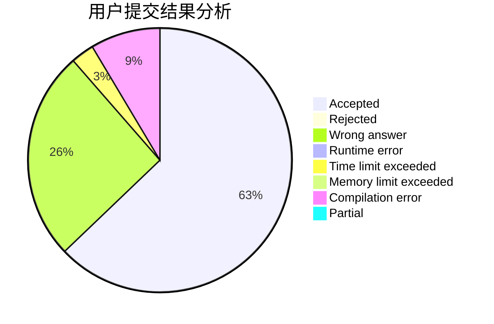
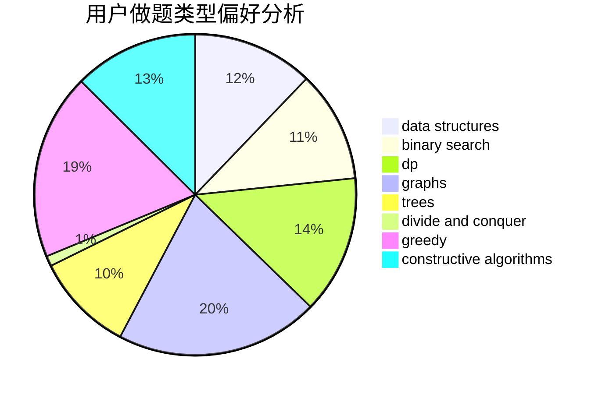
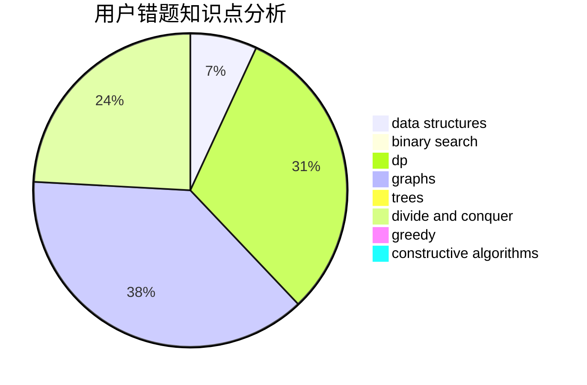

# Kuuki_rikigaku

<!-- tabs:start -->

#### **用户提交结果分析**

#### **用户做题类型偏好分析**

#### **用户错题知识点分析**

<!-- tabs:end -->
# 推荐题目
[1357C1](https://codeforces.com/contest/1357C/problem/1)		nan		  
[1092B](https://codeforces.com/contest/1092/problem/B)		sortings		  
[773E](https://codeforces.com/contest/773/problem/E)		data structures,
                        sortings		  
[717A](https://codeforces.com/contest/717/problem/A)		math,
                        number theory		  
[1073A](https://codeforces.com/contest/1073/problem/A)		implementation,
                        strings		  
[8D](https://codeforces.com/contest/8/problem/D)		binary search,
                        geometry		  
[883G](https://codeforces.com/contest/883/problem/G)		dfs and similar,
                        graphs		  
[289B](https://codeforces.com/contest/289/problem/B)		brute force,
                        dp,
                        implementation,
                        sortings,
                        ternary search		  
[1066C](https://codeforces.com/contest/1066/problem/C)		implementation		  
[1148H](https://codeforces.com/contest/1148/problem/H)		data structures		  
