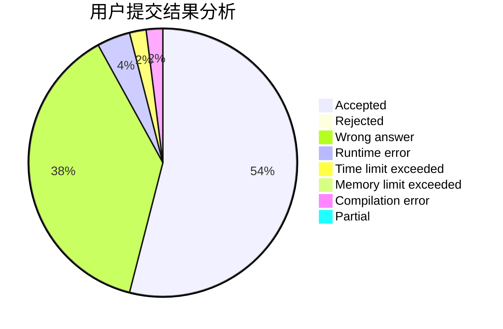
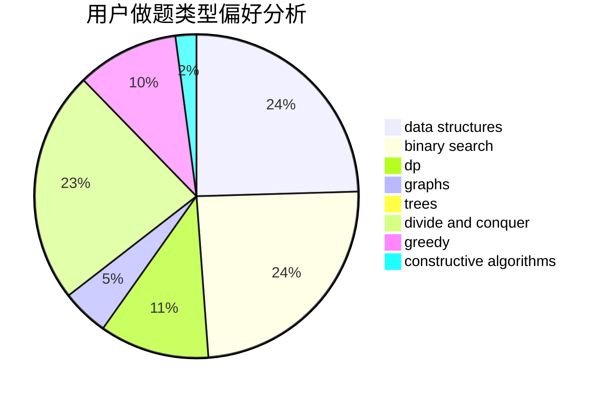

# Kvar_ispw17

<!-- tabs:start -->

#### **用户提交结果分析**

#### **用户做题类型偏好分析**

#### **用户错题知识点分析**

<!-- tabs:end -->
# 推荐题目
[121E](https://codeforces.com/contest/121/problem/E)		data structures		  
[782B](https://codeforces.com/contest/782/problem/B)		dsu,graphs,sortings,trees		  
[1505C](https://codeforces.com/contest/1505/problem/C)		implementation		  
[691A](https://codeforces.com/contest/691/problem/A)		implementation		  
[601B](https://codeforces.com/contest/601/problem/B)		data structures,
                        math		  
[441D](https://codeforces.com/contest/441/problem/D)		constructive algorithms,
                        dsu,
                        graphs,
                        implementation,
                        math,
                        string suffix structures		  
[538A](https://codeforces.com/contest/538/problem/A)		brute force,
                        implementation		  
[1100B](https://codeforces.com/contest/1100/problem/B)		data structures,
                        implementation		  
[1137F](https://codeforces.com/contest/1137/problem/F)		data structures,
                        trees		  
[633G](https://codeforces.com/contest/633/problem/G)		bitmasks,
                        data structures,
                        dfs and similar,
                        math,
                        number theory		  
