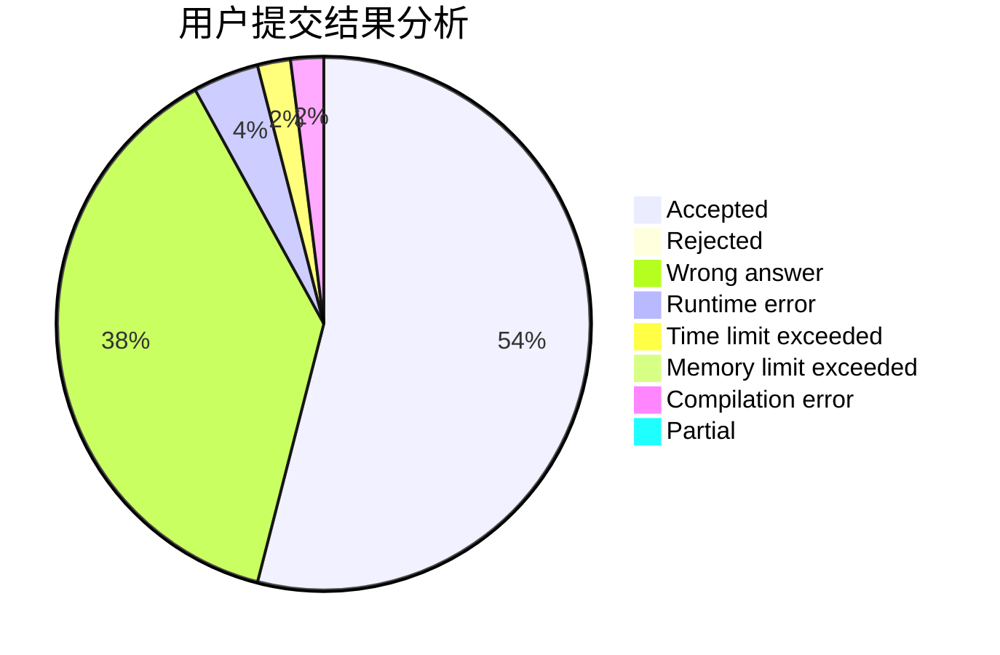
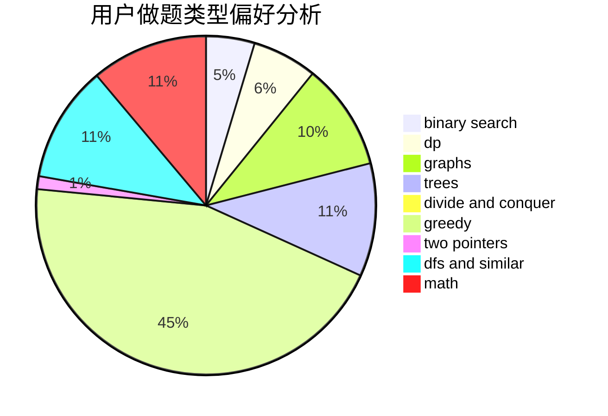

# Kvar_ispw17

<!-- tabs:start -->

#### **用户提交结果分析**

#### **用户做题类型偏好分析**

<!-- tabs:end -->
# 推荐题目
[1227G](https://codeforces.com/contest/1227/problem/G)
[800A](https://codeforces.com/contest/800/problem/A)
[152D](https://codeforces.com/contest/152/problem/D)
[710E](https://codeforces.com/contest/710/problem/E)
[620D](https://codeforces.com/contest/620/problem/D)
[462B](https://codeforces.com/contest/462/problem/B)
[559B](https://codeforces.com/contest/559/problem/B)
[1100E](https://codeforces.com/contest/1100/problem/E)
[113B](https://codeforces.com/contest/113/problem/B)
[666B](https://codeforces.com/contest/666/problem/B)
