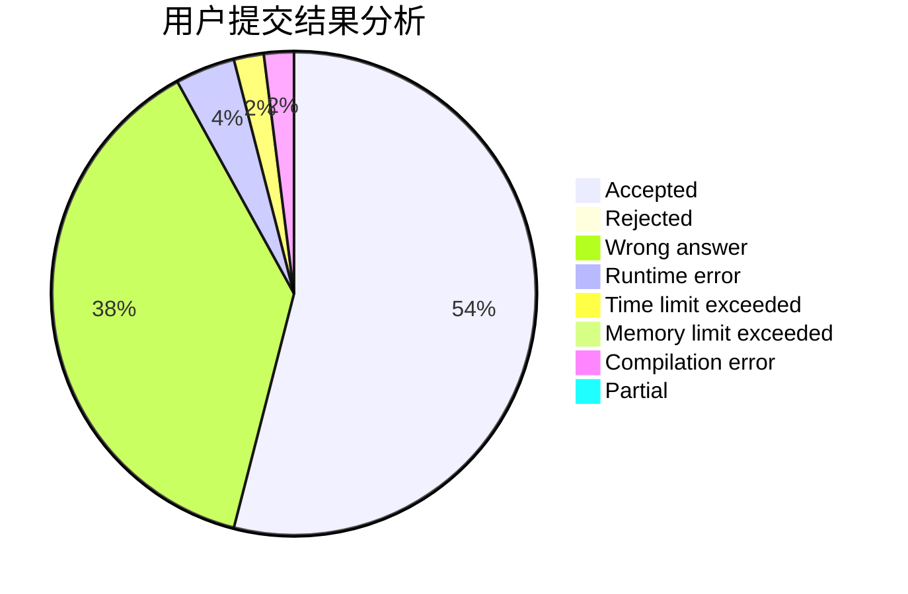
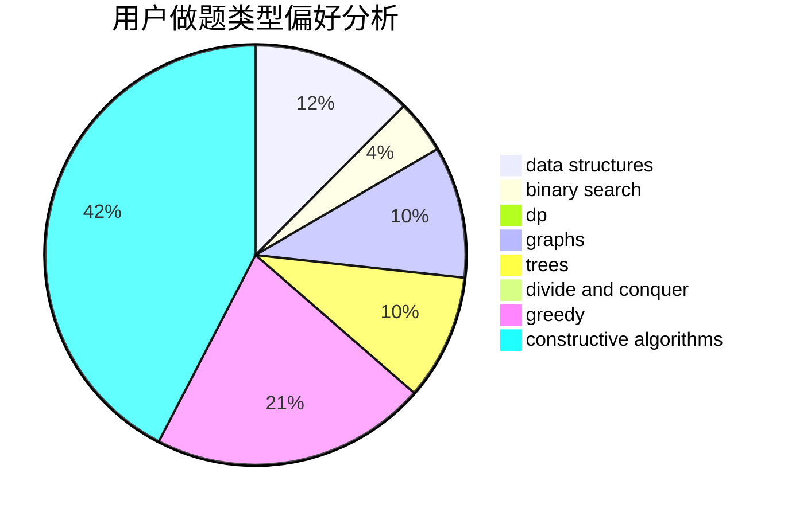

# Kvar_ispw17

<!-- tabs:start -->

#### **用户提交结果分析**

#### **用户做题类型偏好分析**

#### **用户错题知识点分析**

<!-- tabs:end -->
# 推荐题目
[1227G](https://codeforces.com/contest/1227/problem/G)		constructive algorithms		  
[800A](https://codeforces.com/contest/800/problem/A)		dsu,graphs,sortings,trees		  
[152D](https://codeforces.com/contest/152/problem/D)		brute force		  
[710E](https://codeforces.com/contest/710/problem/E)		dfs and similar,
                        dp		  
[620D](https://codeforces.com/contest/620/problem/D)		binary search,
                        two pointers		  
[462B](https://codeforces.com/contest/462/problem/B)		greedy		  
[559B](https://codeforces.com/contest/559/problem/B)		divide and conquer,
                        hashing,
                        sortings,
                        strings		  
[1100E](https://codeforces.com/contest/1100/problem/E)		binary search,
                        dfs and similar,
                        graphs		  
[113B](https://codeforces.com/contest/113/problem/B)		brute force,
                        data structures,
                        hashing,
                        strings		  
[666B](https://codeforces.com/contest/666/problem/B)		graphs,
                        shortest paths		  
