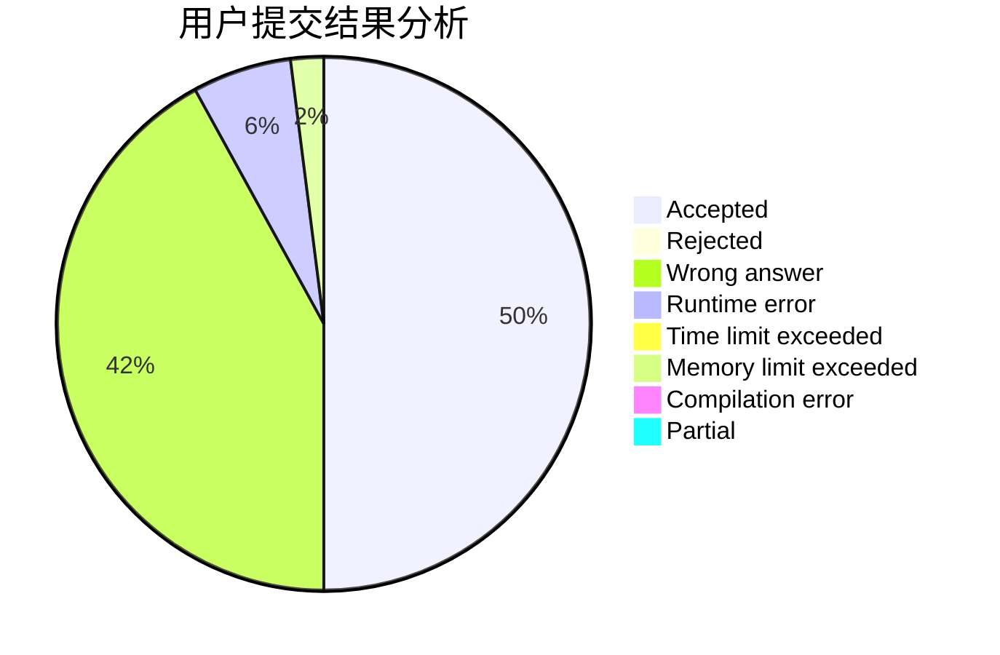
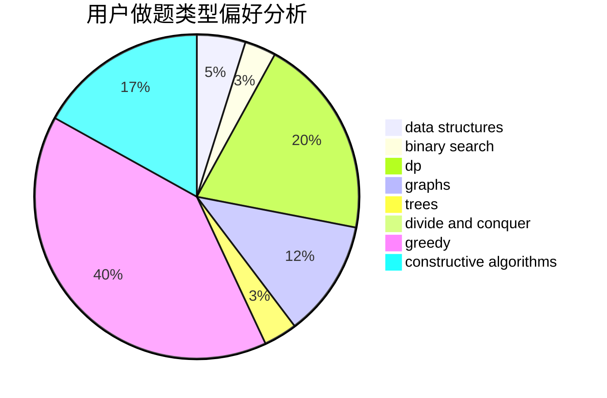

# Kvning
<!-- tabs:start -->
#### **用户提交结果分析**

#### **用户做题类型偏好分析**

#### **用户错题知识点分析**

<!-- tabs:end -->
# 推荐题目
[Exam](https://codeforces.com/contest/1483/problem/F)		data structures,
                        string suffix structures,
                        trees		  
[Little Girl and Maximum XOR](http://codeforces.com/problemset/problem/276/D)		bitmasks,
                        dp,
                        greedy,
                        implementation,
                        math		  
[Nick and Array](http://codeforces.com/problemset/problem/1180/B)		greedy,
                        implementation		  
[Where do I Turn?](http://codeforces.com/problemset/problem/227/A)		geometry		  
[Vanya and Fence](http://codeforces.com/problemset/problem/677/A)		implementation		  
[Largest Beautiful Number](http://codeforces.com/problemset/problem/946/E)		greedy,
                        implementation		  
[Points, Lines and Ready-made Titles](https://codeforces.com/contest/871/problem/C)		dfs and similar,
                        dsu,
                        graphs,
                        trees		  
[Restore a Number](http://codeforces.com/problemset/problem/670/F)		brute force,
                        constructive algorithms,
                        strings		  
[Wrong Answer on test 233 (Hard Version)](http://codeforces.com/problemset/problem/1227/F2)		combinatorics,
                        math		  
[Leaf Partition](http://codeforces.com/problemset/problem/1146/F)		dp,
                        trees		  
<!-- tabs:start -->
#### **data structures**
[Exam](https://codeforces.com/contest/1483/problem/F)		data structures,
                        string suffix structures,
                        trees		  
[Little Girl and Maximum XOR](http://codeforces.com/problemset/problem/853/C)		data structures		  
[Nick and Array](http://codeforces.com/problemset/problem/1167/F)		combinatorics,
                        data structures,
                        math,
                        sortings		  
[Where do I Turn?](http://codeforces.com/problemset/problem/1472/E)		binary search,
                        data structures,
                        dp,
                        sortings,
                        two pointers		  
[Vanya and Fence](http://codeforces.com/problemset/problem/573/D)		data structures,
                        divide and conquer,
                        dp		  
[Largest Beautiful Number](http://codeforces.com/problemset/problem/1468/M)		data structures,
                        graphs,
                        implementation		  
[Points, Lines and Ready-made Titles](http://codeforces.com/problemset/problem/1373/G)		data structures,
                        divide and conquer,
                        greedy		  
[Restore a Number](http://codeforces.com/problemset/problem/1492/C)		binary search,
                        data structures,
                        dp,
                        greedy,
                        two pointers		  
[Wrong Answer on test 233 (Hard Version)](http://codeforces.com/problemset/problem/1490/G)		binary search,
                        data structures,
                        math		  
[Leaf Partition](http://codeforces.com/problemset/problem/1479/D)		binary search,
                        bitmasks,
                        brute force,
                        data structures,
                        probabilities,
                        trees		  
#### **binary search**
[Exam](http://codeforces.com/problemset/problem/1472/E)		binary search,
                        data structures,
                        dp,
                        sortings,
                        two pointers		  
[Little Girl and Maximum XOR](http://codeforces.com/problemset/problem/1492/C)		binary search,
                        data structures,
                        dp,
                        greedy,
                        two pointers		  
[Nick and Array](http://codeforces.com/problemset/problem/1463/D)		binary search,
                        constructive algorithms,
                        greedy,
                        two pointers		  
[Where do I Turn?](http://codeforces.com/problemset/problem/1490/G)		binary search,
                        data structures,
                        math		  
[Vanya and Fence](http://codeforces.com/problemset/problem/1479/D)		binary search,
                        bitmasks,
                        brute force,
                        data structures,
                        probabilities,
                        trees		  
[Largest Beautiful Number](http://codeforces.com/problemset/problem/1436/E)		binary search,
                        data structures,
                        two pointers		  
[Points, Lines and Ready-made Titles](http://codeforces.com/problemset/problem/1461/D)		binary search,
                        brute force,
                        data structures,
                        divide and conquer,
                        implementation,
                        sortings		  
[Restore a Number](http://codeforces.com/problemset/problem/1493/C)		binary search,
                        brute force,
                        constructive algorithms,
                        greedy,
                        strings		  
[Wrong Answer on test 233 (Hard Version)](http://codeforces.com/problemset/problem/1487/D)		binary search,
                        brute force,
                        math,
                        number theory		  
[Leaf Partition](http://codeforces.com/problemset/problem/1486/B)		binary search,
                        geometry,
                        shortest paths,
                        sortings		  
#### **dp**
[Exam](http://codeforces.com/problemset/problem/276/D)		bitmasks,
                        dp,
                        greedy,
                        implementation,
                        math		  
[Little Girl and Maximum XOR](http://codeforces.com/problemset/problem/1146/F)		dp,
                        trees		  
[Nick and Array](http://codeforces.com/problemset/problem/894/E)		dp,
                        graphs		  
[Where do I Turn?](http://codeforces.com/problemset/problem/731/E)		dp,
                        games		  
[Vanya and Fence](https://codeforces.com/contest/1248/problem/C)		combinatorics,
                        dp,
                        math		  
[Largest Beautiful Number](http://codeforces.com/problemset/problem/1472/E)		binary search,
                        data structures,
                        dp,
                        sortings,
                        two pointers		  
[Points, Lines and Ready-made Titles](http://codeforces.com/problemset/problem/506/E)		combinatorics,
                        dp,
                        matrices,
                        strings		  
[Restore a Number](http://codeforces.com/problemset/problem/573/D)		data structures,
                        divide and conquer,
                        dp		  
[Wrong Answer on test 233 (Hard Version)](http://codeforces.com/problemset/problem/1260/E)		brute force,
                        dp,
                        greedy		  
[Leaf Partition](http://codeforces.com/problemset/problem/1392/D)		dp,
                        greedy		  
#### **graph**
[Exam](https://codeforces.com/contest/871/problem/C)		dfs and similar,
                        dsu,
                        graphs,
                        trees		  
[Little Girl and Maximum XOR](http://codeforces.com/problemset/problem/1063/B)		graphs,
                        shortest paths		  
[Nick and Array](http://codeforces.com/problemset/problem/894/E)		dp,
                        graphs		  
[Where do I Turn?](http://codeforces.com/problemset/problem/1468/M)		data structures,
                        graphs,
                        implementation		  
[Vanya and Fence](http://codeforces.com/problemset/problem/1487/C)		brute force,
                        constructive algorithms,
                        dfs and similar,
                        graphs,
                        greedy,
                        implementation,
                        math		  
[Largest Beautiful Number](http://codeforces.com/problemset/problem/1437/C)		dp,
                        flows,
                        graph matchings,
                        greedy,
                        math,
                        sortings		  
[Points, Lines and Ready-made Titles](http://codeforces.com/problemset/problem/1470/D)		constructive algorithms,
                        dfs and similar,
                        graph matchings,
                        graphs,
                        greedy		  
[Restore a Number](http://codeforces.com/problemset/problem/1476/C)		dp,
                        graphs,
                        greedy		  
[Wrong Answer on test 233 (Hard Version)](http://codeforces.com/problemset/problem/1304/D)		constructive algorithms,
                        graphs,
                        greedy,
                        two pointers		  
[Leaf Partition](http://codeforces.com/problemset/problem/1475/C)		combinatorics,
                        graphs,
                        math		  
#### **trees**
[Exam](https://codeforces.com/contest/1483/problem/F)		data structures,
                        string suffix structures,
                        trees		  
[Little Girl and Maximum XOR](https://codeforces.com/contest/871/problem/C)		dfs and similar,
                        dsu,
                        graphs,
                        trees		  
[Nick and Array](http://codeforces.com/problemset/problem/1146/F)		dp,
                        trees		  
[Where do I Turn?](http://codeforces.com/problemset/problem/1479/D)		binary search,
                        bitmasks,
                        brute force,
                        data structures,
                        probabilities,
                        trees		  
[Vanya and Fence](http://codeforces.com/problemset/problem/1511/C)		brute force,
                        data structures,
                        implementation,
                        trees		  
[Largest Beautiful Number](http://codeforces.com/problemset/problem/1499/F)		combinatorics,
                        dfs and similar,
                        dp,
                        trees		  
[Points, Lines and Ready-made Titles](http://codeforces.com/problemset/problem/1491/E)		brute force,
                        dfs and similar,
                        divide and conquer,
                        number theory,
                        trees		  
[Restore a Number](http://codeforces.com/problemset/problem/1466/D)		data structures,
                        greedy,
                        sortings,
                        trees		  
[Wrong Answer on test 233 (Hard Version)](http://codeforces.com/problemset/problem/1495/D)		combinatorics,
                        dfs and similar,
                        graphs,
                        math,
                        shortest paths,
                        trees		  
[Leaf Partition](http://codeforces.com/problemset/problem/1303/G)		data structures,
                        divide and conquer,
                        geometry,
                        trees		  
#### **divide and conquer**
[Exam](http://codeforces.com/problemset/problem/573/D)		data structures,
                        divide and conquer,
                        dp		  
[Little Girl and Maximum XOR](http://codeforces.com/problemset/problem/1373/G)		data structures,
                        divide and conquer,
                        greedy		  
[Nick and Array](http://codeforces.com/problemset/problem/1461/D)		binary search,
                        brute force,
                        data structures,
                        divide and conquer,
                        implementation,
                        sortings		  
[Where do I Turn?](http://codeforces.com/problemset/problem/1466/G)		combinatorics,
                        divide and conquer,
                        hashing,
                        math,
                        string suffix structures,
                        strings		  
[Vanya and Fence](http://codeforces.com/problemset/problem/1490/D)		dfs and similar,
                        divide and conquer,
                        implementation		  
[Largest Beautiful Number](https://codeforces.com/contest/1483/problem/C)		data structures,
                        divide and conquer,
                        dp		  
[Points, Lines and Ready-made Titles](http://codeforces.com/problemset/problem/1491/E)		brute force,
                        dfs and similar,
                        divide and conquer,
                        number theory,
                        trees		  
[Restore a Number](http://codeforces.com/problemset/problem/1303/G)		data structures,
                        divide and conquer,
                        geometry,
                        trees		  
[Wrong Answer on test 233 (Hard Version)](http://codeforces.com/problemset/problem/1494/D)		constructive algorithms,
                        data structures,
                        dfs and similar,
                        divide and conquer,
                        dsu,
                        greedy,
                        sortings,
                        trees		  
[Leaf Partition](http://codeforces.com/problemset/problem/1482/E)		data structures,
                        divide and conquer,
                        dp		  
#### **greedy**
[Exam](http://codeforces.com/problemset/problem/276/D)		bitmasks,
                        dp,
                        greedy,
                        implementation,
                        math		  
[Little Girl and Maximum XOR](http://codeforces.com/problemset/problem/1180/B)		greedy,
                        implementation		  
[Nick and Array](http://codeforces.com/problemset/problem/946/E)		greedy,
                        implementation		  
[Where do I Turn?](http://codeforces.com/problemset/problem/883/M)		greedy,
                        math		  
[Vanya and Fence](http://codeforces.com/problemset/problem/1375/E)		constructive algorithms,
                        greedy,
                        sortings		  
[Largest Beautiful Number](http://codeforces.com/problemset/problem/1260/E)		brute force,
                        dp,
                        greedy		  
[Points, Lines and Ready-made Titles](http://codeforces.com/problemset/problem/1392/D)		dp,
                        greedy		  
[Restore a Number](http://codeforces.com/problemset/problem/1373/G)		data structures,
                        divide and conquer,
                        greedy		  
[Wrong Answer on test 233 (Hard Version)](http://codeforces.com/problemset/problem/1492/C)		binary search,
                        data structures,
                        dp,
                        greedy,
                        two pointers		  
[Leaf Partition](https://codeforces.com/contest/1496/problem/C)		geometry,
                        greedy,
                        math,
                        sortings		  
#### **constructive algorithms**
[Exam](http://codeforces.com/problemset/problem/670/F)		brute force,
                        constructive algorithms,
                        strings		  
[Little Girl and Maximum XOR](http://codeforces.com/problemset/problem/1375/E)		constructive algorithms,
                        greedy,
                        sortings		  
[Nick and Array](http://codeforces.com/problemset/problem/1088/A)		brute force,
                        constructive algorithms		  
[Where do I Turn?](http://codeforces.com/problemset/problem/1493/A)		constructive algorithms,
                        greedy		  
[Vanya and Fence](http://codeforces.com/problemset/problem/1463/D)		binary search,
                        constructive algorithms,
                        greedy,
                        two pointers		  
[Largest Beautiful Number](https://codeforces.com/contest/1456/problem/B)		bitmasks,
                        brute force,
                        constructive algorithms		  
[Points, Lines and Ready-made Titles](http://codeforces.com/problemset/problem/1492/D)		bitmasks,
                        constructive algorithms,
                        greedy,
                        math		  
[Restore a Number](https://codeforces.com/contest/1504/problem/D)		constructive algorithms,
                        games,
                        interactive		  
[Wrong Answer on test 233 (Hard Version)](https://codeforces.com/contest/1483/problem/A)		brute force,
                        constructive algorithms,
                        greedy,
                        implementation		  
[Leaf Partition](https://codeforces.com/contest/1457/problem/D)		bitmasks,
                        brute force,
                        constructive algorithms		  
#### **sortings**
[Exam](http://codeforces.com/problemset/problem/1167/F)		combinatorics,
                        data structures,
                        math,
                        sortings		  
[Little Girl and Maximum XOR](http://codeforces.com/problemset/problem/1375/E)		constructive algorithms,
                        greedy,
                        sortings		  
[Nick and Array](http://codeforces.com/problemset/problem/1472/E)		binary search,
                        data structures,
                        dp,
                        sortings,
                        two pointers		  
[Where do I Turn?](https://codeforces.com/contest/1496/problem/C)		geometry,
                        greedy,
                        math,
                        sortings		  
[Vanya and Fence](http://codeforces.com/problemset/problem/1495/A)		geometry,
                        greedy,
                        math,
                        sortings		  
[Largest Beautiful Number](http://codeforces.com/problemset/problem/1497/A)		brute force,
                        data structures,
                        greedy,
                        sortings		  
[Points, Lines and Ready-made Titles](http://codeforces.com/problemset/problem/1427/A)		math,
                        sortings		  
[Restore a Number](http://codeforces.com/problemset/problem/1461/D)		binary search,
                        brute force,
                        data structures,
                        divide and conquer,
                        implementation,
                        sortings		  
[Wrong Answer on test 233 (Hard Version)](http://codeforces.com/problemset/problem/1437/C)		dp,
                        flows,
                        graph matchings,
                        greedy,
                        math,
                        sortings		  
[Leaf Partition](http://codeforces.com/problemset/problem/1473/A)		greedy,
                        implementation,
                        math,
                        sortings		  
<!-- tabs:end -->
