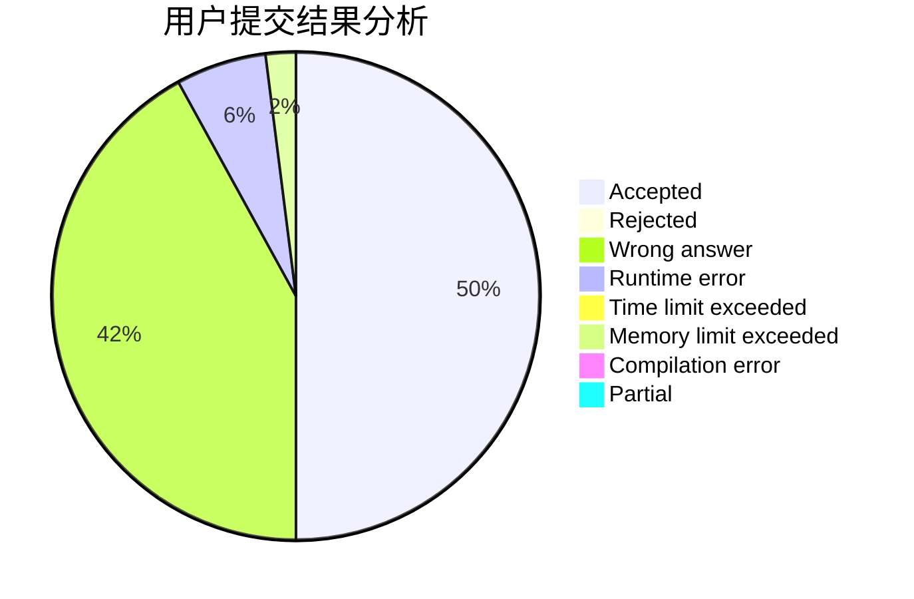
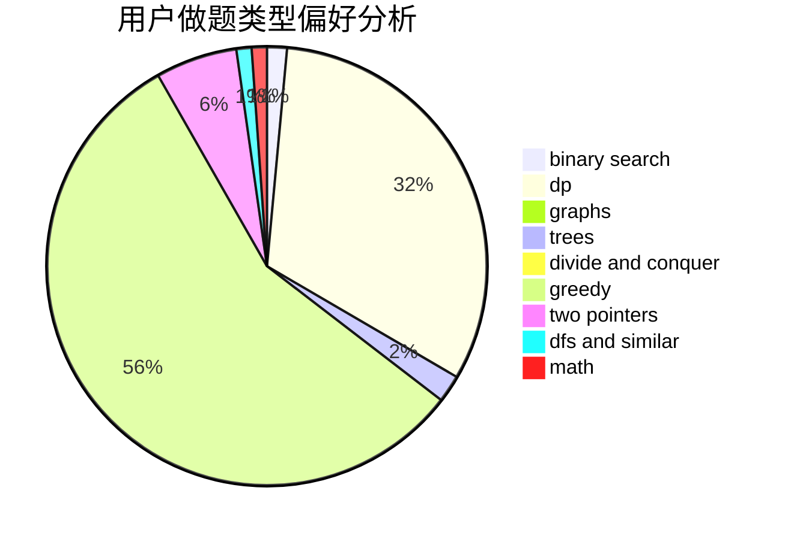

# Kvning

<!-- tabs:start -->

#### **用户提交结果分析**

#### **用户做题类型偏好分析**

<!-- tabs:end -->
# 推荐题目
[701A](https://codeforces.com/contest/701/problem/A)
[291A](https://codeforces.com/contest/291/problem/A)
[1183C](https://codeforces.com/contest/1183/problem/C)
[461B](https://codeforces.com/contest/461/problem/B)
[963B](https://codeforces.com/contest/963/problem/B)
[871E](https://codeforces.com/contest/871/problem/E)
[246B](https://codeforces.com/contest/246/problem/B)
[593B](https://codeforces.com/contest/593/problem/B)
[74A](https://codeforces.com/contest/74/problem/A)
[527B](https://codeforces.com/contest/527/problem/B)
