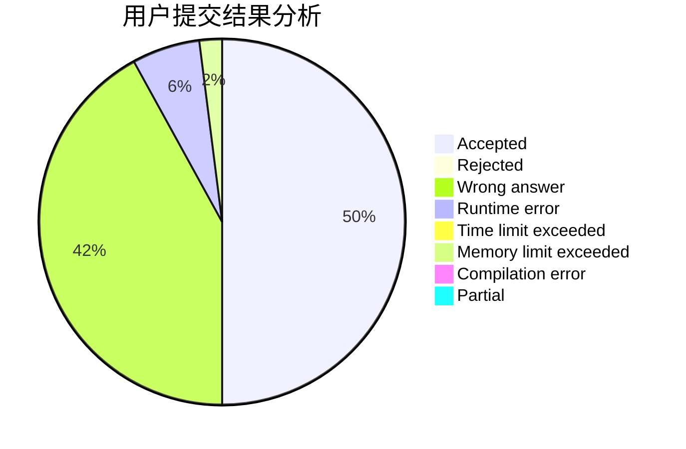
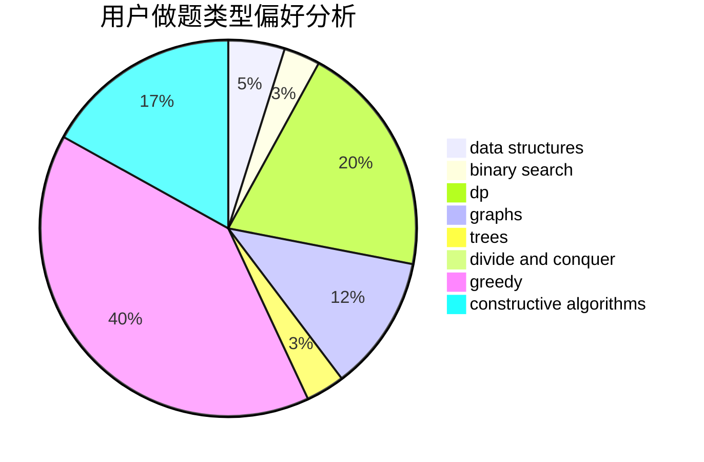

# Kvning

<!-- tabs:start -->

#### **用户提交结果分析**

#### **用户做题类型偏好分析**

#### **用户错题知识点分析**

<!-- tabs:end -->
# 推荐题目
[677A](https://codeforces.com/contest/677/problem/A)		implementation		  
[276D](https://codeforces.com/contest/276/problem/D)		bitmasks,
                        dp,
                        greedy,
                        implementation,
                        math		  
[1180B](https://codeforces.com/contest/1180/problem/B)		greedy,
                        implementation		  
[43A](https://codeforces.com/contest/43/problem/A)		strings		  
[946E](https://codeforces.com/contest/946/problem/E)		greedy,
                        implementation		  
[853C](https://codeforces.com/contest/853/problem/C)		data structures		  
[227A](https://codeforces.com/contest/227/problem/A)		geometry		  
[573D](https://codeforces.com/contest/573/problem/D)		data structures,
                        divide and conquer,
                        dp		  
[731E](https://codeforces.com/contest/731/problem/E)		dp,
                        games		  
[506E](https://codeforces.com/contest/506/problem/E)		combinatorics,
                        dp,
                        matrices,
                        strings		  
