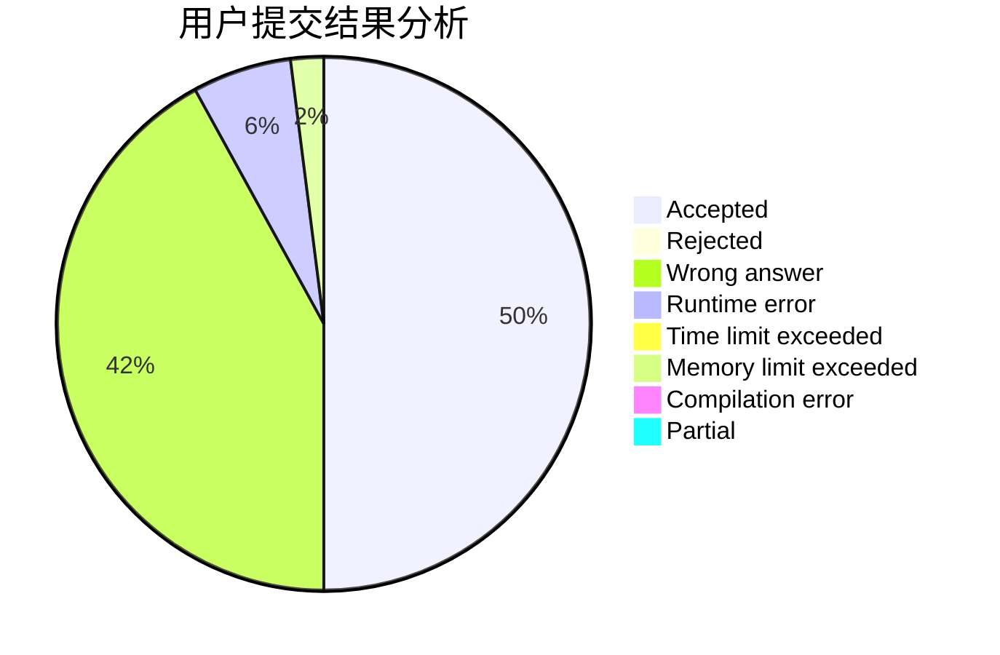
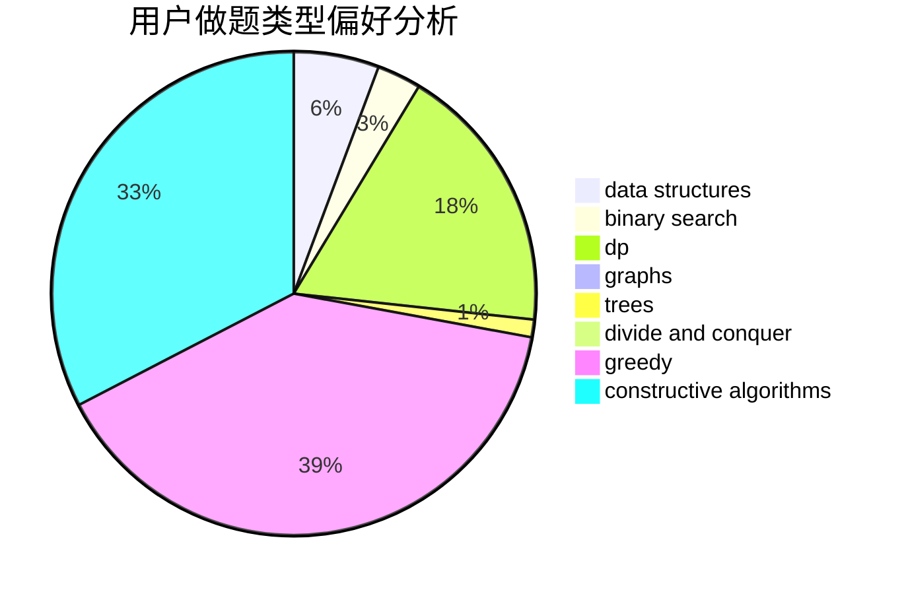

# Kvning

<!-- tabs:start -->

#### **用户提交结果分析**

#### **用户做题类型偏好分析**

#### **用户错题知识点分析**

<!-- tabs:end -->
# 推荐题目
[701A](https://codeforces.com/contest/701/problem/A)		greedy,
                        implementation		  
[291A](https://codeforces.com/contest/291/problem/A)		*special problem,
                        implementation,
                        sortings		  
[1183C](https://codeforces.com/contest/1183/problem/C)		binary search,
                        math		  
[461B](https://codeforces.com/contest/461/problem/B)		dfs and similar,
                        dp,
                        trees		  
[963B](https://codeforces.com/contest/963/problem/B)		constructive algorithms,
                        dfs and similar,
                        dp,
                        greedy,
                        trees		  
[871E](https://codeforces.com/contest/871/problem/E)		graphs,
                        greedy,
                        trees		  
[246B](https://codeforces.com/contest/246/problem/B)		greedy,
                        math		  
[593B](https://codeforces.com/contest/593/problem/B)		geometry,
                        sortings		  
[74A](https://codeforces.com/contest/74/problem/A)		implementation		  
[527B](https://codeforces.com/contest/527/problem/B)		greedy		  
