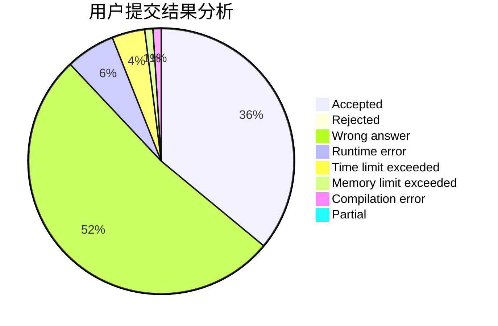
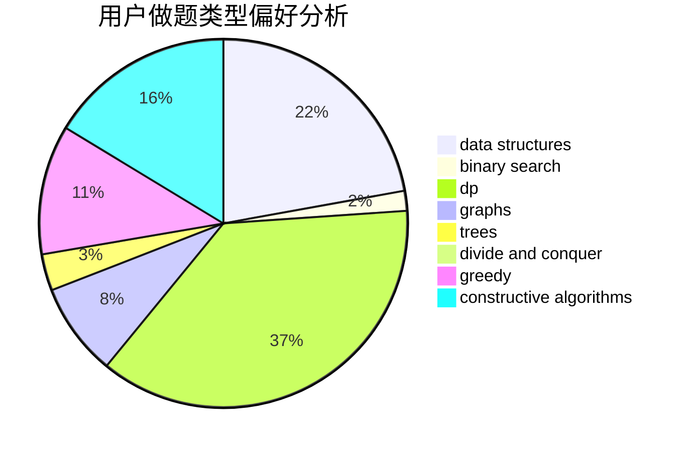
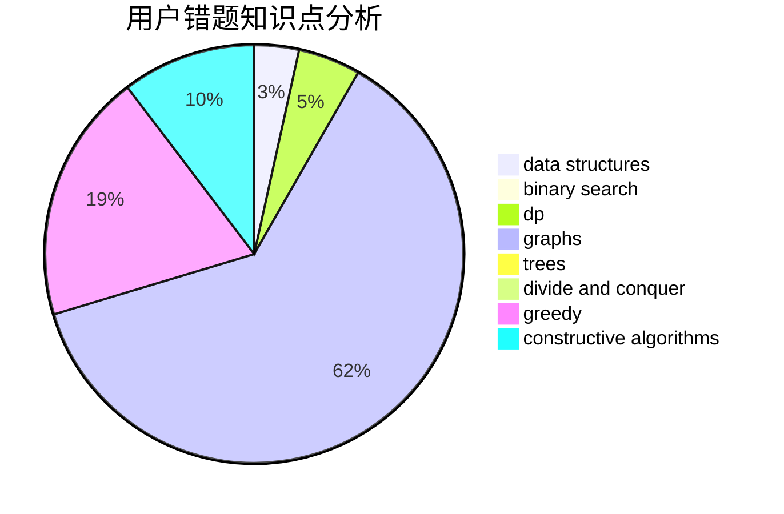

# Kwords

<!-- tabs:start -->

#### **用户提交结果分析**

#### **用户做题类型偏好分析**

#### **用户错题知识点分析**

<!-- tabs:end -->
# 推荐题目
[1243A](https://codeforces.com/contest/1243/problem/A)		implementation		  
[95A](https://codeforces.com/contest/95/problem/A)		implementation,
                        strings		  
[543C](https://codeforces.com/contest/543/problem/C)		bitmasks,
                        dp		  
[849B](https://codeforces.com/contest/849/problem/B)		brute force,
                        geometry		  
[1200B](https://codeforces.com/contest/1200/problem/B)		dp,
                        greedy		  
[772C](https://codeforces.com/contest/772/problem/C)		constructive algorithms,
                        dp,
                        graphs,
                        math,
                        number theory		  
[651D](https://codeforces.com/contest/651/problem/D)		dsu,graphs,sortings,trees		  
[405B](https://codeforces.com/contest/405/problem/B)		nan		  
[26D](https://codeforces.com/contest/26/problem/D)		combinatorics,
                        math,
                        probabilities		  
[447A](https://codeforces.com/contest/447/problem/A)		implementation		  
