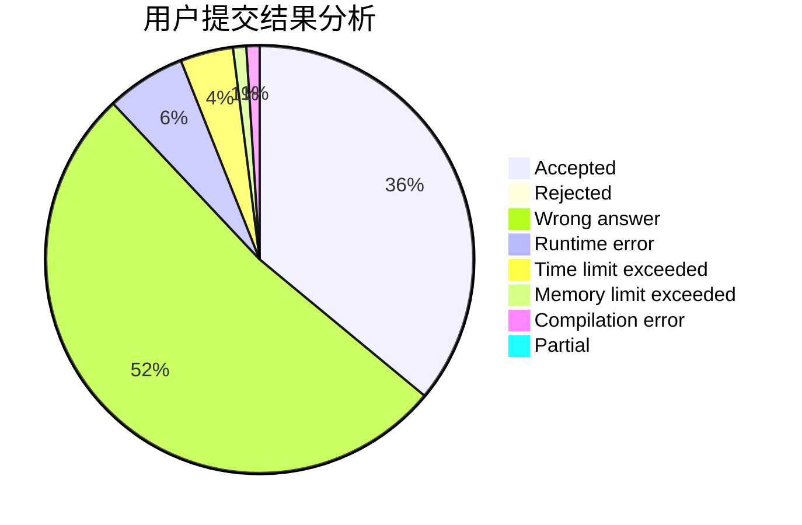
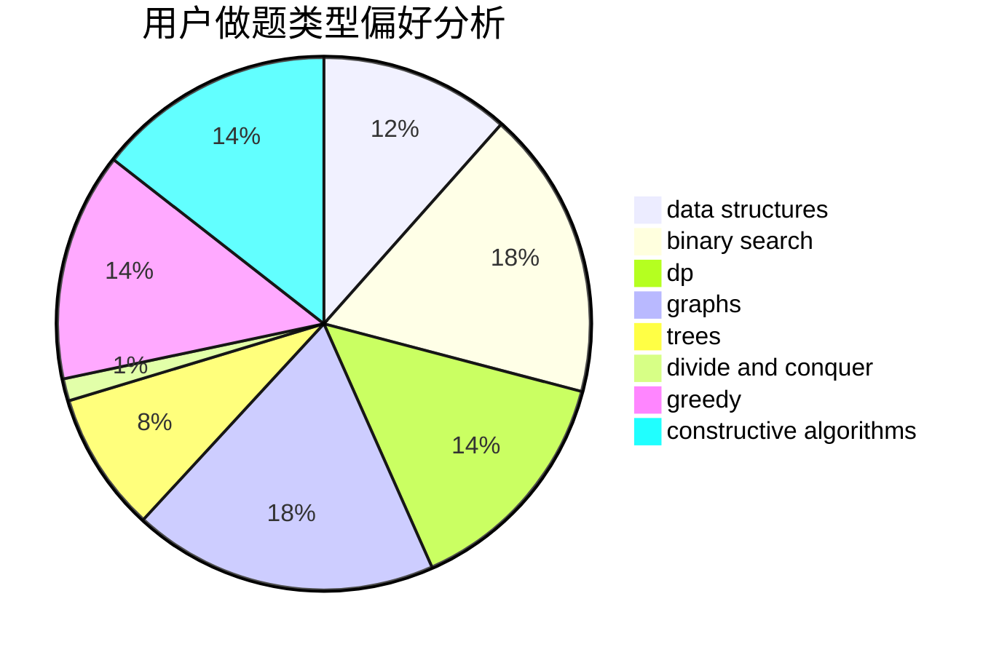
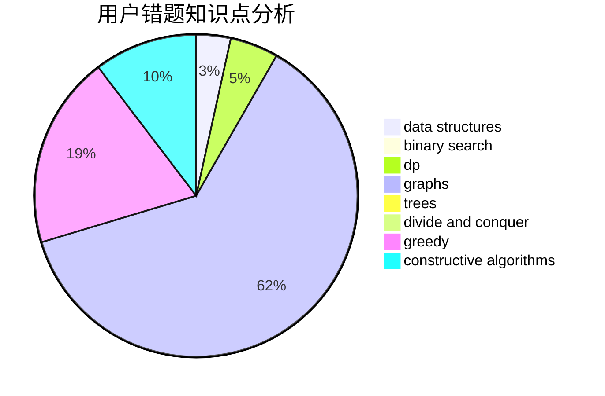

# Kwords
<!-- tabs:start -->
#### **用户提交结果分析**

#### **用户做题类型偏好分析**

#### **用户错题知识点分析**

<!-- tabs:end -->
# 推荐题目
[Drazil and Park](https://codeforces.com/contest/516/problem/C)		data structures		  
[Kill `Em All](http://codeforces.com/problemset/problem/1238/B)		greedy,
                        sortings		  
[Run For Your Prize](http://codeforces.com/problemset/problem/938/B)		brute force,
                        greedy		  
[Birthday](http://codeforces.com/problemset/problem/623/D)		greedy,
                        math,
                        probabilities		  
[Right-Left Cipher](http://codeforces.com/problemset/problem/1085/A)		implementation,
                        strings		  
[Megacity](http://codeforces.com/problemset/problem/424/B)		binary search,
                        greedy,
                        implementation,
                        sortings		  
[Boys and Girls](http://codeforces.com/problemset/problem/253/A)		greedy		  
[Keyboard Layouts](http://codeforces.com/problemset/problem/831/B)		implementation,
                        strings		  
[K for the Price of One (Easy Version)](http://codeforces.com/problemset/problem/1282/B1)		dp,
                        greedy,
                        sortings		  
[Barcode](http://codeforces.com/problemset/problem/225/C)		dp,
                        matrices		  
<!-- tabs:start -->
#### **data structures**
[Drazil and Park](https://codeforces.com/contest/516/problem/C)		data structures		  
[Kill `Em All](http://codeforces.com/problemset/problem/292/E)		data structures		  
[Run For Your Prize](http://codeforces.com/problemset/problem/1381/A2)		constructive algorithms,
                        data structures,
                        implementation,
                        strings,
                        two pointers		  
[Birthday](http://codeforces.com/problemset/problem/1492/C)		binary search,
                        data structures,
                        dp,
                        greedy,
                        two pointers		  
[Right-Left Cipher](http://codeforces.com/problemset/problem/1490/G)		binary search,
                        data structures,
                        math		  
[Megacity](http://codeforces.com/problemset/problem/1479/D)		binary search,
                        bitmasks,
                        brute force,
                        data structures,
                        probabilities,
                        trees		  
[Boys and Girls](http://codeforces.com/problemset/problem/1497/A)		brute force,
                        data structures,
                        greedy,
                        sortings		  
[Keyboard Layouts](http://codeforces.com/problemset/problem/1491/C)		brute force,
                        data structures,
                        dp,
                        greedy,
                        implementation		  
[K for the Price of One (Easy Version)](http://codeforces.com/problemset/problem/1492/B)		data structures,
                        greedy,
                        math		  
[Barcode](http://codeforces.com/problemset/problem/1436/E)		binary search,
                        data structures,
                        two pointers		  
#### **binary search**
[Drazil and Park](http://codeforces.com/problemset/problem/424/B)		binary search,
                        greedy,
                        implementation,
                        sortings		  
[Kill `Em All](http://codeforces.com/problemset/problem/804/D)		binary search,
                        brute force,
                        dfs and similar,
                        dp,
                        sortings,
                        trees		  
[Run For Your Prize](http://codeforces.com/problemset/problem/822/C)		binary search,
                        greedy,
                        implementation,
                        sortings		  
[Birthday](http://codeforces.com/problemset/problem/1409/E)		binary search,
                        dp,
                        sortings,
                        two pointers		  
[Right-Left Cipher](http://codeforces.com/problemset/problem/1452/B)		binary search,
                        greedy,
                        math,
                        sortings		  
[Megacity](http://codeforces.com/problemset/problem/1492/C)		binary search,
                        data structures,
                        dp,
                        greedy,
                        two pointers		  
[Boys and Girls](http://codeforces.com/problemset/problem/1463/D)		binary search,
                        constructive algorithms,
                        greedy,
                        two pointers		  
[Keyboard Layouts](http://codeforces.com/problemset/problem/1490/G)		binary search,
                        data structures,
                        math		  
[K for the Price of One (Easy Version)](http://codeforces.com/problemset/problem/1479/D)		binary search,
                        bitmasks,
                        brute force,
                        data structures,
                        probabilities,
                        trees		  
[Barcode](http://codeforces.com/problemset/problem/1436/E)		binary search,
                        data structures,
                        two pointers		  
#### **dp**
[Drazil and Park](http://codeforces.com/problemset/problem/1282/B1)		dp,
                        greedy,
                        sortings		  
[Kill `Em All](http://codeforces.com/problemset/problem/225/C)		dp,
                        matrices		  
[Run For Your Prize](https://codeforces.com/contest/1074/problem/C)		dp,
                        geometry		  
[Birthday](http://codeforces.com/problemset/problem/513/E2)		dp		  
[Right-Left Cipher](http://codeforces.com/problemset/problem/1153/F)		combinatorics,
                        dp,
                        math,
                        probabilities		  
[Megacity](http://codeforces.com/problemset/problem/382/E)		combinatorics,
                        dp		  
[Boys and Girls](http://codeforces.com/problemset/problem/429/C)		bitmasks,
                        constructive algorithms,
                        dp,
                        greedy,
                        trees		  
[Keyboard Layouts](http://codeforces.com/problemset/problem/1368/H1)		dp,
                        flows,
                        greedy		  
[K for the Price of One (Easy Version)](http://codeforces.com/problemset/problem/804/D)		binary search,
                        brute force,
                        dfs and similar,
                        dp,
                        sortings,
                        trees		  
[Barcode](http://codeforces.com/problemset/problem/629/C)		dp,
                        strings		  
#### **graph**
[Drazil and Park](http://codeforces.com/problemset/problem/1238/F)		dfs and similar,
                        dp,
                        graphs,
                        trees		  
[Kill `Em All](http://codeforces.com/problemset/problem/1487/C)		brute force,
                        constructive algorithms,
                        dfs and similar,
                        graphs,
                        greedy,
                        implementation,
                        math		  
[Run For Your Prize](http://codeforces.com/problemset/problem/1437/C)		dp,
                        flows,
                        graph matchings,
                        greedy,
                        math,
                        sortings		  
[Birthday](http://codeforces.com/problemset/problem/1470/D)		constructive algorithms,
                        dfs and similar,
                        graph matchings,
                        graphs,
                        greedy		  
[Right-Left Cipher](http://codeforces.com/problemset/problem/1476/C)		dp,
                        graphs,
                        greedy		  
[Megacity](http://codeforces.com/problemset/problem/1304/D)		constructive algorithms,
                        graphs,
                        greedy,
                        two pointers		  
[Boys and Girls](http://codeforces.com/problemset/problem/1475/C)		combinatorics,
                        graphs,
                        math		  
[Keyboard Layouts](http://codeforces.com/problemset/problem/553/E)		dp,
                        fft,
                        graphs,
                        math,
                        probabilities		  
[K for the Price of One (Easy Version)](http://codeforces.com/problemset/problem/1495/C)		constructive algorithms,
                        graphs		  
[Barcode](http://codeforces.com/problemset/problem/1510/K)		brute force,
                        graphs,
                        implementation		  
#### **trees**
[Drazil and Park](http://codeforces.com/problemset/problem/429/C)		bitmasks,
                        constructive algorithms,
                        dp,
                        greedy,
                        trees		  
[Kill `Em All](http://codeforces.com/problemset/problem/804/D)		binary search,
                        brute force,
                        dfs and similar,
                        dp,
                        sortings,
                        trees		  
[Run For Your Prize](http://codeforces.com/problemset/problem/1238/F)		dfs and similar,
                        dp,
                        graphs,
                        trees		  
[Birthday](http://codeforces.com/problemset/problem/1479/D)		binary search,
                        bitmasks,
                        brute force,
                        data structures,
                        probabilities,
                        trees		  
[Right-Left Cipher](http://codeforces.com/problemset/problem/1511/C)		brute force,
                        data structures,
                        implementation,
                        trees		  
[Megacity](http://codeforces.com/problemset/problem/1499/F)		combinatorics,
                        dfs and similar,
                        dp,
                        trees		  
[Boys and Girls](http://codeforces.com/problemset/problem/1491/E)		brute force,
                        dfs and similar,
                        divide and conquer,
                        number theory,
                        trees		  
[Keyboard Layouts](http://codeforces.com/problemset/problem/1466/D)		data structures,
                        greedy,
                        sortings,
                        trees		  
[K for the Price of One (Easy Version)](http://codeforces.com/problemset/problem/1495/D)		combinatorics,
                        dfs and similar,
                        graphs,
                        math,
                        shortest paths,
                        trees		  
[Barcode](http://codeforces.com/problemset/problem/1303/G)		data structures,
                        divide and conquer,
                        geometry,
                        trees		  
#### **divide and conquer**
[Drazil and Park](http://codeforces.com/problemset/problem/1461/D)		binary search,
                        brute force,
                        data structures,
                        divide and conquer,
                        implementation,
                        sortings		  
[Kill `Em All](http://codeforces.com/problemset/problem/1466/G)		combinatorics,
                        divide and conquer,
                        hashing,
                        math,
                        string suffix structures,
                        strings		  
[Run For Your Prize](http://codeforces.com/problemset/problem/1490/D)		dfs and similar,
                        divide and conquer,
                        implementation		  
[Birthday](https://codeforces.com/contest/1483/problem/C)		data structures,
                        divide and conquer,
                        dp		  
[Right-Left Cipher](http://codeforces.com/problemset/problem/1491/E)		brute force,
                        dfs and similar,
                        divide and conquer,
                        number theory,
                        trees		  
[Megacity](http://codeforces.com/problemset/problem/1303/G)		data structures,
                        divide and conquer,
                        geometry,
                        trees		  
[Boys and Girls](http://codeforces.com/problemset/problem/1494/D)		constructive algorithms,
                        data structures,
                        dfs and similar,
                        divide and conquer,
                        dsu,
                        greedy,
                        sortings,
                        trees		  
[Keyboard Layouts](http://codeforces.com/problemset/problem/1482/E)		data structures,
                        divide and conquer,
                        dp		  
[K for the Price of One (Easy Version)](http://codeforces.com/problemset/problem/566/C)		dfs and similar,
                        divide and conquer,
                        trees		  
[Barcode](http://codeforces.com/problemset/problem/1428/F)		binary search,
                        data structures,
                        divide and conquer,
                        dp,
                        two pointers		  
#### **greedy**
[Drazil and Park](http://codeforces.com/problemset/problem/1238/B)		greedy,
                        sortings		  
[Kill `Em All](http://codeforces.com/problemset/problem/938/B)		brute force,
                        greedy		  
[Run For Your Prize](http://codeforces.com/problemset/problem/623/D)		greedy,
                        math,
                        probabilities		  
[Birthday](http://codeforces.com/problemset/problem/424/B)		binary search,
                        greedy,
                        implementation,
                        sortings		  
[Right-Left Cipher](http://codeforces.com/problemset/problem/253/A)		greedy		  
[Megacity](http://codeforces.com/problemset/problem/1282/B1)		dp,
                        greedy,
                        sortings		  
[Boys and Girls](http://codeforces.com/problemset/problem/429/C)		bitmasks,
                        constructive algorithms,
                        dp,
                        greedy,
                        trees		  
[Keyboard Layouts](http://codeforces.com/problemset/problem/620/C)		greedy		  
[K for the Price of One (Easy Version)](http://codeforces.com/problemset/problem/1368/H1)		dp,
                        flows,
                        greedy		  
[Barcode](http://codeforces.com/problemset/problem/766/C)		brute force,
                        dp,
                        greedy,
                        strings		  
#### **constructive algorithms**
[Drazil and Park](http://codeforces.com/problemset/problem/679/A)		constructive algorithms,
                        interactive,
                        math		  
[Kill `Em All](http://codeforces.com/problemset/problem/429/C)		bitmasks,
                        constructive algorithms,
                        dp,
                        greedy,
                        trees		  
[Run For Your Prize](http://codeforces.com/problemset/problem/1004/C)		constructive algorithms,
                        implementation		  
[Birthday](http://codeforces.com/problemset/problem/1196/F)		brute force,
                        constructive algorithms,
                        shortest paths,
                        sortings		  
[Right-Left Cipher](https://codeforces.com/contest/1484/problem/C)		brute force,
                        constructive algorithms,
                        greedy,
                        implementation		  
[Megacity](http://codeforces.com/problemset/problem/1381/A2)		constructive algorithms,
                        data structures,
                        implementation,
                        strings,
                        two pointers		  
[Boys and Girls](http://codeforces.com/problemset/problem/1493/A)		constructive algorithms,
                        greedy		  
[Keyboard Layouts](http://codeforces.com/problemset/problem/1463/D)		binary search,
                        constructive algorithms,
                        greedy,
                        two pointers		  
[K for the Price of One (Easy Version)](https://codeforces.com/contest/1456/problem/B)		bitmasks,
                        brute force,
                        constructive algorithms		  
[Barcode](http://codeforces.com/problemset/problem/1492/D)		bitmasks,
                        constructive algorithms,
                        greedy,
                        math		  
#### **sortings**
[Drazil and Park](http://codeforces.com/problemset/problem/1238/B)		greedy,
                        sortings		  
[Kill `Em All](http://codeforces.com/problemset/problem/424/B)		binary search,
                        greedy,
                        implementation,
                        sortings		  
[Run For Your Prize](http://codeforces.com/problemset/problem/1282/B1)		dp,
                        greedy,
                        sortings		  
[Birthday](http://codeforces.com/problemset/problem/804/D)		binary search,
                        brute force,
                        dfs and similar,
                        dp,
                        sortings,
                        trees		  
[Right-Left Cipher](http://codeforces.com/problemset/problem/1196/F)		brute force,
                        constructive algorithms,
                        shortest paths,
                        sortings		  
[Megacity](http://codeforces.com/problemset/problem/1427/B)		greedy,
                        implementation,
                        sortings		  
[Boys and Girls](http://codeforces.com/problemset/problem/822/C)		binary search,
                        greedy,
                        implementation,
                        sortings		  
[Keyboard Layouts](http://codeforces.com/problemset/problem/1409/E)		binary search,
                        dp,
                        sortings,
                        two pointers		  
[K for the Price of One (Easy Version)](http://codeforces.com/problemset/problem/1452/B)		binary search,
                        greedy,
                        math,
                        sortings		  
[Barcode](https://codeforces.com/contest/1496/problem/C)		geometry,
                        greedy,
                        math,
                        sortings		  
<!-- tabs:end -->
