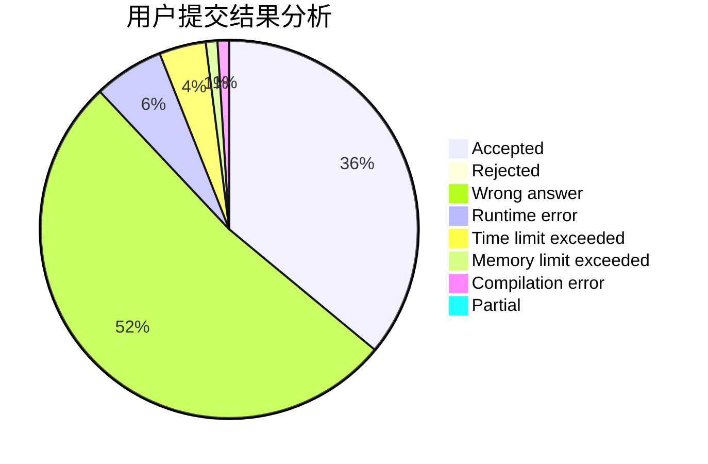
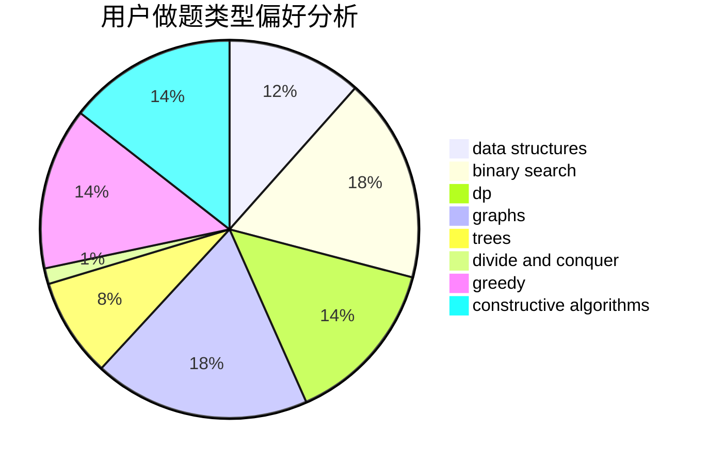
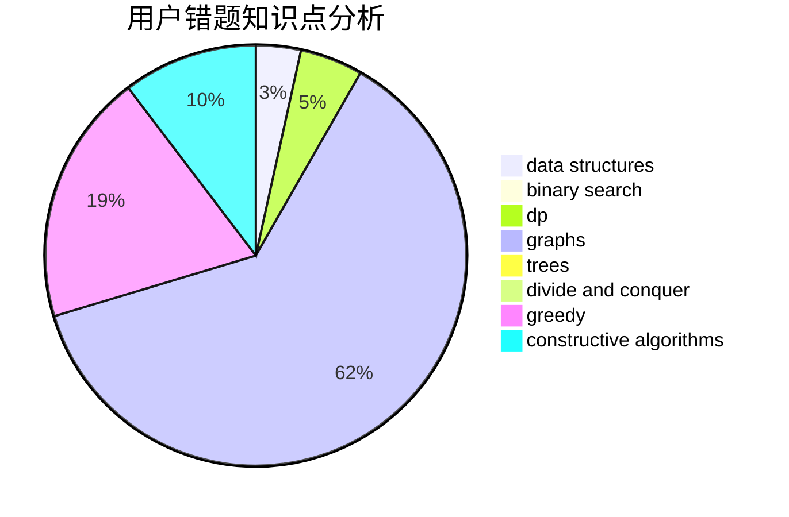

# Kwords

<!-- tabs:start -->

#### **用户提交结果分析**

#### **用户做题类型偏好分析**

#### **用户错题知识点分析**

<!-- tabs:end -->
# 推荐题目
[1238B](https://codeforces.com/contest/1238/problem/B)		greedy,
                        sortings		  
[938B](https://codeforces.com/contest/938/problem/B)		brute force,
                        greedy		  
[516C](https://codeforces.com/contest/516/problem/C)		dsu,graphs,sortings,trees		  
[831B](https://codeforces.com/contest/831/problem/B)		implementation,
                        strings		  
[1196F](https://codeforces.com/contest/1196/problem/F)		brute force,
                        constructive algorithms,
                        shortest paths,
                        sortings		  
[754B](https://codeforces.com/contest/754/problem/B)		brute force,
                        implementation		  
[623D](https://codeforces.com/contest/623/problem/D)		greedy,
                        math,
                        probabilities		  
[377A](https://codeforces.com/contest/377/problem/A)		dfs and similar		  
[253A](https://codeforces.com/contest/253/problem/A)		greedy		  
[424B](https://codeforces.com/contest/424/problem/B)		binary search,
                        greedy,
                        implementation,
                        sortings		  
