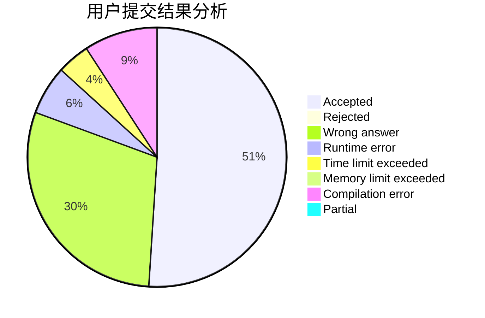
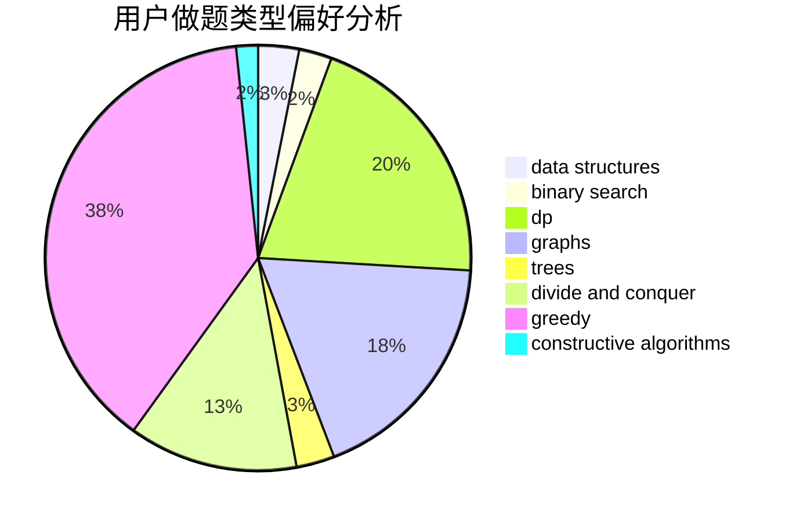

# Kyooma

<!-- tabs:start -->

#### **用户提交结果分析**

#### **用户做题类型偏好分析**

#### **用户错题知识点分析**

<!-- tabs:end -->
# 推荐题目
[295C](https://codeforces.com/contest/295/problem/C)		combinatorics,
                        dp,
                        graphs,
                        shortest paths		  
[20A](https://codeforces.com/contest/20/problem/A)		implementation		  
[49E](https://codeforces.com/contest/49/problem/E)		dp		  
[1196F](https://codeforces.com/contest/1196/problem/F)		brute force,
                        constructive algorithms,
                        shortest paths,
                        sortings		  
[1118E](https://codeforces.com/contest/1118/problem/E)		constructive algorithms,
                        implementation		  
[200B](https://codeforces.com/contest/200/problem/B)		implementation,
                        math		  
[482D](https://codeforces.com/contest/482/problem/D)		combinatorics,
                        dp,
                        trees		  
[577E](https://codeforces.com/contest/577/problem/E)		dsu,graphs,sortings,trees		  
[574D](https://codeforces.com/contest/574/problem/D)		dsu,graphs,sortings,trees		  
[50A](https://codeforces.com/contest/50/problem/A)		greedy,
                        math		  
