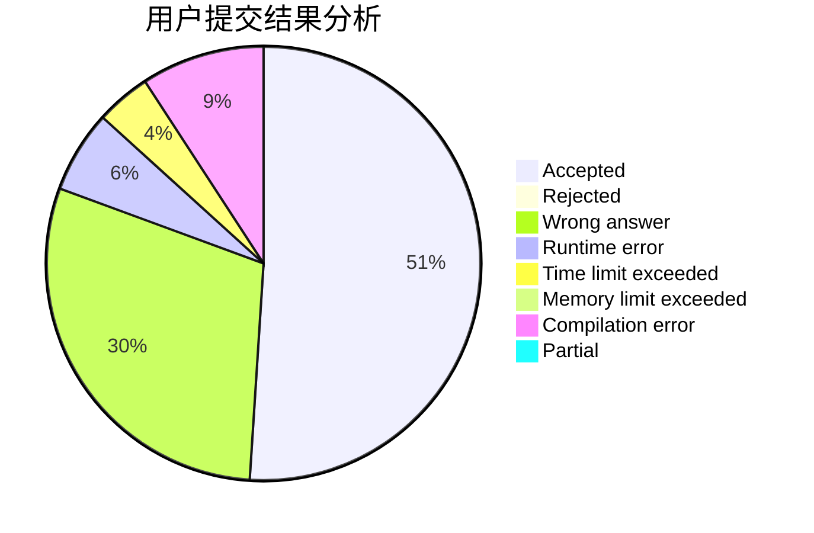
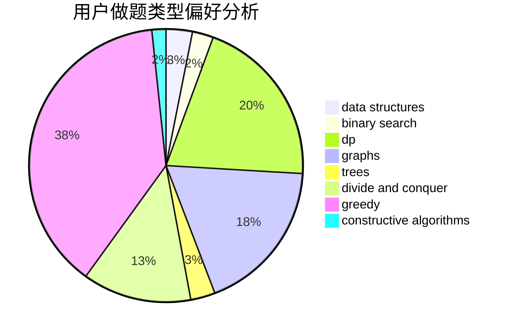

# Kyooma
<!-- tabs:start -->
#### **用户提交结果分析**

#### **用户做题类型偏好分析**

#### **用户错题知识点分析**

<!-- tabs:end -->
# 推荐题目
[Random Function and Tree](http://codeforces.com/problemset/problem/482/D)		combinatorics,
                        dp,
                        trees		  
[Complete Mirror](http://codeforces.com/problemset/problem/1182/D)		constructive algorithms,
                        dfs and similar,
                        dp,
                        hashing,
                        implementation,
                        trees		  
[New Year Cards](http://codeforces.com/problemset/problem/140/B)		brute force,
                        greedy,
                        implementation		  
[Common ancestor](http://codeforces.com/problemset/problem/49/E)		dp		  
[BerOS file system](http://codeforces.com/problemset/problem/20/A)		implementation		  
[K-th Path](http://codeforces.com/problemset/problem/1196/F)		brute force,
                        constructive algorithms,
                        shortest paths,
                        sortings		  
[Ksusha the Squirrel](http://codeforces.com/problemset/problem/299/B)		brute force,
                        implementation		  
[Bulls and Cows](http://codeforces.com/problemset/problem/63/C)		brute force,
                        implementation		  
[Points on Plane](https://codeforces.com/contest/577/problem/E)		constructive algorithms,
                        divide and conquer,
                        geometry,
                        greedy,
                        sortings		  
[Increasing Subsequence (easy version)](http://codeforces.com/problemset/problem/1157/C1)		greedy		  
<!-- tabs:start -->
#### **data structures**
[Random Function and Tree](http://codeforces.com/problemset/problem/817/D)		data structures,
                        divide and conquer,
                        dsu,
                        sortings		  
[Complete Mirror](https://codeforces.com/contest/574/problem/D)		binary search,
                        data structures,
                        dp,
                        math		  
[New Year Cards](http://codeforces.com/problemset/problem/587/F)		data structures,
                        strings		  
[Common ancestor](http://codeforces.com/problemset/problem/1265/B)		data structures,
                        implementation,
                        math,
                        two pointers		  
[BerOS file system](http://codeforces.com/problemset/problem/1142/B)		data structures,
                        dfs and similar,
                        dp,
                        math,
                        trees		  
[K-th Path](http://codeforces.com/problemset/problem/1492/C)		binary search,
                        data structures,
                        dp,
                        greedy,
                        two pointers		  
[Ksusha the Squirrel](http://codeforces.com/problemset/problem/1490/G)		binary search,
                        data structures,
                        math		  
[Bulls and Cows](http://codeforces.com/problemset/problem/1479/D)		binary search,
                        bitmasks,
                        brute force,
                        data structures,
                        probabilities,
                        trees		  
[Points on Plane](http://codeforces.com/problemset/problem/1497/A)		brute force,
                        data structures,
                        greedy,
                        sortings		  
[Increasing Subsequence (easy version)](http://codeforces.com/problemset/problem/1491/C)		brute force,
                        data structures,
                        dp,
                        greedy,
                        implementation		  
#### **binary search**
[Random Function and Tree](https://codeforces.com/contest/574/problem/D)		binary search,
                        data structures,
                        dp,
                        math		  
[Complete Mirror](https://codeforces.com/contest/1169/problem/C)		binary search,
                        greedy		  
[New Year Cards](http://codeforces.com/problemset/problem/1492/C)		binary search,
                        data structures,
                        dp,
                        greedy,
                        two pointers		  
[Common ancestor](http://codeforces.com/problemset/problem/1463/D)		binary search,
                        constructive algorithms,
                        greedy,
                        two pointers		  
[BerOS file system](http://codeforces.com/problemset/problem/1490/G)		binary search,
                        data structures,
                        math		  
[K-th Path](http://codeforces.com/problemset/problem/1479/D)		binary search,
                        bitmasks,
                        brute force,
                        data structures,
                        probabilities,
                        trees		  
[Ksusha the Squirrel](http://codeforces.com/problemset/problem/1436/E)		binary search,
                        data structures,
                        two pointers		  
[Bulls and Cows](http://codeforces.com/problemset/problem/1461/D)		binary search,
                        brute force,
                        data structures,
                        divide and conquer,
                        implementation,
                        sortings		  
[Points on Plane](http://codeforces.com/problemset/problem/1493/C)		binary search,
                        brute force,
                        constructive algorithms,
                        greedy,
                        strings		  
[Increasing Subsequence (easy version)](http://codeforces.com/problemset/problem/1487/D)		binary search,
                        brute force,
                        math,
                        number theory		  
#### **dp**
[Random Function and Tree](http://codeforces.com/problemset/problem/482/D)		combinatorics,
                        dp,
                        trees		  
[Complete Mirror](http://codeforces.com/problemset/problem/1182/D)		constructive algorithms,
                        dfs and similar,
                        dp,
                        hashing,
                        implementation,
                        trees		  
[New Year Cards](http://codeforces.com/problemset/problem/49/E)		dp		  
[Common ancestor](http://codeforces.com/problemset/problem/295/C)		combinatorics,
                        dp,
                        graphs,
                        shortest paths		  
[BerOS file system](http://codeforces.com/problemset/problem/713/C)		dp,
                        sortings		  
[K-th Path](http://codeforces.com/problemset/problem/235/E)		combinatorics,
                        dp,
                        implementation,
                        math,
                        number theory		  
[Ksusha the Squirrel](https://codeforces.com/contest/477/problem/C)		dp,
                        strings		  
[Bulls and Cows](http://codeforces.com/problemset/problem/812/B)		bitmasks,
                        brute force,
                        dp		  
[Points on Plane](https://codeforces.com/contest/574/problem/D)		binary search,
                        data structures,
                        dp,
                        math		  
[Increasing Subsequence (easy version)](http://codeforces.com/problemset/problem/431/C)		dp,
                        implementation,
                        trees		  
#### **graph**
[Random Function and Tree](http://codeforces.com/problemset/problem/1148/G)		constructive algorithms,
                        graphs,
                        math,
                        number theory,
                        probabilities		  
[Complete Mirror](http://codeforces.com/problemset/problem/295/C)		combinatorics,
                        dp,
                        graphs,
                        shortest paths		  
[New Year Cards](http://codeforces.com/problemset/problem/274/D)		dfs and similar,
                        graphs,
                        greedy,
                        sortings		  
[Common ancestor](https://codeforces.com/contest/782/problem/D)		2-sat,
                        graphs,
                        greedy,
                        implementation,
                        shortest paths,
                        strings		  
[BerOS file system](http://codeforces.com/problemset/problem/590/E)		graph matchings,
                        strings		  
[K-th Path](http://codeforces.com/problemset/problem/1487/C)		brute force,
                        constructive algorithms,
                        dfs and similar,
                        graphs,
                        greedy,
                        implementation,
                        math		  
[Ksusha the Squirrel](http://codeforces.com/problemset/problem/1437/C)		dp,
                        flows,
                        graph matchings,
                        greedy,
                        math,
                        sortings		  
[Bulls and Cows](http://codeforces.com/problemset/problem/1470/D)		constructive algorithms,
                        dfs and similar,
                        graph matchings,
                        graphs,
                        greedy		  
[Points on Plane](http://codeforces.com/problemset/problem/1476/C)		dp,
                        graphs,
                        greedy		  
[Increasing Subsequence (easy version)](http://codeforces.com/problemset/problem/1304/D)		constructive algorithms,
                        graphs,
                        greedy,
                        two pointers		  
#### **trees**
[Random Function and Tree](http://codeforces.com/problemset/problem/482/D)		combinatorics,
                        dp,
                        trees		  
[Complete Mirror](http://codeforces.com/problemset/problem/1182/D)		constructive algorithms,
                        dfs and similar,
                        dp,
                        hashing,
                        implementation,
                        trees		  
[New Year Cards](http://codeforces.com/problemset/problem/886/C)		dsu,
                        greedy,
                        implementation,
                        trees		  
[Common ancestor](http://codeforces.com/problemset/problem/431/C)		dp,
                        implementation,
                        trees		  
[BerOS file system](http://codeforces.com/problemset/problem/1142/B)		data structures,
                        dfs and similar,
                        dp,
                        math,
                        trees		  
[K-th Path](http://codeforces.com/problemset/problem/1479/D)		binary search,
                        bitmasks,
                        brute force,
                        data structures,
                        probabilities,
                        trees		  
[Ksusha the Squirrel](http://codeforces.com/problemset/problem/1511/C)		brute force,
                        data structures,
                        implementation,
                        trees		  
[Bulls and Cows](http://codeforces.com/problemset/problem/1499/F)		combinatorics,
                        dfs and similar,
                        dp,
                        trees		  
[Points on Plane](http://codeforces.com/problemset/problem/1491/E)		brute force,
                        dfs and similar,
                        divide and conquer,
                        number theory,
                        trees		  
[Increasing Subsequence (easy version)](http://codeforces.com/problemset/problem/1466/D)		data structures,
                        greedy,
                        sortings,
                        trees		  
#### **divide and conquer**
[Random Function and Tree](https://codeforces.com/contest/577/problem/E)		constructive algorithms,
                        divide and conquer,
                        geometry,
                        greedy,
                        sortings		  
[Complete Mirror](http://codeforces.com/problemset/problem/817/D)		data structures,
                        divide and conquer,
                        dsu,
                        sortings		  
[New Year Cards](http://codeforces.com/problemset/problem/1461/D)		binary search,
                        brute force,
                        data structures,
                        divide and conquer,
                        implementation,
                        sortings		  
[Common ancestor](http://codeforces.com/problemset/problem/1466/G)		combinatorics,
                        divide and conquer,
                        hashing,
                        math,
                        string suffix structures,
                        strings		  
[BerOS file system](http://codeforces.com/problemset/problem/1490/D)		dfs and similar,
                        divide and conquer,
                        implementation		  
[K-th Path](https://codeforces.com/contest/1483/problem/C)		data structures,
                        divide and conquer,
                        dp		  
[Ksusha the Squirrel](http://codeforces.com/problemset/problem/1491/E)		brute force,
                        dfs and similar,
                        divide and conquer,
                        number theory,
                        trees		  
[Bulls and Cows](http://codeforces.com/problemset/problem/1303/G)		data structures,
                        divide and conquer,
                        geometry,
                        trees		  
[Points on Plane](http://codeforces.com/problemset/problem/1494/D)		constructive algorithms,
                        data structures,
                        dfs and similar,
                        divide and conquer,
                        dsu,
                        greedy,
                        sortings,
                        trees		  
[Increasing Subsequence (easy version)](http://codeforces.com/problemset/problem/1482/E)		data structures,
                        divide and conquer,
                        dp		  
#### **greedy**
[Random Function and Tree](http://codeforces.com/problemset/problem/140/B)		brute force,
                        greedy,
                        implementation		  
[Complete Mirror](https://codeforces.com/contest/577/problem/E)		constructive algorithms,
                        divide and conquer,
                        geometry,
                        greedy,
                        sortings		  
[New Year Cards](http://codeforces.com/problemset/problem/1157/C1)		greedy		  
[Common ancestor](http://codeforces.com/problemset/problem/886/C)		dsu,
                        greedy,
                        implementation,
                        trees		  
[BerOS file system](http://codeforces.com/problemset/problem/274/D)		dfs and similar,
                        graphs,
                        greedy,
                        sortings		  
[K-th Path](https://codeforces.com/contest/782/problem/D)		2-sat,
                        graphs,
                        greedy,
                        implementation,
                        shortest paths,
                        strings		  
[Ksusha the Squirrel](https://codeforces.com/contest/1169/problem/C)		binary search,
                        greedy		  
[Bulls and Cows](http://codeforces.com/problemset/problem/1443/B)		dp,
                        greedy,
                        math,
                        sortings		  
[Points on Plane](http://codeforces.com/problemset/problem/50/A)		greedy,
                        math		  
[Increasing Subsequence (easy version)](http://codeforces.com/problemset/problem/1497/B)		constructive algorithms,
                        greedy,
                        math		  
#### **constructive algorithms**
[Random Function and Tree](http://codeforces.com/problemset/problem/1182/D)		constructive algorithms,
                        dfs and similar,
                        dp,
                        hashing,
                        implementation,
                        trees		  
[Complete Mirror](http://codeforces.com/problemset/problem/1196/F)		brute force,
                        constructive algorithms,
                        shortest paths,
                        sortings		  
[New Year Cards](https://codeforces.com/contest/577/problem/E)		constructive algorithms,
                        divide and conquer,
                        geometry,
                        greedy,
                        sortings		  
[Common ancestor](http://codeforces.com/problemset/problem/1148/G)		constructive algorithms,
                        graphs,
                        math,
                        number theory,
                        probabilities		  
[BerOS file system](http://codeforces.com/problemset/problem/1118/E)		constructive algorithms,
                        implementation		  
[K-th Path](http://codeforces.com/problemset/problem/1497/B)		constructive algorithms,
                        greedy,
                        math		  
[Ksusha the Squirrel](http://codeforces.com/problemset/problem/1493/A)		constructive algorithms,
                        greedy		  
[Bulls and Cows](http://codeforces.com/problemset/problem/1463/D)		binary search,
                        constructive algorithms,
                        greedy,
                        two pointers		  
[Points on Plane](https://codeforces.com/contest/1456/problem/B)		bitmasks,
                        brute force,
                        constructive algorithms		  
[Increasing Subsequence (easy version)](http://codeforces.com/problemset/problem/1492/D)		bitmasks,
                        constructive algorithms,
                        greedy,
                        math		  
#### **sortings**
[Random Function and Tree](http://codeforces.com/problemset/problem/1196/F)		brute force,
                        constructive algorithms,
                        shortest paths,
                        sortings		  
[Complete Mirror](https://codeforces.com/contest/577/problem/E)		constructive algorithms,
                        divide and conquer,
                        geometry,
                        greedy,
                        sortings		  
[New Year Cards](http://codeforces.com/problemset/problem/817/D)		data structures,
                        divide and conquer,
                        dsu,
                        sortings		  
[Common ancestor](http://codeforces.com/problemset/problem/713/C)		dp,
                        sortings		  
[BerOS file system](http://codeforces.com/problemset/problem/274/D)		dfs and similar,
                        graphs,
                        greedy,
                        sortings		  
[K-th Path](http://codeforces.com/problemset/problem/1443/B)		dp,
                        greedy,
                        math,
                        sortings		  
[Ksusha the Squirrel](https://codeforces.com/contest/1496/problem/C)		geometry,
                        greedy,
                        math,
                        sortings		  
[Bulls and Cows](http://codeforces.com/problemset/problem/1495/A)		geometry,
                        greedy,
                        math,
                        sortings		  
[Points on Plane](http://codeforces.com/problemset/problem/1497/A)		brute force,
                        data structures,
                        greedy,
                        sortings		  
[Increasing Subsequence (easy version)](http://codeforces.com/problemset/problem/1427/A)		math,
                        sortings		  
<!-- tabs:end -->
