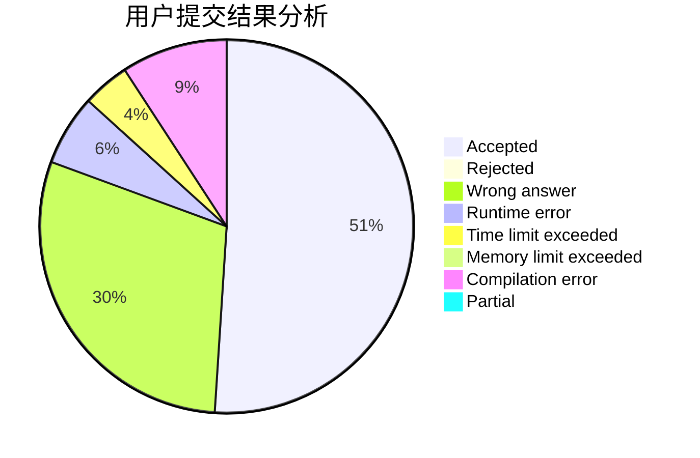
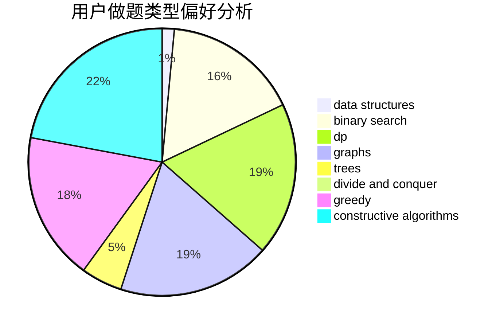

# Kyooma

<!-- tabs:start -->

#### **用户提交结果分析**

#### **用户做题类型偏好分析**

#### **用户错题知识点分析**

<!-- tabs:end -->
# 推荐题目
[312A](https://codeforces.com/contest/312/problem/A)		implementation,
                        strings		  
[231C](https://codeforces.com/contest/231/problem/C)		binary search,
                        sortings,
                        two pointers		  
[51F](https://codeforces.com/contest/51/problem/F)		dfs and similar,
                        dp,
                        graphs,
                        trees		  
[1200B](https://codeforces.com/contest/1200/problem/B)		dp,
                        greedy		  
[1120C](https://codeforces.com/contest/1120/problem/C)		dp,
                        strings		  
[225D](https://codeforces.com/contest/225/problem/D)		bitmasks,
                        dfs and similar,
                        graphs,
                        implementation		  
[501C](https://codeforces.com/contest/501/problem/C)		constructive algorithms,
                        data structures,
                        greedy,
                        sortings,
                        trees		  
[599B](https://codeforces.com/contest/599/problem/B)		implementation		  
[594E](https://codeforces.com/contest/594/problem/E)		string suffix structures,
                        strings		  
[533A](https://codeforces.com/contest/533/problem/A)		binary search,
                        data structures,
                        dfs and similar,
                        greedy,
                        trees		  
