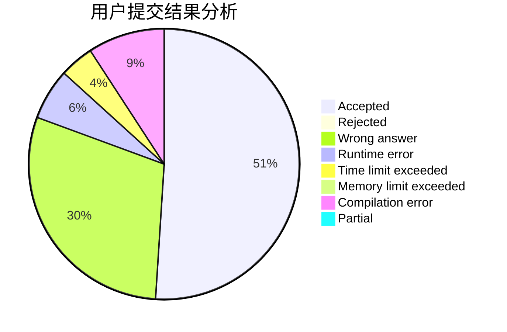
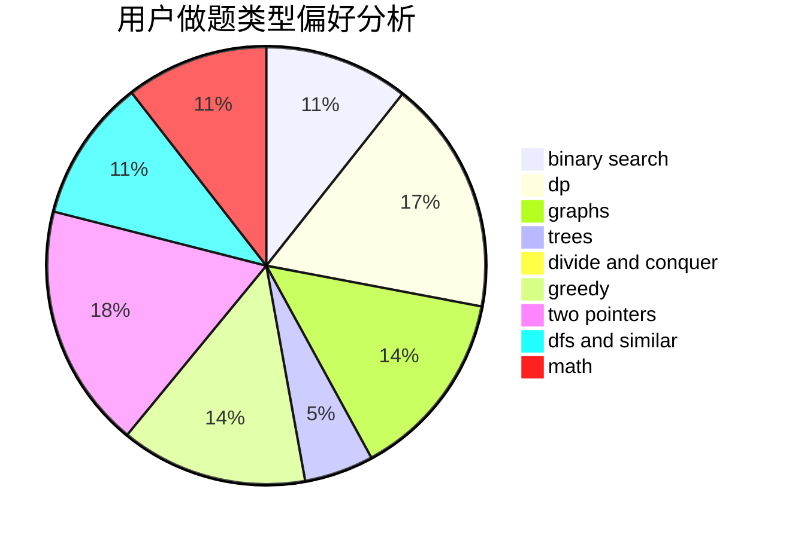

# Kyooma

<!-- tabs:start -->

#### **用户提交结果分析**

#### **用户做题类型偏好分析**

<!-- tabs:end -->
# 推荐题目
[312A](https://codeforces.com/contest/312/problem/A)
[231C](https://codeforces.com/contest/231/problem/C)
[51F](https://codeforces.com/contest/51/problem/F)
[1200B](https://codeforces.com/contest/1200/problem/B)
[1120C](https://codeforces.com/contest/1120/problem/C)
[225D](https://codeforces.com/contest/225/problem/D)
[501C](https://codeforces.com/contest/501/problem/C)
[599B](https://codeforces.com/contest/599/problem/B)
[594E](https://codeforces.com/contest/594/problem/E)
[533A](https://codeforces.com/contest/533/problem/A)
