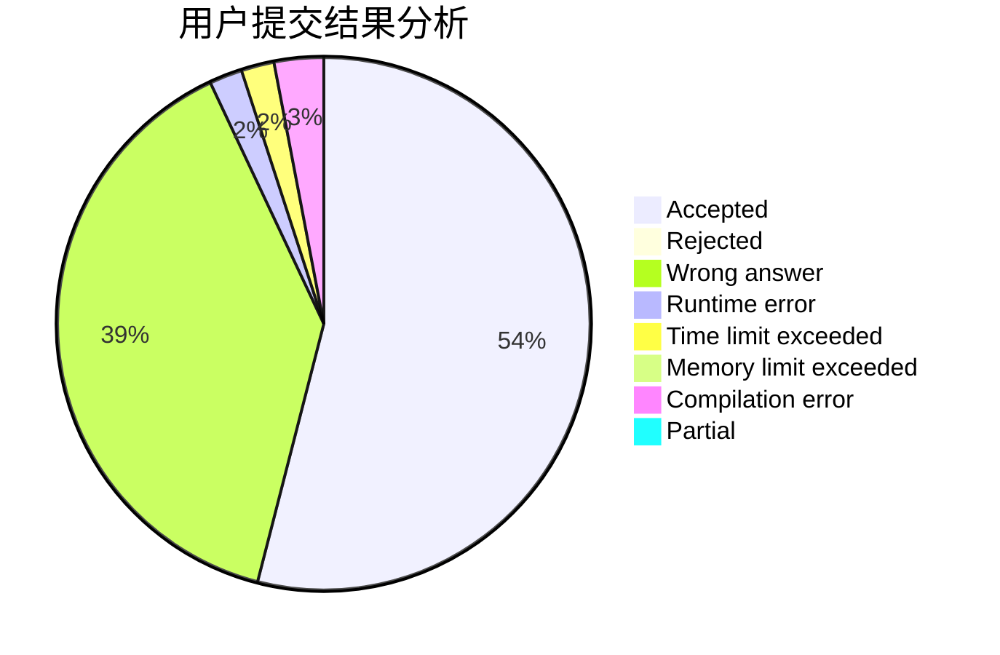
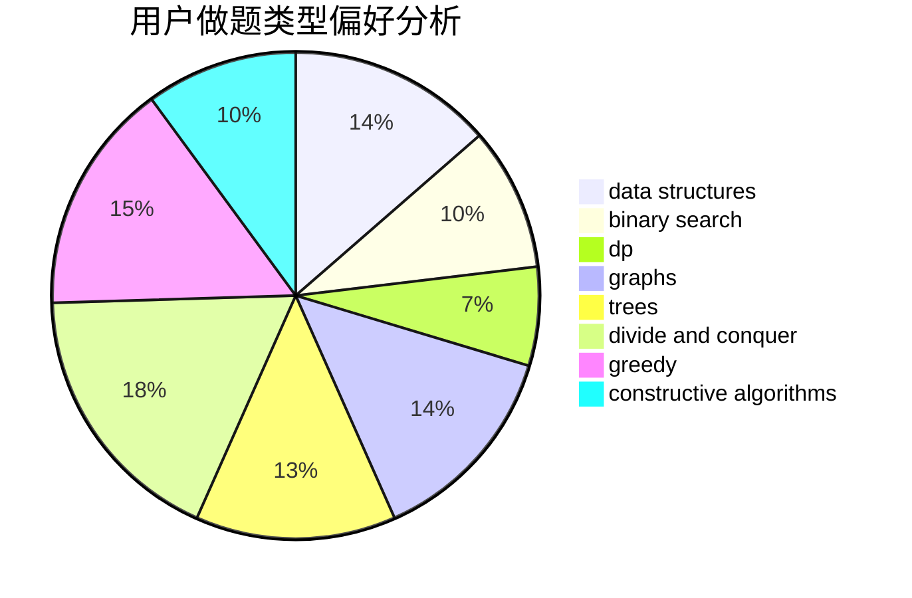
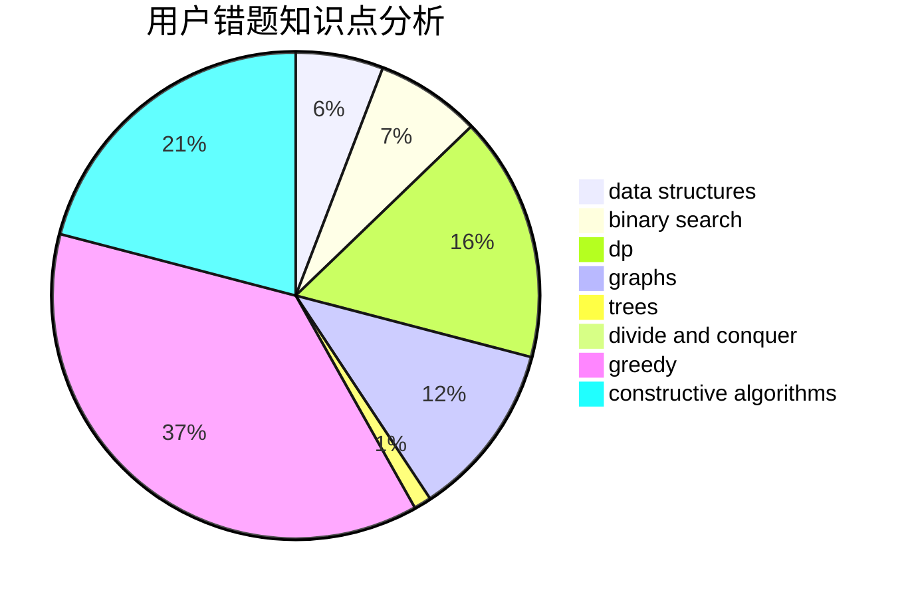

# L-jiji
<!-- tabs:start -->
#### **用户提交结果分析**

#### **用户做题类型偏好分析**

#### **用户错题知识点分析**

<!-- tabs:end -->
# 推荐题目
[Fibonacci String Subsequences](http://codeforces.com/problemset/problem/946/F)		combinatorics,
                        dp,
                        matrices		  
[Funny Game](http://codeforces.com/problemset/problem/731/E)		dp,
                        games		  
[Symmetric Projections](http://codeforces.com/problemset/problem/886/F)		geometry		  
[Definite Game](http://codeforces.com/problemset/problem/1081/A)		constructive algorithms,
                        math		  
[Little Elephant and Inversions](http://codeforces.com/problemset/problem/220/E)		data structures,
                        two pointers		  
[Almost Increasing Array](http://codeforces.com/problemset/problem/946/G)		data structures,
                        dp		  
[Little Girl and Maximum XOR](http://codeforces.com/problemset/problem/276/D)		bitmasks,
                        dp,
                        greedy,
                        implementation,
                        math		  
[PFAST Inc.](http://codeforces.com/problemset/problem/114/B)		bitmasks,
                        brute force,
                        graphs		  
[GCD Groups 2](http://codeforces.com/problemset/problem/1198/F)		greedy,
                        number theory,
                        probabilities		  
[The Tower is Going Home](http://codeforces.com/problemset/problem/1044/A)		binary search,
                        two pointers		  
<!-- tabs:start -->
#### **data structures**
[Fibonacci String Subsequences](http://codeforces.com/problemset/problem/220/E)		data structures,
                        two pointers		  
[Funny Game](http://codeforces.com/problemset/problem/946/G)		data structures,
                        dp		  
[Symmetric Projections](http://codeforces.com/problemset/problem/1252/K)		data structures,
                        math,
                        matrices		  
[Definite Game](http://codeforces.com/problemset/problem/827/D)		data structures,
                        dfs and similar,
                        graphs,
                        trees		  
[Little Elephant and Inversions](http://codeforces.com/problemset/problem/893/D)		data structures,
                        dp,
                        greedy,
                        implementation		  
[Almost Increasing Array](http://codeforces.com/problemset/problem/797/F)		data structures,
                        dp,
                        greedy,
                        sortings		  
[Little Girl and Maximum XOR](http://codeforces.com/problemset/problem/1204/D2)		data structures,
                        greedy,
                        math,
                        strings		  
[PFAST Inc.](http://codeforces.com/problemset/problem/1492/C)		binary search,
                        data structures,
                        dp,
                        greedy,
                        two pointers		  
[GCD Groups 2](http://codeforces.com/problemset/problem/1490/G)		binary search,
                        data structures,
                        math		  
[The Tower is Going Home](http://codeforces.com/problemset/problem/1479/D)		binary search,
                        bitmasks,
                        brute force,
                        data structures,
                        probabilities,
                        trees		  
#### **binary search**
[Fibonacci String Subsequences](http://codeforces.com/problemset/problem/1044/A)		binary search,
                        two pointers		  
[Funny Game](http://codeforces.com/problemset/problem/1492/C)		binary search,
                        data structures,
                        dp,
                        greedy,
                        two pointers		  
[Symmetric Projections](http://codeforces.com/problemset/problem/1463/D)		binary search,
                        constructive algorithms,
                        greedy,
                        two pointers		  
[Definite Game](http://codeforces.com/problemset/problem/1490/G)		binary search,
                        data structures,
                        math		  
[Little Elephant and Inversions](http://codeforces.com/problemset/problem/1479/D)		binary search,
                        bitmasks,
                        brute force,
                        data structures,
                        probabilities,
                        trees		  
[Almost Increasing Array](http://codeforces.com/problemset/problem/1436/E)		binary search,
                        data structures,
                        two pointers		  
[Little Girl and Maximum XOR](http://codeforces.com/problemset/problem/1461/D)		binary search,
                        brute force,
                        data structures,
                        divide and conquer,
                        implementation,
                        sortings		  
[PFAST Inc.](http://codeforces.com/problemset/problem/1493/C)		binary search,
                        brute force,
                        constructive algorithms,
                        greedy,
                        strings		  
[GCD Groups 2](http://codeforces.com/problemset/problem/1487/D)		binary search,
                        brute force,
                        math,
                        number theory		  
[The Tower is Going Home](http://codeforces.com/problemset/problem/1486/B)		binary search,
                        geometry,
                        shortest paths,
                        sortings		  
#### **dp**
[Fibonacci String Subsequences](http://codeforces.com/problemset/problem/946/F)		combinatorics,
                        dp,
                        matrices		  
[Funny Game](http://codeforces.com/problemset/problem/731/E)		dp,
                        games		  
[Symmetric Projections](http://codeforces.com/problemset/problem/946/G)		data structures,
                        dp		  
[Definite Game](http://codeforces.com/problemset/problem/276/D)		bitmasks,
                        dp,
                        greedy,
                        implementation,
                        math		  
[Little Elephant and Inversions](http://codeforces.com/problemset/problem/893/D)		data structures,
                        dp,
                        greedy,
                        implementation		  
[Almost Increasing Array](http://codeforces.com/problemset/problem/416/E)		dp,
                        graphs,
                        shortest paths		  
[Little Girl and Maximum XOR](http://codeforces.com/problemset/problem/797/F)		data structures,
                        dp,
                        greedy,
                        sortings		  
[PFAST Inc.](http://codeforces.com/problemset/problem/797/B)		dp,
                        greedy,
                        implementation		  
[GCD Groups 2](http://codeforces.com/problemset/problem/1385/D)		bitmasks,
                        brute force,
                        divide and conquer,
                        dp,
                        implementation		  
[The Tower is Going Home](http://codeforces.com/problemset/problem/618/D)		dfs and similar,
                        dp,
                        graph matchings,
                        greedy,
                        trees		  
#### **graph**
[Fibonacci String Subsequences](http://codeforces.com/problemset/problem/114/B)		bitmasks,
                        brute force,
                        graphs		  
[Funny Game](http://codeforces.com/problemset/problem/827/D)		data structures,
                        dfs and similar,
                        graphs,
                        trees		  
[Symmetric Projections](http://codeforces.com/problemset/problem/762/F)		combinatorics,
                        graphs,
                        trees		  
[Definite Game](http://codeforces.com/problemset/problem/416/E)		dp,
                        graphs,
                        shortest paths		  
[Little Elephant and Inversions](https://codeforces.com/contest/782/problem/B)		dfs and similar,
                        graphs		  
[Almost Increasing Array](http://codeforces.com/problemset/problem/707/B)		graphs		  
[Little Girl and Maximum XOR](http://codeforces.com/problemset/problem/618/D)		dfs and similar,
                        dp,
                        graph matchings,
                        greedy,
                        trees		  
[PFAST Inc.](http://codeforces.com/problemset/problem/1487/C)		brute force,
                        constructive algorithms,
                        dfs and similar,
                        graphs,
                        greedy,
                        implementation,
                        math		  
[GCD Groups 2](http://codeforces.com/problemset/problem/1437/C)		dp,
                        flows,
                        graph matchings,
                        greedy,
                        math,
                        sortings		  
[The Tower is Going Home](http://codeforces.com/problemset/problem/1470/D)		constructive algorithms,
                        dfs and similar,
                        graph matchings,
                        graphs,
                        greedy		  
#### **trees**
[Fibonacci String Subsequences](http://codeforces.com/problemset/problem/827/D)		data structures,
                        dfs and similar,
                        graphs,
                        trees		  
[Funny Game](http://codeforces.com/problemset/problem/762/F)		combinatorics,
                        graphs,
                        trees		  
[Symmetric Projections](http://codeforces.com/problemset/problem/618/D)		dfs and similar,
                        dp,
                        graph matchings,
                        greedy,
                        trees		  
[Definite Game](http://codeforces.com/problemset/problem/1479/D)		binary search,
                        bitmasks,
                        brute force,
                        data structures,
                        probabilities,
                        trees		  
[Little Elephant and Inversions](http://codeforces.com/problemset/problem/1511/C)		brute force,
                        data structures,
                        implementation,
                        trees		  
[Almost Increasing Array](http://codeforces.com/problemset/problem/1499/F)		combinatorics,
                        dfs and similar,
                        dp,
                        trees		  
[Little Girl and Maximum XOR](http://codeforces.com/problemset/problem/1491/E)		brute force,
                        dfs and similar,
                        divide and conquer,
                        number theory,
                        trees		  
[PFAST Inc.](http://codeforces.com/problemset/problem/1466/D)		data structures,
                        greedy,
                        sortings,
                        trees		  
[GCD Groups 2](http://codeforces.com/problemset/problem/1495/D)		combinatorics,
                        dfs and similar,
                        graphs,
                        math,
                        shortest paths,
                        trees		  
[The Tower is Going Home](http://codeforces.com/problemset/problem/1303/G)		data structures,
                        divide and conquer,
                        geometry,
                        trees		  
#### **divide and conquer**
[Fibonacci String Subsequences](http://codeforces.com/problemset/problem/1385/D)		bitmasks,
                        brute force,
                        divide and conquer,
                        dp,
                        implementation		  
[Funny Game](http://codeforces.com/problemset/problem/1461/D)		binary search,
                        brute force,
                        data structures,
                        divide and conquer,
                        implementation,
                        sortings		  
[Symmetric Projections](http://codeforces.com/problemset/problem/1466/G)		combinatorics,
                        divide and conquer,
                        hashing,
                        math,
                        string suffix structures,
                        strings		  
[Definite Game](http://codeforces.com/problemset/problem/1490/D)		dfs and similar,
                        divide and conquer,
                        implementation		  
[Little Elephant and Inversions](https://codeforces.com/contest/1483/problem/C)		data structures,
                        divide and conquer,
                        dp		  
[Almost Increasing Array](http://codeforces.com/problemset/problem/1491/E)		brute force,
                        dfs and similar,
                        divide and conquer,
                        number theory,
                        trees		  
[Little Girl and Maximum XOR](http://codeforces.com/problemset/problem/1303/G)		data structures,
                        divide and conquer,
                        geometry,
                        trees		  
[PFAST Inc.](http://codeforces.com/problemset/problem/1494/D)		constructive algorithms,
                        data structures,
                        dfs and similar,
                        divide and conquer,
                        dsu,
                        greedy,
                        sortings,
                        trees		  
[GCD Groups 2](http://codeforces.com/problemset/problem/1482/E)		data structures,
                        divide and conquer,
                        dp		  
[The Tower is Going Home](http://codeforces.com/problemset/problem/566/C)		dfs and similar,
                        divide and conquer,
                        trees		  
#### **greedy**
[Fibonacci String Subsequences](http://codeforces.com/problemset/problem/276/D)		bitmasks,
                        dp,
                        greedy,
                        implementation,
                        math		  
[Funny Game](http://codeforces.com/problemset/problem/1198/F)		greedy,
                        number theory,
                        probabilities		  
[Symmetric Projections](http://codeforces.com/problemset/problem/258/A)		greedy,
                        math		  
[Definite Game](http://codeforces.com/problemset/problem/1374/C)		greedy,
                        strings		  
[Little Elephant and Inversions](http://codeforces.com/problemset/problem/893/D)		data structures,
                        dp,
                        greedy,
                        implementation		  
[Almost Increasing Array](http://codeforces.com/problemset/problem/797/F)		data structures,
                        dp,
                        greedy,
                        sortings		  
[Little Girl and Maximum XOR](http://codeforces.com/problemset/problem/797/B)		dp,
                        greedy,
                        implementation		  
[PFAST Inc.](https://codeforces.com/contest/1265/problem/C)		greedy,
                        implementation		  
[GCD Groups 2](http://codeforces.com/problemset/problem/1070/D)		greedy		  
[The Tower is Going Home](http://codeforces.com/problemset/problem/618/D)		dfs and similar,
                        dp,
                        graph matchings,
                        greedy,
                        trees		  
#### **constructive algorithms**
[Fibonacci String Subsequences](http://codeforces.com/problemset/problem/1081/A)		constructive algorithms,
                        math		  
[Funny Game](http://codeforces.com/problemset/problem/1166/E)		bitmasks,
                        brute force,
                        constructive algorithms,
                        math,
                        number theory		  
[Symmetric Projections](http://codeforces.com/problemset/problem/1493/A)		constructive algorithms,
                        greedy		  
[Definite Game](http://codeforces.com/problemset/problem/1463/D)		binary search,
                        constructive algorithms,
                        greedy,
                        two pointers		  
[Little Elephant and Inversions](https://codeforces.com/contest/1456/problem/B)		bitmasks,
                        brute force,
                        constructive algorithms		  
[Almost Increasing Array](http://codeforces.com/problemset/problem/1492/D)		bitmasks,
                        constructive algorithms,
                        greedy,
                        math		  
[Little Girl and Maximum XOR](https://codeforces.com/contest/1504/problem/D)		constructive algorithms,
                        games,
                        interactive		  
[PFAST Inc.](https://codeforces.com/contest/1483/problem/A)		brute force,
                        constructive algorithms,
                        greedy,
                        implementation		  
[GCD Groups 2](https://codeforces.com/contest/1457/problem/D)		bitmasks,
                        brute force,
                        constructive algorithms		  
[The Tower is Going Home](http://codeforces.com/problemset/problem/1513/A)		constructive algorithms,
                        implementation		  
#### **sortings**
[Fibonacci String Subsequences](http://codeforces.com/problemset/problem/797/F)		data structures,
                        dp,
                        greedy,
                        sortings		  
[Funny Game](http://codeforces.com/problemset/problem/843/A)		dfs and similar,
                        dsu,
                        implementation,
                        math,
                        sortings		  
[Symmetric Projections](https://codeforces.com/contest/1496/problem/C)		geometry,
                        greedy,
                        math,
                        sortings		  
[Definite Game](http://codeforces.com/problemset/problem/1495/A)		geometry,
                        greedy,
                        math,
                        sortings		  
[Little Elephant and Inversions](http://codeforces.com/problemset/problem/1497/A)		brute force,
                        data structures,
                        greedy,
                        sortings		  
[Almost Increasing Array](http://codeforces.com/problemset/problem/1427/A)		math,
                        sortings		  
[Little Girl and Maximum XOR](http://codeforces.com/problemset/problem/1461/D)		binary search,
                        brute force,
                        data structures,
                        divide and conquer,
                        implementation,
                        sortings		  
[PFAST Inc.](http://codeforces.com/problemset/problem/1437/C)		dp,
                        flows,
                        graph matchings,
                        greedy,
                        math,
                        sortings		  
[GCD Groups 2](http://codeforces.com/problemset/problem/1473/A)		greedy,
                        implementation,
                        math,
                        sortings		  
[The Tower is Going Home](http://codeforces.com/problemset/problem/1486/B)		binary search,
                        geometry,
                        shortest paths,
                        sortings		  
<!-- tabs:end -->
