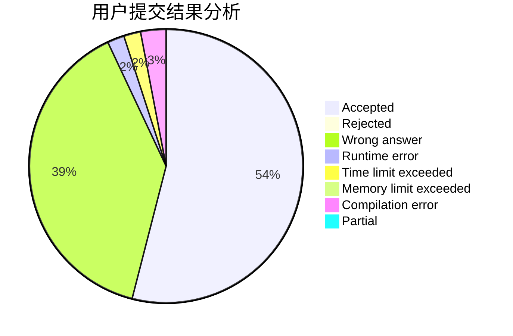
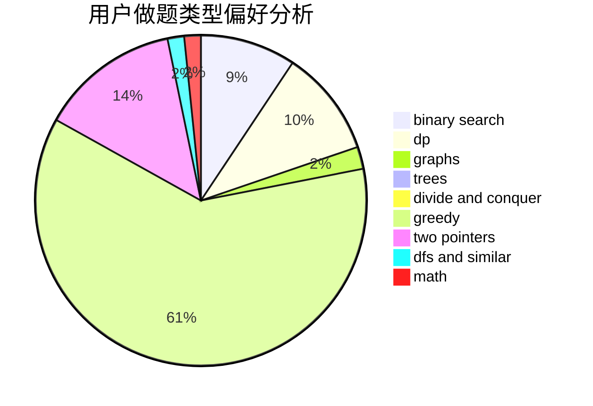

# L-jiji

<!-- tabs:start -->

#### **用户提交结果分析**

#### **用户做题类型偏好分析**

<!-- tabs:end -->
# 推荐题目
[845G](https://codeforces.com/contest/845/problem/G)
[963C](https://codeforces.com/contest/963/problem/C)
[1081D](https://codeforces.com/contest/1081/problem/D)
[906A](https://codeforces.com/contest/906/problem/A)
[291A](https://codeforces.com/contest/291/problem/A)
[922D](https://codeforces.com/contest/922/problem/D)
[74A](https://codeforces.com/contest/74/problem/A)
[811A](https://codeforces.com/contest/811/problem/A)
[1202D](https://codeforces.com/contest/1202/problem/D)
[1044F](https://codeforces.com/contest/1044/problem/F)
