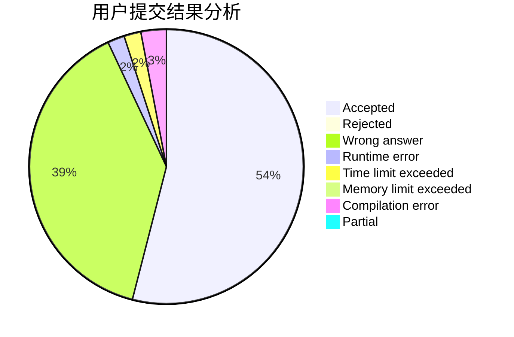
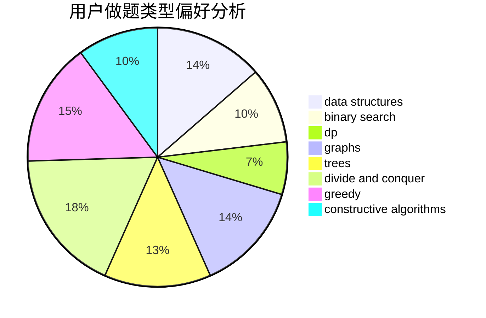
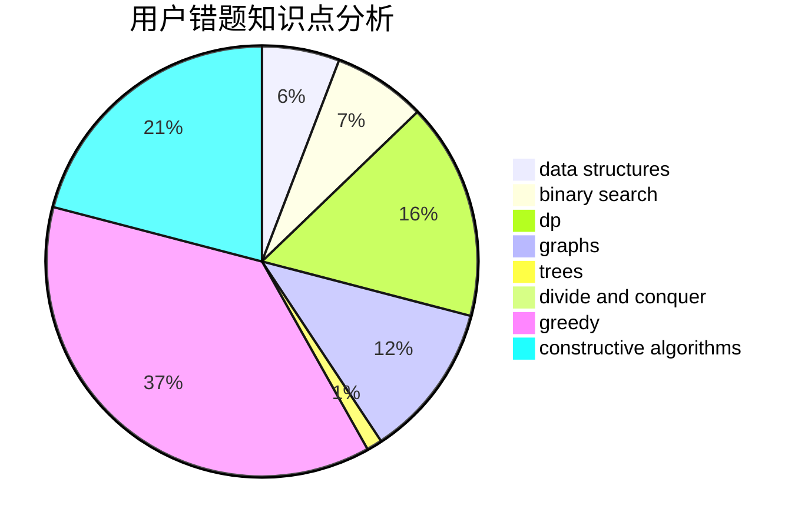

# L-jiji

<!-- tabs:start -->

#### **用户提交结果分析**

#### **用户做题类型偏好分析**

#### **用户错题知识点分析**

<!-- tabs:end -->
# 推荐题目
[827D](https://codeforces.com/contest/827/problem/D)		data structures,
                        dfs and similar,
                        graphs,
                        trees		  
[946F](https://codeforces.com/contest/946/problem/F)		combinatorics,
                        dp,
                        matrices		  
[1081A](https://codeforces.com/contest/1081/problem/A)		constructive algorithms,
                        math		  
[886F](https://codeforces.com/contest/886/problem/F)		geometry		  
[276D](https://codeforces.com/contest/276/problem/D)		bitmasks,
                        dp,
                        greedy,
                        implementation,
                        math		  
[908C](https://codeforces.com/contest/908/problem/C)		brute force,
                        geometry,
                        implementation,
                        math		  
[731E](https://codeforces.com/contest/731/problem/E)		dp,
                        games		  
[797B](https://codeforces.com/contest/797/problem/B)		dp,
                        greedy,
                        implementation		  
[1198F](https://codeforces.com/contest/1198/problem/F)		greedy,
                        number theory,
                        probabilities		  
[1044A](https://codeforces.com/contest/1044/problem/A)		binary search,
                        two pointers		  
