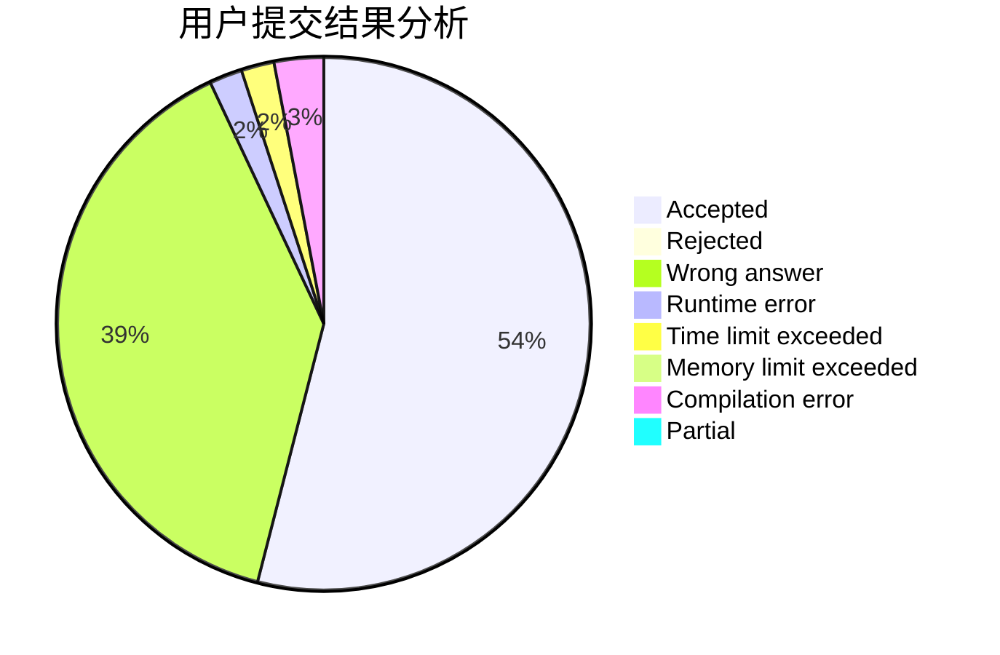
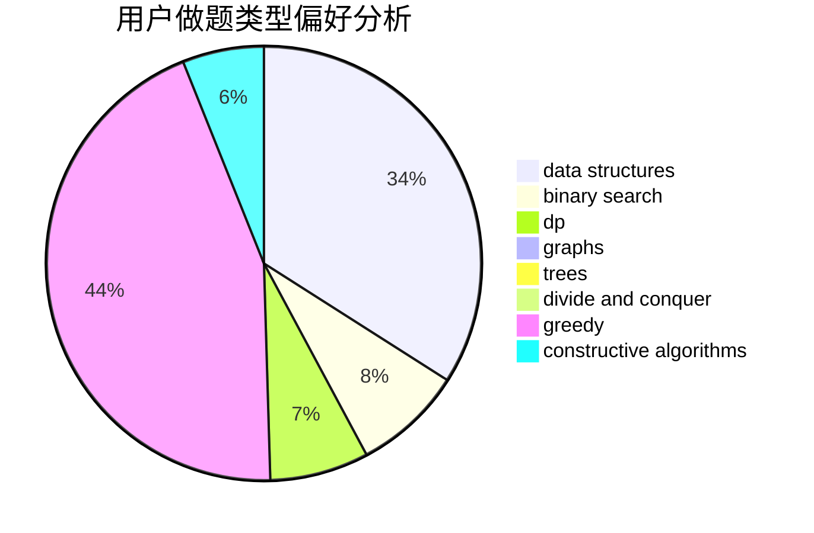

# L-jiji

<!-- tabs:start -->

#### **用户提交结果分析**

#### **用户做题类型偏好分析**

#### **用户错题知识点分析**

<!-- tabs:end -->
# 推荐题目
[845G](https://codeforces.com/contest/845/problem/G)		dfs and similar,
                        graphs,
                        math		  
[963C](https://codeforces.com/contest/963/problem/C)		brute force,
                        math,
                        number theory		  
[1081D](https://codeforces.com/contest/1081/problem/D)		dsu,
                        graphs,
                        shortest paths,
                        sortings		  
[906A](https://codeforces.com/contest/906/problem/A)		implementation,
                        strings		  
[291A](https://codeforces.com/contest/291/problem/A)		*special problem,
                        implementation,
                        sortings		  
[922D](https://codeforces.com/contest/922/problem/D)		greedy,
                        sortings		  
[74A](https://codeforces.com/contest/74/problem/A)		implementation		  
[811A](https://codeforces.com/contest/811/problem/A)		brute force,
                        implementation		  
[1202D](https://codeforces.com/contest/1202/problem/D)		combinatorics,
                        constructive algorithms,
                        math,
                        strings		  
[1044F](https://codeforces.com/contest/1044/problem/F)		data structures		  
