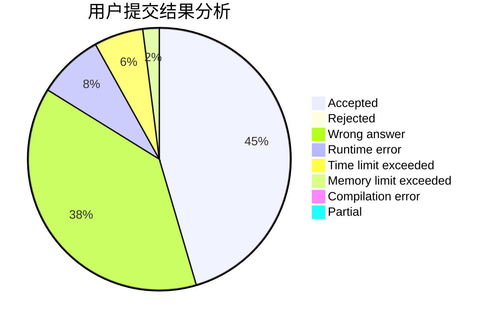
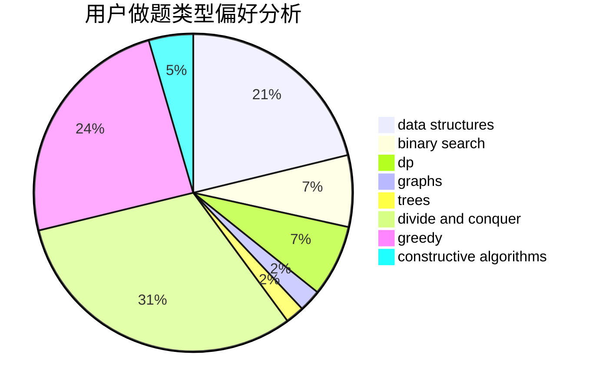
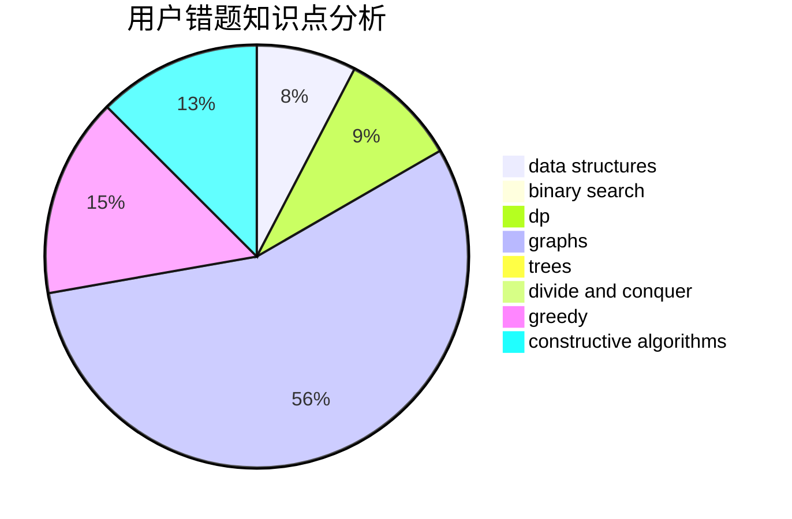

# L.I.

<!-- tabs:start -->

#### **用户提交结果分析**

#### **用户做题类型偏好分析**

#### **用户错题知识点分析**

<!-- tabs:end -->
# 推荐题目
[263A](https://codeforces.com/contest/263/problem/A)		implementation		  
[757E](https://codeforces.com/contest/757/problem/E)		brute force,
                        combinatorics,
                        dp,
                        number theory		  
[686A](https://codeforces.com/contest/686/problem/A)		constructive algorithms,
                        implementation		  
[1417D](https://codeforces.com/contest/1417/problem/D)		dsu,graphs,sortings,trees		  
[888E](https://codeforces.com/contest/888/problem/E)		bitmasks,
                        divide and conquer,
                        meet-in-the-middle		  
[1182D](https://codeforces.com/contest/1182/problem/D)		constructive algorithms,
                        dfs and similar,
                        dp,
                        hashing,
                        implementation,
                        trees		  
[1164F](https://codeforces.com/contest/1164/problem/F)		dsu,graphs,sortings,trees		  
[256D](https://codeforces.com/contest/256/problem/D)		dp		  
[707A](https://codeforces.com/contest/707/problem/A)		implementation		  
[746B](https://codeforces.com/contest/746/problem/B)		implementation,
                        strings		  
