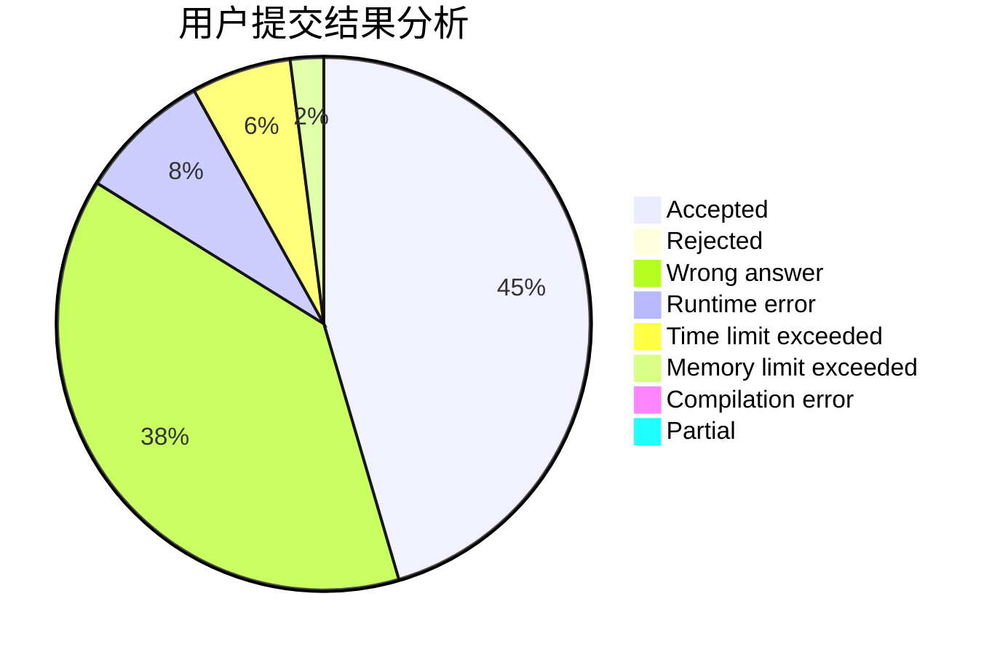
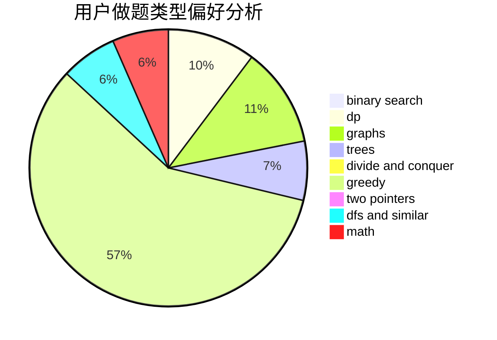

# L.I.

<!-- tabs:start -->

#### **用户提交结果分析**

#### **用户做题类型偏好分析**

<!-- tabs:end -->
# 推荐题目
[27D](https://codeforces.com/contest/27/problem/D)
[776D](https://codeforces.com/contest/776/problem/D)
[708A](https://codeforces.com/contest/708/problem/A)
[1425A](https://codeforces.com/contest/1425/problem/A)
[908C](https://codeforces.com/contest/908/problem/C)
[11852](https://codeforces.com/contest/1185/problem/2)
[1165C](https://codeforces.com/contest/1165/problem/C)
[274C](https://codeforces.com/contest/274/problem/C)
[725C](https://codeforces.com/contest/725/problem/C)
[765D](https://codeforces.com/contest/765/problem/D)
