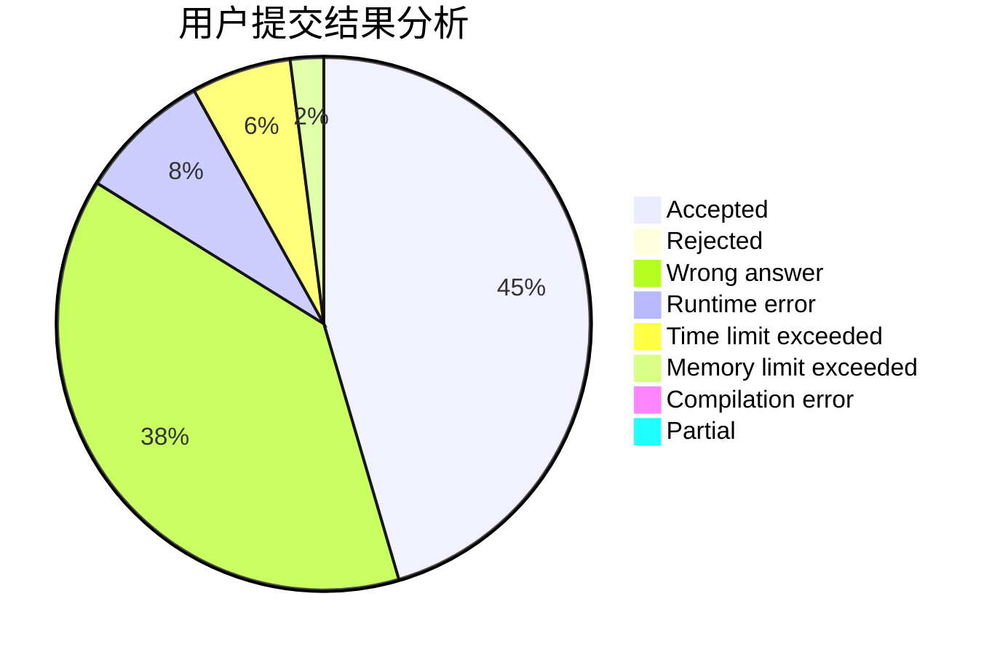
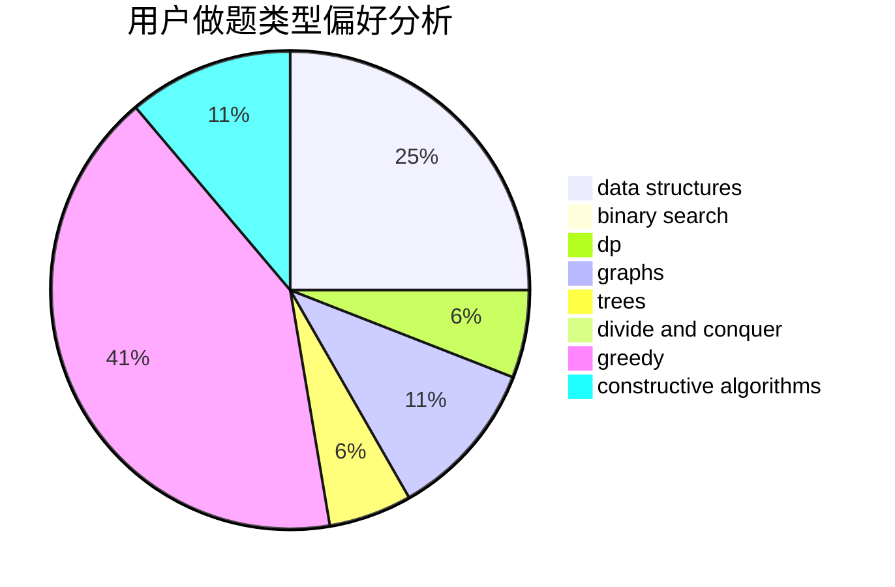
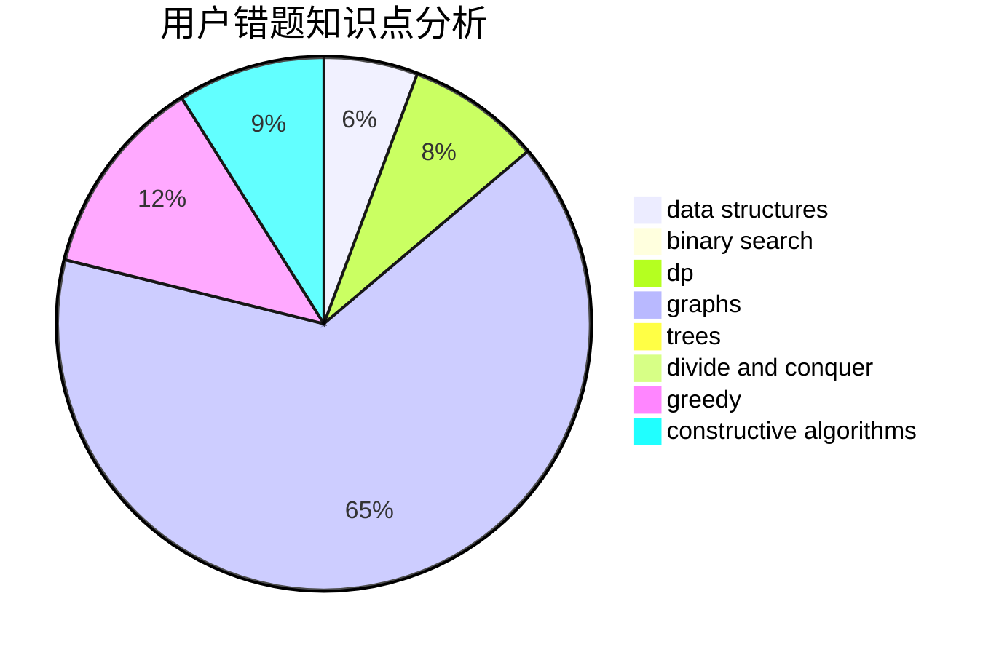

# L.I.

<!-- tabs:start -->

#### **用户提交结果分析**

#### **用户做题类型偏好分析**

#### **用户错题知识点分析**

<!-- tabs:end -->
# 推荐题目
[27D](https://codeforces.com/contest/27/problem/D)		2-sat,
                        dfs and similar,
                        dsu,
                        graphs		  
[776D](https://codeforces.com/contest/776/problem/D)		2-sat,
                        dfs and similar,
                        dsu,
                        graphs		  
[708A](https://codeforces.com/contest/708/problem/A)		constructive algorithms,
                        greedy,
                        implementation,
                        strings		  
[1425A](https://codeforces.com/contest/1425/problem/A)		games,
                        greedy		  
[908C](https://codeforces.com/contest/908/problem/C)		brute force,
                        geometry,
                        implementation,
                        math		  
[11852](https://codeforces.com/contest/1185/problem/2)		dsu,graphs,sortings,trees		  
[1165C](https://codeforces.com/contest/1165/problem/C)		greedy		  
[274C](https://codeforces.com/contest/274/problem/C)		brute force,
                        geometry		  
[725C](https://codeforces.com/contest/725/problem/C)		brute force,
                        constructive algorithms,
                        implementation,
                        strings		  
[765D](https://codeforces.com/contest/765/problem/D)		constructive algorithms,
                        dsu,
                        math		  
