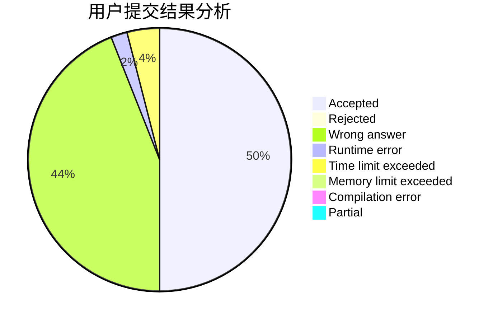
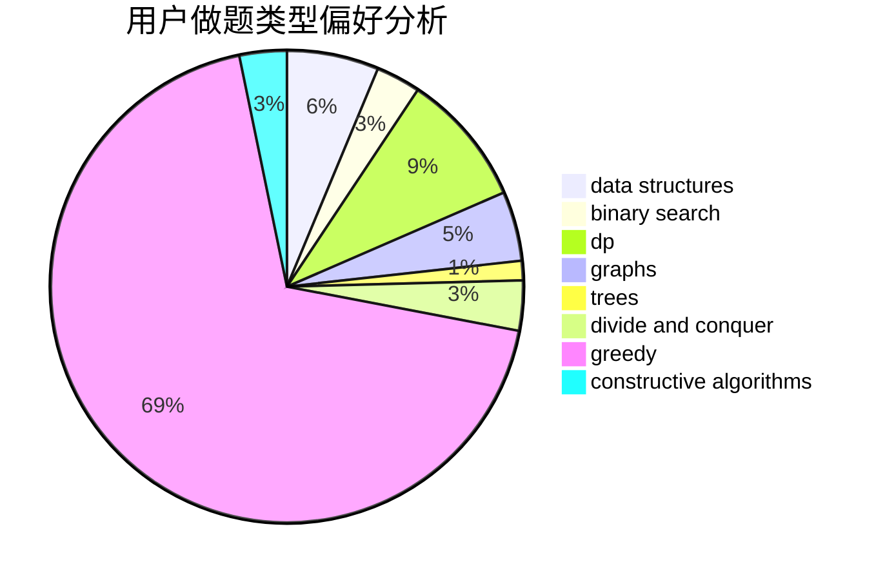
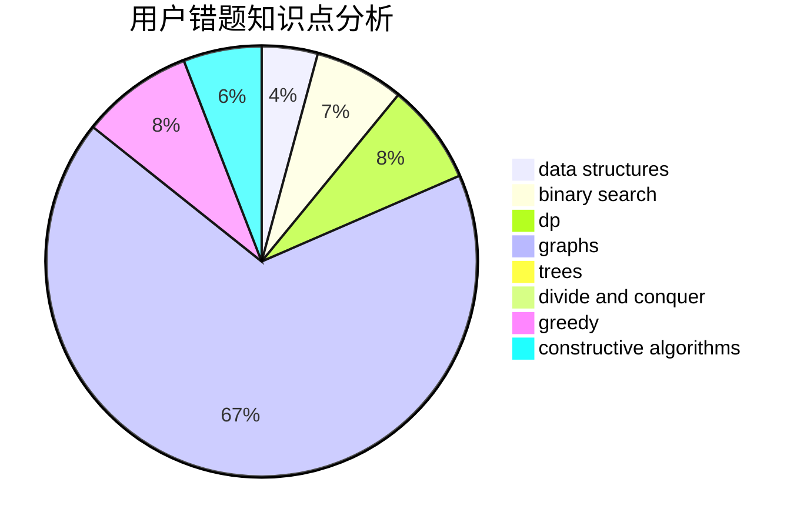

# 0Omega

<!-- tabs:start -->

#### **用户提交结果分析**

#### **用户做题类型偏好分析**

#### **用户错题知识点分析**

<!-- tabs:end -->
# 推荐题目
[1043G](https://codeforces.com/contest/1043/problem/G)		data structures,
                        divide and conquer,
                        hashing,
                        string suffix structures,
                        strings		  
[1045G](https://codeforces.com/contest/1045/problem/G)		data structures		  
[1054G](https://codeforces.com/contest/1054/problem/G)		constructive algorithms,
                        greedy,
                        math		  
[1054F](https://codeforces.com/contest/1054/problem/F)		flows,
                        graph matchings		  
[1051A](https://codeforces.com/contest/1051/problem/A)		greedy,
                        implementation,
                        strings		  
[1043F](https://codeforces.com/contest/1043/problem/F)		bitmasks,
                        combinatorics,
                        dp,
                        math,
                        number theory,
                        shortest paths		  
[1047A](https://codeforces.com/contest/1047/problem/A)		math		  
[1046C](https://codeforces.com/contest/1046/problem/C)		greedy		  
[1045I](https://codeforces.com/contest/1045/problem/I)		hashing,
                        strings		  
[1044A](https://codeforces.com/contest/1044/problem/A)		binary search,
                        two pointers		  
