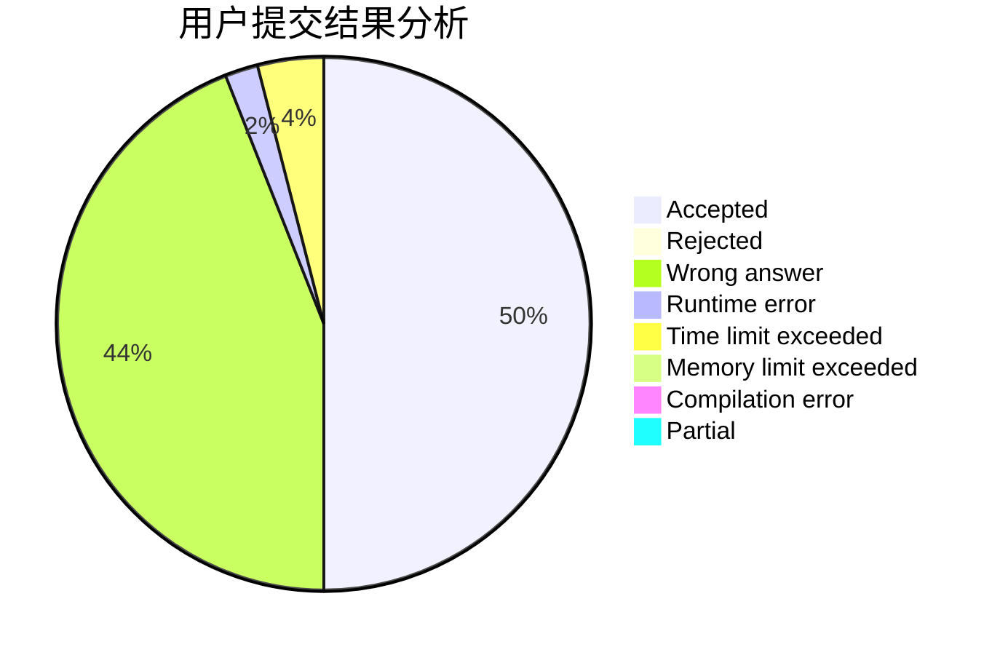
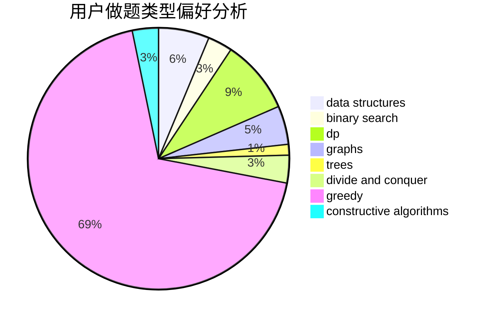
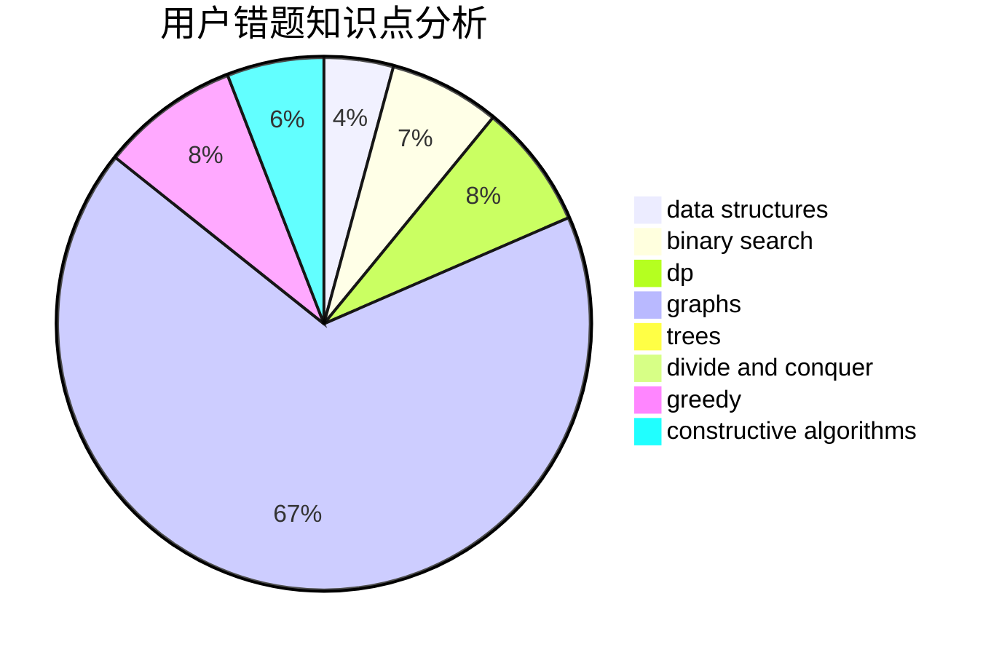

# 0Omega
<!-- tabs:start -->
#### **用户提交结果分析**

#### **用户做题类型偏好分析**

#### **用户错题知识点分析**

<!-- tabs:end -->
# 推荐题目
[Speckled Band](http://codeforces.com/problemset/problem/1043/G)		data structures,
                        divide and conquer,
                        hashing,
                        string suffix structures,
                        strings		  
[AI robots](http://codeforces.com/problemset/problem/1045/G)		data structures		  
[Euler tour](http://codeforces.com/problemset/problem/1053/E)		constructive algorithms,
                        trees		  
[Tree and XOR](http://codeforces.com/problemset/problem/1055/F)		strings,
                        trees		  
[Space Formula](http://codeforces.com/problemset/problem/1046/C)		greedy		  
[Little C Loves 3 I](http://codeforces.com/problemset/problem/1047/A)		math		  
[The Tower is Going Home](http://codeforces.com/problemset/problem/1044/A)		binary search,
                        two pointers		  
[Moonwalk challenge](http://codeforces.com/problemset/problem/1045/J)		data structures,
                        strings,
                        trees		  
[Vasya and Triangle](https://codeforces.com/contest/1053/problem/A)		geometry,
                        number theory		  
[Electric Scheme](http://codeforces.com/problemset/problem/1054/F)		flows,
                        graph matchings		  
<!-- tabs:start -->
#### **data structures**
[Speckled Band](http://codeforces.com/problemset/problem/1043/G)		data structures,
                        divide and conquer,
                        hashing,
                        string suffix structures,
                        strings		  
[AI robots](http://codeforces.com/problemset/problem/1045/G)		data structures		  
[Moonwalk challenge](http://codeforces.com/problemset/problem/1045/J)		data structures,
                        strings,
                        trees		  
[Deduction Queries](http://codeforces.com/problemset/problem/1044/D)		data structures,
                        dsu		  
[Putting Boxes Together](https://codeforces.com/contest/1053/problem/C)		data structures		  
[DFS](http://codeforces.com/problemset/problem/1044/F)		data structures		  
[Distinctification](http://codeforces.com/problemset/problem/1051/G)		data structures,
                        dsu,
                        greedy		  
[Vasya and Big Integers](http://codeforces.com/problemset/problem/1051/E)		binary search,
                        data structures,
                        dp,
                        hashing,
                        strings		  
[Maximum width](http://codeforces.com/problemset/problem/1492/C)		binary search,
                        data structures,
                        dp,
                        greedy,
                        two pointers		  
[Old Floppy Drive](http://codeforces.com/problemset/problem/1490/G)		binary search,
                        data structures,
                        math		  
#### **binary search**
[The Tower is Going Home](http://codeforces.com/problemset/problem/1044/A)		binary search,
                        two pointers		  
[Segments on the Line](http://codeforces.com/problemset/problem/1055/E)		binary search,
                        dp		  
[Vasya and Big Integers](http://codeforces.com/problemset/problem/1051/E)		binary search,
                        data structures,
                        dp,
                        hashing,
                        strings		  
[Maximum width](http://codeforces.com/problemset/problem/1492/C)		binary search,
                        data structures,
                        dp,
                        greedy,
                        two pointers		  
[Pairs](http://codeforces.com/problemset/problem/1463/D)		binary search,
                        constructive algorithms,
                        greedy,
                        two pointers		  
[Old Floppy Drive](http://codeforces.com/problemset/problem/1490/G)		binary search,
                        data structures,
                        math		  
[Odd Mineral Resource](http://codeforces.com/problemset/problem/1479/D)		binary search,
                        bitmasks,
                        brute force,
                        data structures,
                        probabilities,
                        trees		  
[Complicated Computations](http://codeforces.com/problemset/problem/1436/E)		binary search,
                        data structures,
                        two pointers		  
[Divide and Summarize](http://codeforces.com/problemset/problem/1461/D)		binary search,
                        brute force,
                        data structures,
                        divide and conquer,
                        implementation,
                        sortings		  
[K-beautiful Strings](http://codeforces.com/problemset/problem/1493/C)		binary search,
                        brute force,
                        constructive algorithms,
                        greedy,
                        strings		  
#### **dp**
[Vasya and Multisets](http://codeforces.com/problemset/problem/1051/C)		brute force,
                        dp,
                        greedy,
                        implementation,
                        math		  
[Segments on the Line](http://codeforces.com/problemset/problem/1055/E)		binary search,
                        dp		  
[Bicolorings](http://codeforces.com/problemset/problem/1051/D)		bitmasks,
                        dp		  
[Make It One](http://codeforces.com/problemset/problem/1043/F)		bitmasks,
                        combinatorics,
                        dp,
                        math,
                        number theory,
                        shortest paths		  
[Vasya and Big Integers](http://codeforces.com/problemset/problem/1051/E)		binary search,
                        data structures,
                        dp,
                        hashing,
                        strings		  
[Vasya and Good Sequences](https://codeforces.com/contest/1053/problem/B)		bitmasks,
                        dp		  
[Maximum width](http://codeforces.com/problemset/problem/1492/C)		binary search,
                        data structures,
                        dp,
                        greedy,
                        two pointers		  
[Bouncing Ball](https://codeforces.com/contest/1457/problem/C)		brute force,
                        dp,
                        implementation		  
[Pekora and Trampoline](http://codeforces.com/problemset/problem/1491/C)		brute force,
                        data structures,
                        dp,
                        greedy,
                        implementation		  
[Chef Monocarp](http://codeforces.com/problemset/problem/1437/C)		dp,
                        flows,
                        graph matchings,
                        greedy,
                        math,
                        sortings		  
#### **graph**
[Electric Scheme](http://codeforces.com/problemset/problem/1054/F)		flows,
                        graph matchings		  
[Metro](http://codeforces.com/problemset/problem/1055/A)		graphs		  
[The Shortest Statement](http://codeforces.com/problemset/problem/1051/F)		graphs,
                        shortest paths,
                        trees		  
[Relatively Prime Graph](http://codeforces.com/problemset/problem/1009/D)		brute force,
                        constructive algorithms,
                        graphs,
                        greedy,
                        math		  
[Hyperspace Highways](http://codeforces.com/problemset/problem/1045/C)		dfs and similar,
                        graphs,
                        trees		  
[Little C Loves 3 II](https://codeforces.com/contest/1047/problem/D)		brute force,
                        constructive algorithms,
                        flows,
                        graph matchings		  
[Military Problem](http://codeforces.com/problemset/problem/1006/E)		dfs and similar,
                        graphs,
                        trees		  
[Minimum Ties](http://codeforces.com/problemset/problem/1487/C)		brute force,
                        constructive algorithms,
                        dfs and similar,
                        graphs,
                        greedy,
                        implementation,
                        math		  
[Chef Monocarp](http://codeforces.com/problemset/problem/1437/C)		dp,
                        flows,
                        graph matchings,
                        greedy,
                        math,
                        sortings		  
[Strange Housing](http://codeforces.com/problemset/problem/1470/D)		constructive algorithms,
                        dfs and similar,
                        graph matchings,
                        graphs,
                        greedy		  
#### **trees**
[Euler tour](http://codeforces.com/problemset/problem/1053/E)		constructive algorithms,
                        trees		  
[Tree and XOR](http://codeforces.com/problemset/problem/1055/F)		strings,
                        trees		  
[Moonwalk challenge](http://codeforces.com/problemset/problem/1045/J)		data structures,
                        strings,
                        trees		  
[Intersecting Subtrees](http://codeforces.com/problemset/problem/1044/B)		dfs and similar,
                        interactive,
                        trees		  
[The Shortest Statement](http://codeforces.com/problemset/problem/1051/F)		graphs,
                        shortest paths,
                        trees		  
[Hyperspace Highways](http://codeforces.com/problemset/problem/1045/C)		dfs and similar,
                        graphs,
                        trees		  
[Military Problem](http://codeforces.com/problemset/problem/1006/E)		dfs and similar,
                        graphs,
                        trees		  
[Odd Mineral Resource](http://codeforces.com/problemset/problem/1479/D)		binary search,
                        bitmasks,
                        brute force,
                        data structures,
                        probabilities,
                        trees		  
[Yet Another Card Deck](http://codeforces.com/problemset/problem/1511/C)		brute force,
                        data structures,
                        implementation,
                        trees		  
[Diameter Cuts](http://codeforces.com/problemset/problem/1499/F)		combinatorics,
                        dfs and similar,
                        dp,
                        trees		  
#### **divide and conquer**
[Speckled Band](http://codeforces.com/problemset/problem/1043/G)		data structures,
                        divide and conquer,
                        hashing,
                        string suffix structures,
                        strings		  
[Divide and Summarize](http://codeforces.com/problemset/problem/1461/D)		binary search,
                        brute force,
                        data structures,
                        divide and conquer,
                        implementation,
                        sortings		  
[Song of the Sirens](http://codeforces.com/problemset/problem/1466/G)		combinatorics,
                        divide and conquer,
                        hashing,
                        math,
                        string suffix structures,
                        strings		  
[Permutation Transformation](http://codeforces.com/problemset/problem/1490/D)		dfs and similar,
                        divide and conquer,
                        implementation		  
[Skyline Photo](https://codeforces.com/contest/1483/problem/C)		data structures,
                        divide and conquer,
                        dp		  
[Fib-tree](http://codeforces.com/problemset/problem/1491/E)		brute force,
                        dfs and similar,
                        divide and conquer,
                        number theory,
                        trees		  
[Sum of Prefix Sums](http://codeforces.com/problemset/problem/1303/G)		data structures,
                        divide and conquer,
                        geometry,
                        trees		  
[Dogeforces](http://codeforces.com/problemset/problem/1494/D)		constructive algorithms,
                        data structures,
                        dfs and similar,
                        divide and conquer,
                        dsu,
                        greedy,
                        sortings,
                        trees		  
[Logistical Questions](http://codeforces.com/problemset/problem/566/C)		dfs and similar,
                        divide and conquer,
                        trees		  
[Fruit Sequences](http://codeforces.com/problemset/problem/1428/F)		binary search,
                        data structures,
                        divide and conquer,
                        dp,
                        two pointers		  
#### **greedy**
[Space Formula](http://codeforces.com/problemset/problem/1046/C)		greedy		  
[Vasya and Multisets](http://codeforces.com/problemset/problem/1051/C)		brute force,
                        dp,
                        greedy,
                        implementation,
                        math		  
[Relatively Prime Pairs](http://codeforces.com/problemset/problem/1051/B)		greedy,
                        math,
                        number theory		  
[Relatively Prime Graph](http://codeforces.com/problemset/problem/1009/D)		brute force,
                        constructive algorithms,
                        graphs,
                        greedy,
                        math		  
[New Road Network](http://codeforces.com/problemset/problem/1054/G)		constructive algorithms,
                        greedy,
                        math		  
[Vasya And Password](http://codeforces.com/problemset/problem/1051/A)		greedy,
                        implementation,
                        strings		  
[Refactoring](http://codeforces.com/problemset/problem/1055/D)		greedy,
                        implementation,
                        strings		  
[Changing Array](http://codeforces.com/problemset/problem/1054/D)		greedy,
                        implementation		  
[Train Hard, Win Easy](http://codeforces.com/problemset/problem/1043/E)		constructive algorithms,
                        greedy,
                        math,
                        sortings		  
[Smallest Word](http://codeforces.com/problemset/problem/1043/C)		constructive algorithms,
                        greedy,
                        implementation		  
#### **constructive algorithms**
[Euler tour](http://codeforces.com/problemset/problem/1053/E)		constructive algorithms,
                        trees		  
[Relatively Prime Graph](http://codeforces.com/problemset/problem/1009/D)		brute force,
                        constructive algorithms,
                        graphs,
                        greedy,
                        math		  
[New Road Network](http://codeforces.com/problemset/problem/1054/G)		constructive algorithms,
                        greedy,
                        math		  
[Little C Loves 3 II](https://codeforces.com/contest/1047/problem/D)		brute force,
                        constructive algorithms,
                        flows,
                        graph matchings		  
[Candies Distribution](http://codeforces.com/problemset/problem/1054/C)		constructive algorithms,
                        implementation		  
[Train Hard, Win Easy](http://codeforces.com/problemset/problem/1043/E)		constructive algorithms,
                        greedy,
                        math,
                        sortings		  
[Smallest Word](http://codeforces.com/problemset/problem/1043/C)		constructive algorithms,
                        greedy,
                        implementation		  
[Ancient civilizations](http://codeforces.com/problemset/problem/1045/E)		constructive algorithms,
                        geometry		  
[Anti-knapsack](http://codeforces.com/problemset/problem/1493/A)		constructive algorithms,
                        greedy		  
[Pairs](http://codeforces.com/problemset/problem/1463/D)		binary search,
                        constructive algorithms,
                        greedy,
                        two pointers		  
#### **sortings**
[Train Hard, Win Easy](http://codeforces.com/problemset/problem/1043/E)		constructive algorithms,
                        greedy,
                        math,
                        sortings		  
[Diamond Miner](https://codeforces.com/contest/1496/problem/C)		geometry,
                        greedy,
                        math,
                        sortings		  
[Meximization](http://codeforces.com/problemset/problem/1497/A)		brute force,
                        data structures,
                        greedy,
                        sortings		  
[Avoiding Zero](http://codeforces.com/problemset/problem/1427/A)		math,
                        sortings		  
[Divide and Summarize](http://codeforces.com/problemset/problem/1461/D)		binary search,
                        brute force,
                        data structures,
                        divide and conquer,
                        implementation,
                        sortings		  
[Chef Monocarp](http://codeforces.com/problemset/problem/1437/C)		dp,
                        flows,
                        graph matchings,
                        greedy,
                        math,
                        sortings		  
[Replacing Elements](http://codeforces.com/problemset/problem/1473/A)		greedy,
                        implementation,
                        math,
                        sortings		  
[Eastern Exhibition](http://codeforces.com/problemset/problem/1486/B)		binary search,
                        geometry,
                        shortest paths,
                        sortings		  
[The Great Hero](http://codeforces.com/problemset/problem/1480/B)		greedy,
                        implementation,
                        sortings		  
[Rescue Nibel!](http://codeforces.com/problemset/problem/1420/D)		combinatorics,
                        data structures,
                        sortings		  
<!-- tabs:end -->
