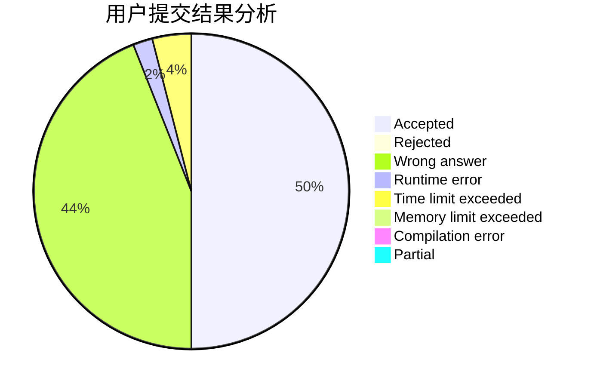
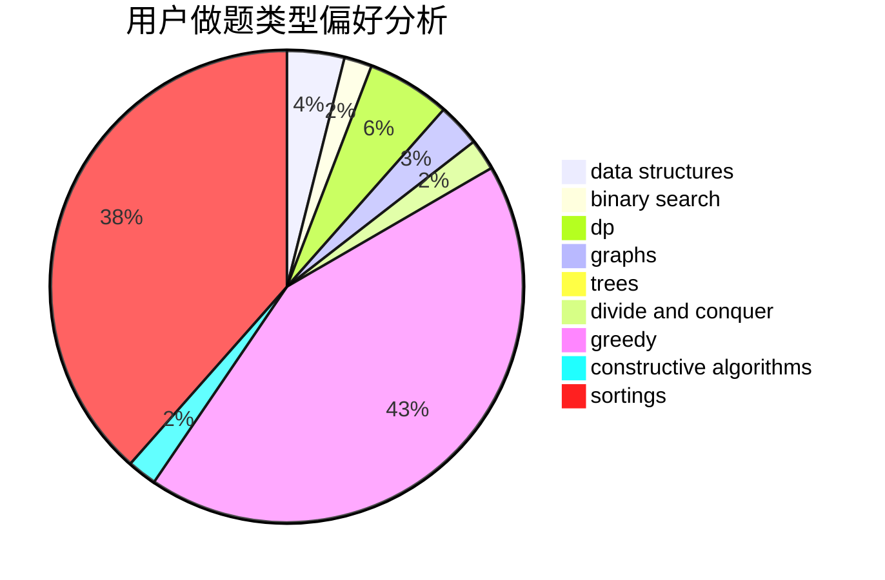
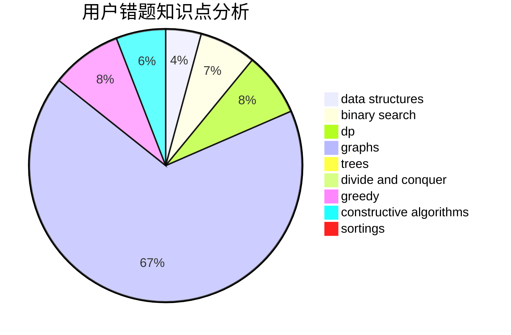

# 0Omega
<!-- tabs:start -->
#### **用户提交结果分析**

#### **用户做题类型偏好分析**

#### **用户错题知识点分析**

<!-- tabs:end -->
# 推荐题目
[1043G](http://codeforces.com/problemset/problem/1043/G)		data structures,
                        divide and conquer,
                        hashing,
                        string suffix structures,
                        strings		  
[1045G](http://codeforces.com/problemset/problem/1045/G)		data structures		  
[1053E](http://codeforces.com/problemset/problem/1053/E)		constructive algorithms,
                        trees		  
[1055F](http://codeforces.com/problemset/problem/1055/F)		strings,
                        trees		  
[1046C](http://codeforces.com/problemset/problem/1046/C)		greedy		  
[1047A](http://codeforces.com/problemset/problem/1047/A)		math		  
[1044A](http://codeforces.com/problemset/problem/1044/A)		binary search,
                        two pointers		  
[1045J](http://codeforces.com/problemset/problem/1045/J)		data structures,
                        strings,
                        trees		  
[1053A](https://codeforces.com/contest/1053/problem/A)		geometry,
                        number theory		  
[1054F](http://codeforces.com/problemset/problem/1054/F)		flows,
                        graph matchings		  
<!-- tabs:start -->
#### **data structures**
[1043G](http://codeforces.com/problemset/problem/1043/G)		data structures,
                        divide and conquer,
                        hashing,
                        string suffix structures,
                        strings		  
[1045G](http://codeforces.com/problemset/problem/1045/G)		data structures		  
[1045J](http://codeforces.com/problemset/problem/1045/J)		data structures,
                        strings,
                        trees		  
[1044D](http://codeforces.com/problemset/problem/1044/D)		data structures,
                        dsu		  
[1053C](https://codeforces.com/contest/1053/problem/C)		data structures		  
[1044F](http://codeforces.com/problemset/problem/1044/F)		data structures		  
[1051G](http://codeforces.com/problemset/problem/1051/G)		data structures,
                        dsu,
                        greedy		  
[1051E](http://codeforces.com/problemset/problem/1051/E)		binary search,
                        data structures,
                        dp,
                        hashing,
                        strings		  
[1492C](http://codeforces.com/problemset/problem/1492/C)		binary search,
                        data structures,
                        dp,
                        greedy,
                        two pointers		  
[1490G](http://codeforces.com/problemset/problem/1490/G)		binary search,
                        data structures,
                        math		  
#### **binary search**
[1044A](http://codeforces.com/problemset/problem/1044/A)		binary search,
                        two pointers		  
[1055E](http://codeforces.com/problemset/problem/1055/E)		binary search,
                        dp		  
[1051E](http://codeforces.com/problemset/problem/1051/E)		binary search,
                        data structures,
                        dp,
                        hashing,
                        strings		  
[1492C](http://codeforces.com/problemset/problem/1492/C)		binary search,
                        data structures,
                        dp,
                        greedy,
                        two pointers		  
[1463D](http://codeforces.com/problemset/problem/1463/D)		binary search,
                        constructive algorithms,
                        greedy,
                        two pointers		  
[1490G](http://codeforces.com/problemset/problem/1490/G)		binary search,
                        data structures,
                        math		  
[1479D](http://codeforces.com/problemset/problem/1479/D)		binary search,
                        bitmasks,
                        brute force,
                        data structures,
                        probabilities,
                        trees		  
[1436E](http://codeforces.com/problemset/problem/1436/E)		binary search,
                        data structures,
                        two pointers		  
[1461D](http://codeforces.com/problemset/problem/1461/D)		binary search,
                        brute force,
                        data structures,
                        divide and conquer,
                        implementation,
                        sortings		  
[1493C](http://codeforces.com/problemset/problem/1493/C)		binary search,
                        brute force,
                        constructive algorithms,
                        greedy,
                        strings		  
#### **dp**
[1051C](http://codeforces.com/problemset/problem/1051/C)		brute force,
                        dp,
                        greedy,
                        implementation,
                        math		  
[1055E](http://codeforces.com/problemset/problem/1055/E)		binary search,
                        dp		  
[1051D](http://codeforces.com/problemset/problem/1051/D)		bitmasks,
                        dp		  
[1043F](http://codeforces.com/problemset/problem/1043/F)		bitmasks,
                        combinatorics,
                        dp,
                        math,
                        number theory,
                        shortest paths		  
[1051E](http://codeforces.com/problemset/problem/1051/E)		binary search,
                        data structures,
                        dp,
                        hashing,
                        strings		  
[1053B](https://codeforces.com/contest/1053/problem/B)		bitmasks,
                        dp		  
[1492C](http://codeforces.com/problemset/problem/1492/C)		binary search,
                        data structures,
                        dp,
                        greedy,
                        two pointers		  
[1457C](https://codeforces.com/contest/1457/problem/C)		brute force,
                        dp,
                        implementation		  
[1491C](http://codeforces.com/problemset/problem/1491/C)		brute force,
                        data structures,
                        dp,
                        greedy,
                        implementation		  
[1437C](http://codeforces.com/problemset/problem/1437/C)		dp,
                        flows,
                        graph matchings,
                        greedy,
                        math,
                        sortings		  
#### **graph**
[1054F](http://codeforces.com/problemset/problem/1054/F)		flows,
                        graph matchings		  
[1055A](http://codeforces.com/problemset/problem/1055/A)		graphs		  
[1051F](http://codeforces.com/problemset/problem/1051/F)		graphs,
                        shortest paths,
                        trees		  
[1009D](http://codeforces.com/problemset/problem/1009/D)		brute force,
                        constructive algorithms,
                        graphs,
                        greedy,
                        math		  
[1045C](http://codeforces.com/problemset/problem/1045/C)		dfs and similar,
                        graphs,
                        trees		  
[1047D](https://codeforces.com/contest/1047/problem/D)		brute force,
                        constructive algorithms,
                        flows,
                        graph matchings		  
[1006E](http://codeforces.com/problemset/problem/1006/E)		dfs and similar,
                        graphs,
                        trees		  
[1487C](http://codeforces.com/problemset/problem/1487/C)		brute force,
                        constructive algorithms,
                        dfs and similar,
                        graphs,
                        greedy,
                        implementation,
                        math		  
[1437C](http://codeforces.com/problemset/problem/1437/C)		dp,
                        flows,
                        graph matchings,
                        greedy,
                        math,
                        sortings		  
[1470D](http://codeforces.com/problemset/problem/1470/D)		constructive algorithms,
                        dfs and similar,
                        graph matchings,
                        graphs,
                        greedy		  
#### **trees**
[1053E](http://codeforces.com/problemset/problem/1053/E)		constructive algorithms,
                        trees		  
[1055F](http://codeforces.com/problemset/problem/1055/F)		strings,
                        trees		  
[1045J](http://codeforces.com/problemset/problem/1045/J)		data structures,
                        strings,
                        trees		  
[1044B](http://codeforces.com/problemset/problem/1044/B)		dfs and similar,
                        interactive,
                        trees		  
[1051F](http://codeforces.com/problemset/problem/1051/F)		graphs,
                        shortest paths,
                        trees		  
[1045C](http://codeforces.com/problemset/problem/1045/C)		dfs and similar,
                        graphs,
                        trees		  
[1006E](http://codeforces.com/problemset/problem/1006/E)		dfs and similar,
                        graphs,
                        trees		  
[1479D](http://codeforces.com/problemset/problem/1479/D)		binary search,
                        bitmasks,
                        brute force,
                        data structures,
                        probabilities,
                        trees		  
[1511C](http://codeforces.com/problemset/problem/1511/C)		brute force,
                        data structures,
                        implementation,
                        trees		  
[1499F](http://codeforces.com/problemset/problem/1499/F)		combinatorics,
                        dfs and similar,
                        dp,
                        trees		  
#### **divide and conquer**
[1043G](http://codeforces.com/problemset/problem/1043/G)		data structures,
                        divide and conquer,
                        hashing,
                        string suffix structures,
                        strings		  
[1461D](http://codeforces.com/problemset/problem/1461/D)		binary search,
                        brute force,
                        data structures,
                        divide and conquer,
                        implementation,
                        sortings		  
[1466G](http://codeforces.com/problemset/problem/1466/G)		combinatorics,
                        divide and conquer,
                        hashing,
                        math,
                        string suffix structures,
                        strings		  
[1490D](http://codeforces.com/problemset/problem/1490/D)		dfs and similar,
                        divide and conquer,
                        implementation		  
[1483C](https://codeforces.com/contest/1483/problem/C)		data structures,
                        divide and conquer,
                        dp		  
[1491E](http://codeforces.com/problemset/problem/1491/E)		brute force,
                        dfs and similar,
                        divide and conquer,
                        number theory,
                        trees		  
[1303G](http://codeforces.com/problemset/problem/1303/G)		data structures,
                        divide and conquer,
                        geometry,
                        trees		  
[1494D](http://codeforces.com/problemset/problem/1494/D)		constructive algorithms,
                        data structures,
                        dfs and similar,
                        divide and conquer,
                        dsu,
                        greedy,
                        sortings,
                        trees		  
[1482E](http://codeforces.com/problemset/problem/1482/E)		data structures,
                        divide and conquer,
                        dp		  
[566C](http://codeforces.com/problemset/problem/566/C)		dfs and similar,
                        divide and conquer,
                        trees		  
#### **greedy**
[1046C](http://codeforces.com/problemset/problem/1046/C)		greedy		  
[1051C](http://codeforces.com/problemset/problem/1051/C)		brute force,
                        dp,
                        greedy,
                        implementation,
                        math		  
[1051B](http://codeforces.com/problemset/problem/1051/B)		greedy,
                        math,
                        number theory		  
[1009D](http://codeforces.com/problemset/problem/1009/D)		brute force,
                        constructive algorithms,
                        graphs,
                        greedy,
                        math		  
[1054G](http://codeforces.com/problemset/problem/1054/G)		constructive algorithms,
                        greedy,
                        math		  
[1051A](http://codeforces.com/problemset/problem/1051/A)		greedy,
                        implementation,
                        strings		  
[1055D](http://codeforces.com/problemset/problem/1055/D)		greedy,
                        implementation,
                        strings		  
[1054D](http://codeforces.com/problemset/problem/1054/D)		greedy,
                        implementation		  
[1043E](http://codeforces.com/problemset/problem/1043/E)		constructive algorithms,
                        greedy,
                        math,
                        sortings		  
[1043C](http://codeforces.com/problemset/problem/1043/C)		constructive algorithms,
                        greedy,
                        implementation		  
#### **constructive algorithms**
[1053E](http://codeforces.com/problemset/problem/1053/E)		constructive algorithms,
                        trees		  
[1009D](http://codeforces.com/problemset/problem/1009/D)		brute force,
                        constructive algorithms,
                        graphs,
                        greedy,
                        math		  
[1054G](http://codeforces.com/problemset/problem/1054/G)		constructive algorithms,
                        greedy,
                        math		  
[1047D](https://codeforces.com/contest/1047/problem/D)		brute force,
                        constructive algorithms,
                        flows,
                        graph matchings		  
[1054C](http://codeforces.com/problemset/problem/1054/C)		constructive algorithms,
                        implementation		  
[1043E](http://codeforces.com/problemset/problem/1043/E)		constructive algorithms,
                        greedy,
                        math,
                        sortings		  
[1043C](http://codeforces.com/problemset/problem/1043/C)		constructive algorithms,
                        greedy,
                        implementation		  
[1045E](http://codeforces.com/problemset/problem/1045/E)		constructive algorithms,
                        geometry		  
[1493A](http://codeforces.com/problemset/problem/1493/A)		constructive algorithms,
                        greedy		  
[1463D](http://codeforces.com/problemset/problem/1463/D)		binary search,
                        constructive algorithms,
                        greedy,
                        two pointers		  
#### **sortings**
[1043E](http://codeforces.com/problemset/problem/1043/E)		constructive algorithms,
                        greedy,
                        math,
                        sortings		  
[1496C](https://codeforces.com/contest/1496/problem/C)		geometry,
                        greedy,
                        math,
                        sortings		  
[1495A](http://codeforces.com/problemset/problem/1495/A)		geometry,
                        greedy,
                        math,
                        sortings		  
[1497A](http://codeforces.com/problemset/problem/1497/A)		brute force,
                        data structures,
                        greedy,
                        sortings		  
[1427A](http://codeforces.com/problemset/problem/1427/A)		math,
                        sortings		  
[1461D](http://codeforces.com/problemset/problem/1461/D)		binary search,
                        brute force,
                        data structures,
                        divide and conquer,
                        implementation,
                        sortings		  
[1437C](http://codeforces.com/problemset/problem/1437/C)		dp,
                        flows,
                        graph matchings,
                        greedy,
                        math,
                        sortings		  
[1473A](http://codeforces.com/problemset/problem/1473/A)		greedy,
                        implementation,
                        math,
                        sortings		  
[1486B](http://codeforces.com/problemset/problem/1486/B)		binary search,
                        geometry,
                        shortest paths,
                        sortings		  
[1480B](http://codeforces.com/problemset/problem/1480/B)		greedy,
                        implementation,
                        sortings		  
<!-- tabs:end -->
