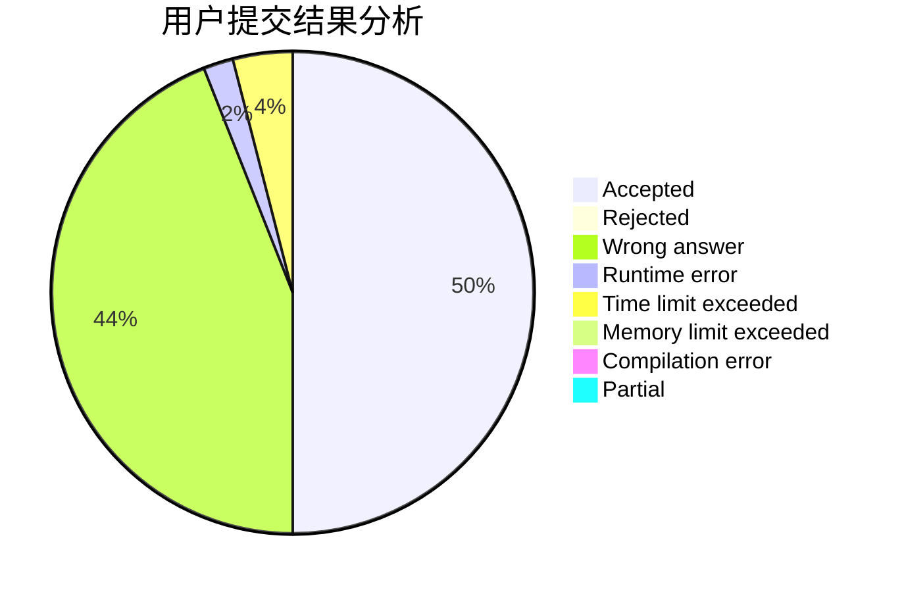
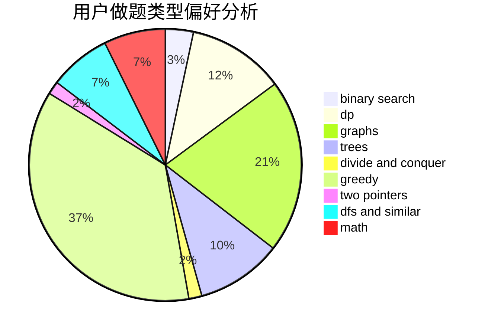

# 0Omega

<!-- tabs:start -->

#### **用户提交结果分析**

#### **用户做题类型偏好分析**

<!-- tabs:end -->
# 推荐题目
[1044D](https://codeforces.com/contest/1044/problem/D)
[1045J](https://codeforces.com/contest/1045/problem/J)
[1055B](https://codeforces.com/contest/1055/problem/B)
[1055A](https://codeforces.com/contest/1055/problem/A)
[1051D](https://codeforces.com/contest/1051/problem/D)
[1044B](https://codeforces.com/contest/1044/problem/B)
[1047D](https://codeforces.com/contest/1047/problem/D)
[1047A](https://codeforces.com/contest/1047/problem/A)
[1046H](https://codeforces.com/contest/1046/problem/H)
[1044F](https://codeforces.com/contest/1044/problem/F)
