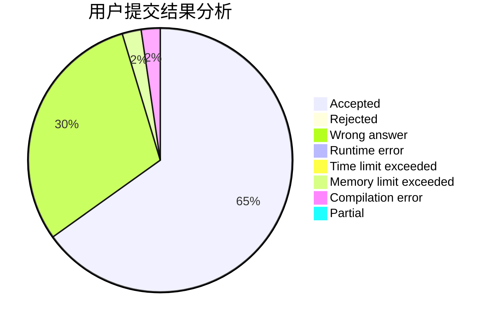
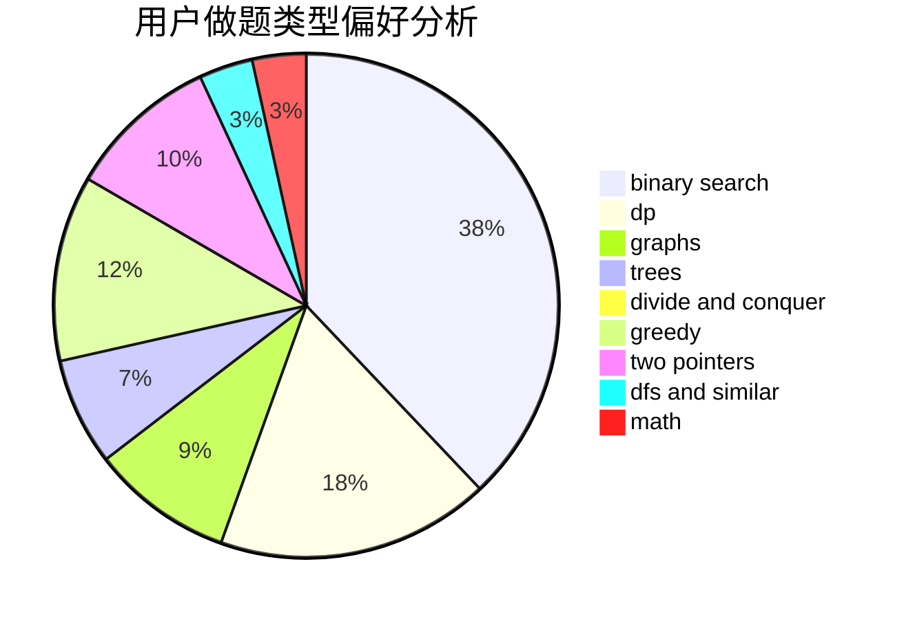

# 524288

<!-- tabs:start -->

#### **用户提交结果分析**

#### **用户做题类型偏好分析**

<!-- tabs:end -->
# 推荐题目
[1382E](https://codeforces.com/contest/1382/problem/E)
[1381E](https://codeforces.com/contest/1381/problem/E)
[1083A](https://codeforces.com/contest/1083/problem/A)
[118C](https://codeforces.com/contest/118/problem/C)
[1382B](https://codeforces.com/contest/1382/problem/B)
[1382A](https://codeforces.com/contest/1382/problem/A)
[13821](https://codeforces.com/contest/1382/problem/1)
[1381D](https://codeforces.com/contest/1381/problem/D)
[13822](https://codeforces.com/contest/1382/problem/2)
[1382D](https://codeforces.com/contest/1382/problem/D)
