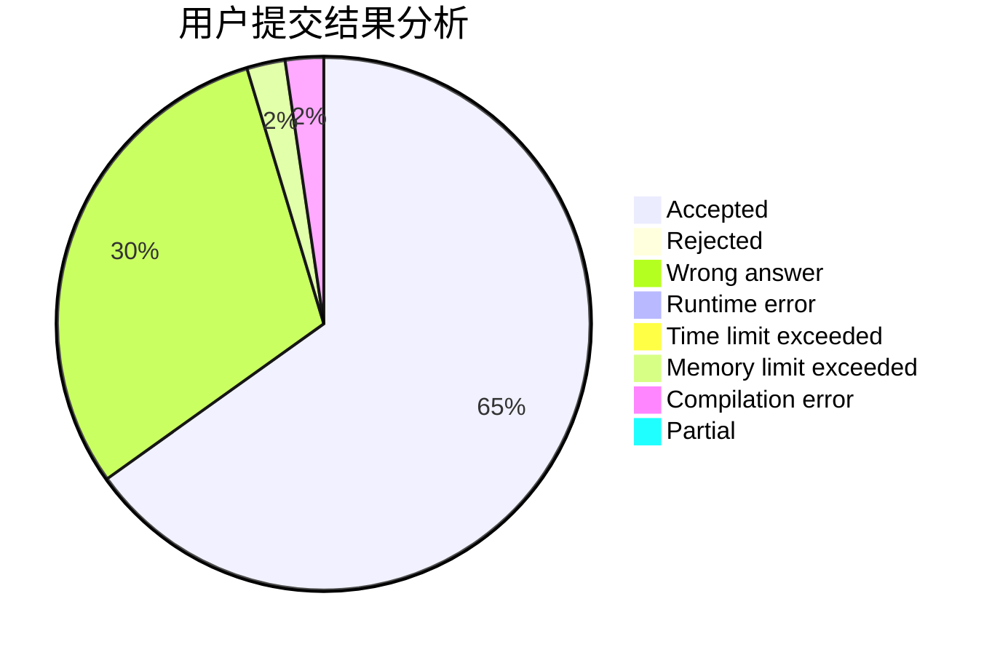
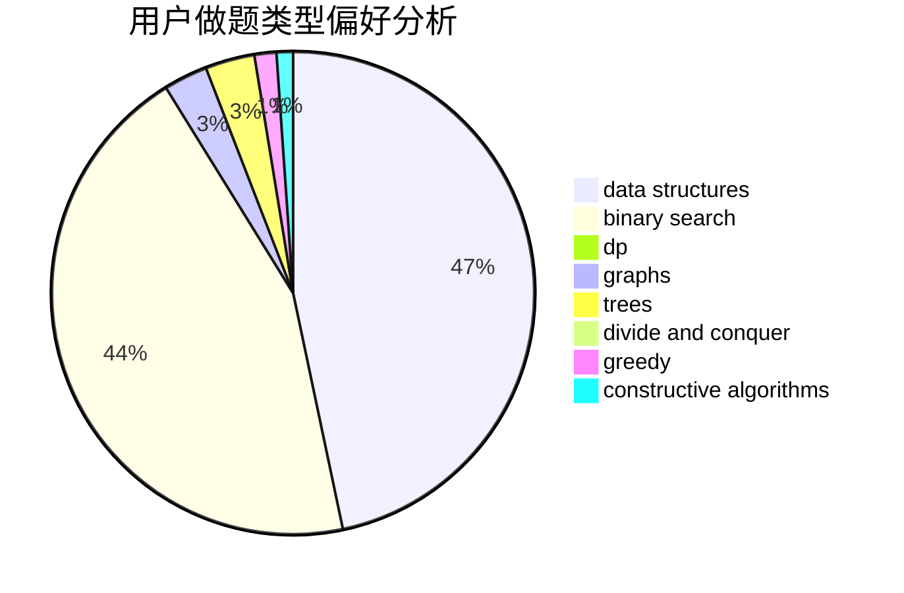
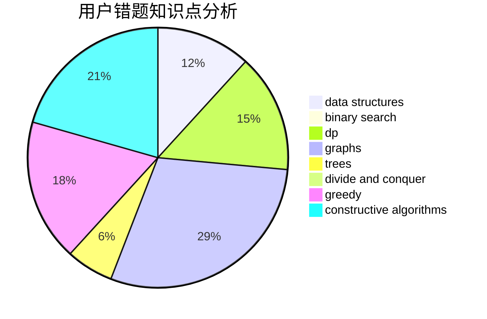

# 524288

<!-- tabs:start -->

#### **用户提交结果分析**

#### **用户做题类型偏好分析**

#### **用户错题知识点分析**

<!-- tabs:end -->
# 推荐题目
[1382E](https://codeforces.com/contest/1382/problem/E)		dsu,graphs,sortings,trees		  
[1381E](https://codeforces.com/contest/1381/problem/E)		geometry,
                        math,
                        sortings		  
[1083A](https://codeforces.com/contest/1083/problem/A)		data structures,
                        dp,
                        trees		  
[118C](https://codeforces.com/contest/118/problem/C)		brute force,
                        greedy,
                        sortings,
                        strings		  
[1382B](https://codeforces.com/contest/1382/problem/B)		dp,
                        games		  
[1382A](https://codeforces.com/contest/1382/problem/A)		brute force		  
[13821](https://codeforces.com/contest/1382/problem/1)		dsu,graphs,sortings,trees		  
[1381D](https://codeforces.com/contest/1381/problem/D)		dfs and similar,
                        dp,
                        greedy,
                        trees,
                        two pointers		  
[13822](https://codeforces.com/contest/1382/problem/2)		dsu,graphs,sortings,trees		  
[1382D](https://codeforces.com/contest/1382/problem/D)		dsu,graphs,sortings,trees		  
