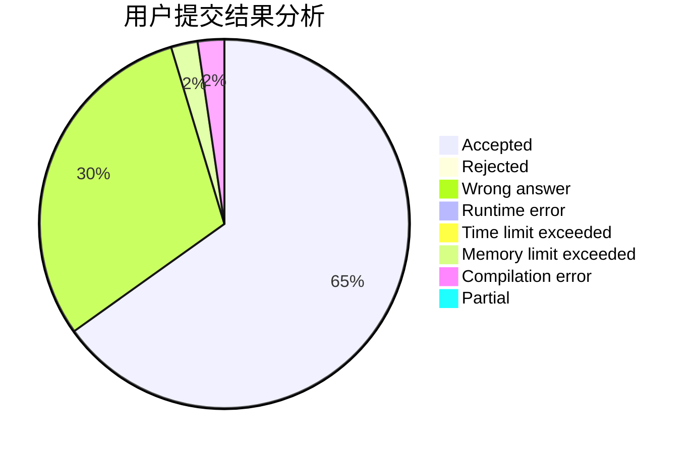
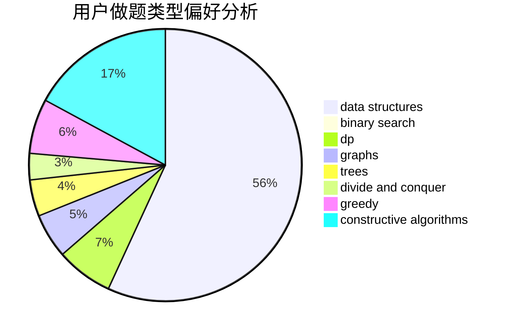
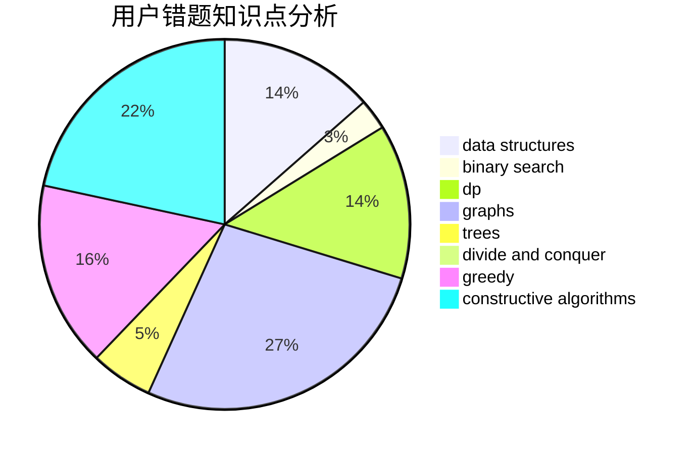

# 524288

<!-- tabs:start -->

#### **用户提交结果分析**

#### **用户做题类型偏好分析**

#### **用户错题知识点分析**

<!-- tabs:end -->
# 推荐题目
[1374A](https://codeforces.com/contest/1374/problem/A)		math		  
[1373B](https://codeforces.com/contest/1373/problem/B)		games		  
[1082E](https://codeforces.com/contest/1082/problem/E)		binary search,
                        dp,
                        greedy		  
[1185G2](https://codeforces.com/contest/1185G/problem/2)		combinatorics,
                        dp		  
[1373F](https://codeforces.com/contest/1373/problem/F)		binary search,
                        constructive algorithms,
                        data structures,
                        greedy		  
[1373E](https://codeforces.com/contest/1373/problem/E)		brute force,
                        constructive algorithms,
                        dp,
                        greedy		  
[1373C](https://codeforces.com/contest/1373/problem/C)		math		  
[1373A](https://codeforces.com/contest/1373/problem/A)		greedy,
                        implementation,
                        math		  
[1373D](https://codeforces.com/contest/1373/problem/D)		divide and conquer,
                        dp,
                        greedy,
                        implementation		  
[1373G](https://codeforces.com/contest/1373/problem/G)		data structures,
                        divide and conquer,
                        greedy		  
