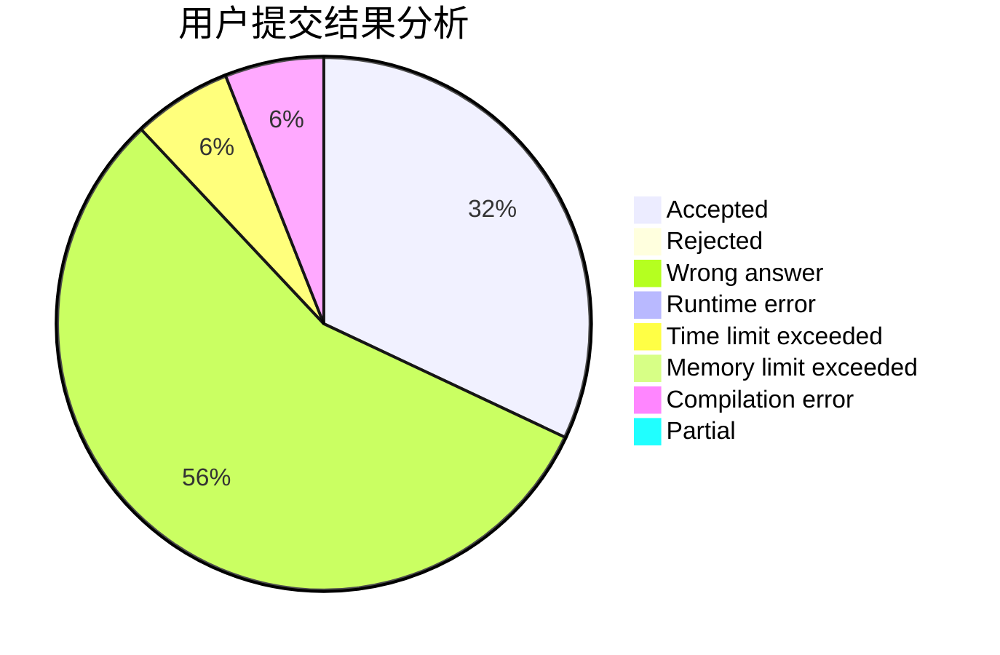
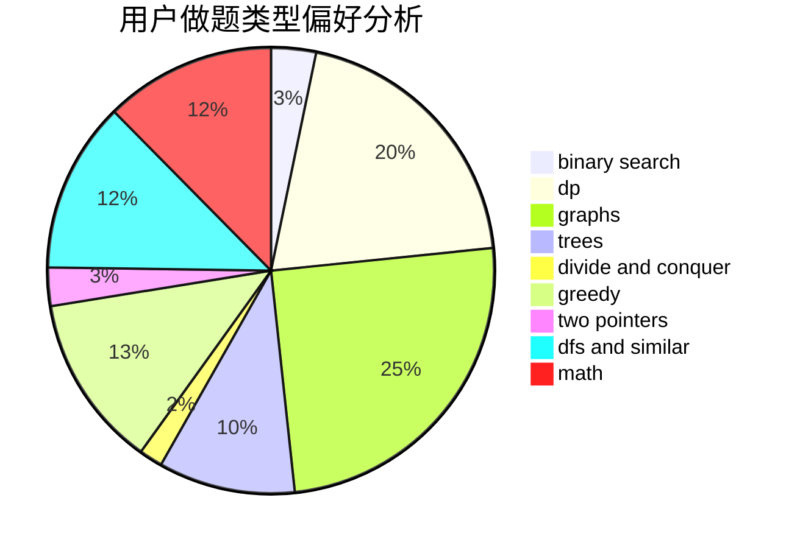

# L0vk

<!-- tabs:start -->

#### **用户提交结果分析**

#### **用户做题类型偏好分析**

<!-- tabs:end -->
# 推荐题目
[963E](https://codeforces.com/contest/963/problem/E)
[1267I](https://codeforces.com/contest/1267/problem/I)
[683B](https://codeforces.com/contest/683/problem/B)
[1113D](https://codeforces.com/contest/1113/problem/D)
[1167B](https://codeforces.com/contest/1167/problem/B)
[861C](https://codeforces.com/contest/861/problem/C)
[1245C](https://codeforces.com/contest/1245/problem/C)
[1239D](https://codeforces.com/contest/1239/problem/D)
[1283D](https://codeforces.com/contest/1283/problem/D)
[701C](https://codeforces.com/contest/701/problem/C)
