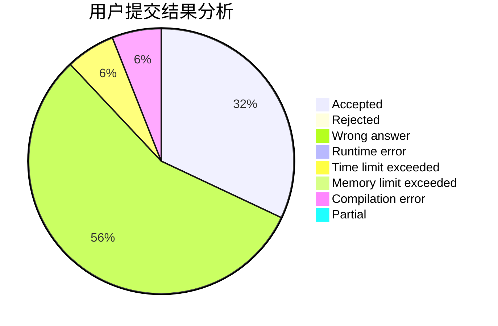
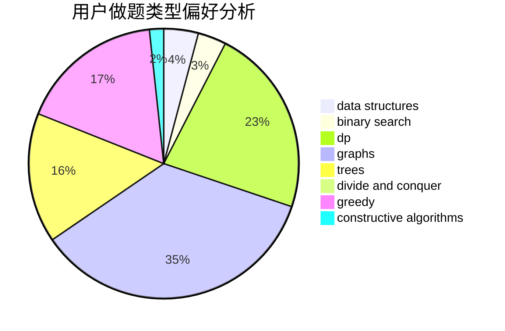
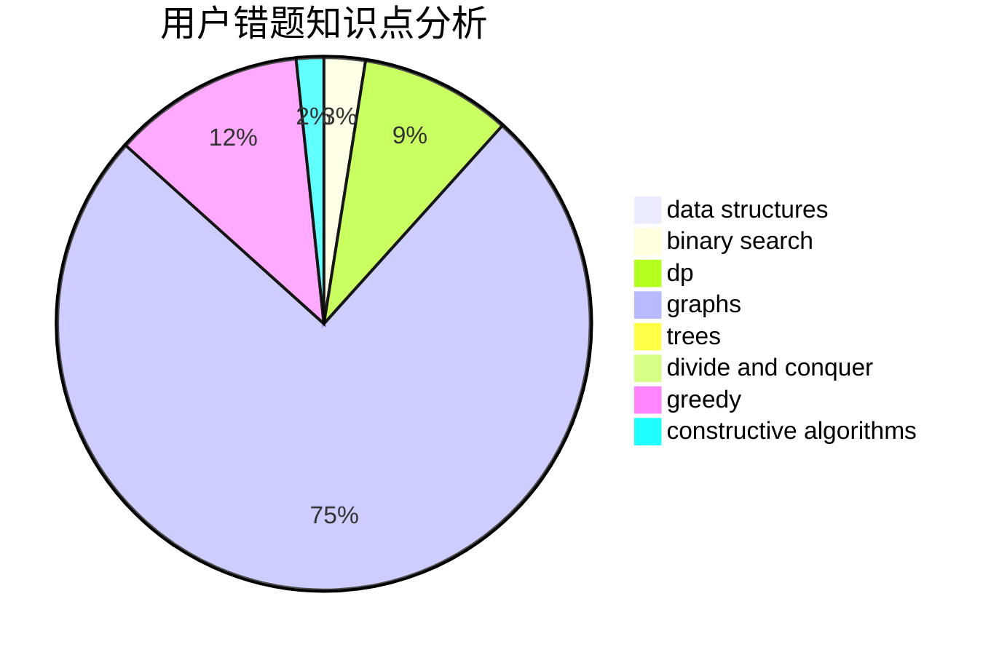

# L0vk

<!-- tabs:start -->

#### **用户提交结果分析**

#### **用户做题类型偏好分析**

#### **用户错题知识点分析**

<!-- tabs:end -->
# 推荐题目
[963E](https://codeforces.com/contest/963/problem/E)		math		  
[1267I](https://codeforces.com/contest/1267/problem/I)		brute force,
                        constructive algorithms,
                        implementation,
                        interactive,
                        sortings		  
[683B](https://codeforces.com/contest/683/problem/B)		*special problem		  
[1113D](https://codeforces.com/contest/1113/problem/D)		dsu,graphs,sortings,trees		  
[1167B](https://codeforces.com/contest/1167/problem/B)		brute force,
                        divide and conquer,
                        interactive,
                        math		  
[861C](https://codeforces.com/contest/861/problem/C)		dsu,graphs,sortings,trees		  
[1245C](https://codeforces.com/contest/1245/problem/C)		dp		  
[1239D](https://codeforces.com/contest/1239/problem/D)		2-sat,
                        dfs and similar,
                        graph matchings,
                        graphs		  
[1283D](https://codeforces.com/contest/1283/problem/D)		graphs,
                        greedy,
                        shortest paths		  
[701C](https://codeforces.com/contest/701/problem/C)		binary search,
                        strings,
                        two pointers		  
