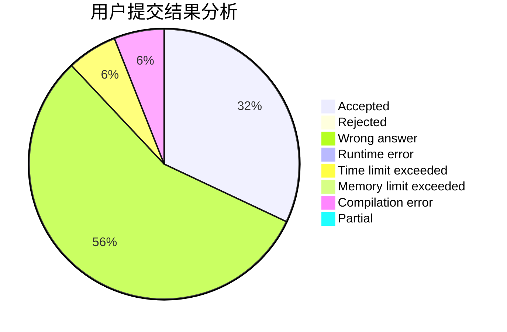
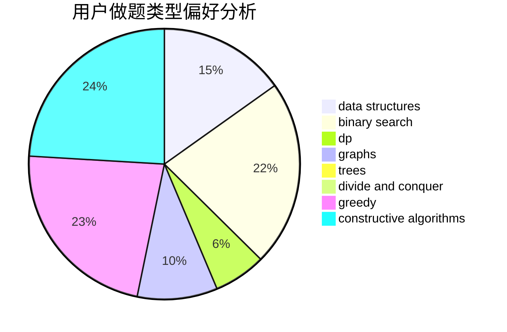
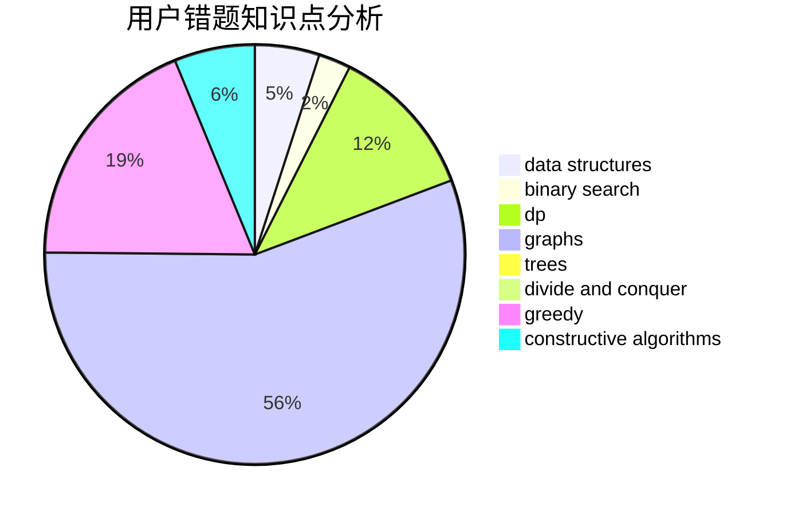

# L0vk

<!-- tabs:start -->

#### **用户提交结果分析**

#### **用户做题类型偏好分析**

#### **用户错题知识点分析**

<!-- tabs:end -->
# 推荐题目
[947A](https://codeforces.com/contest/947/problem/A)		dsu,graphs,sortings,trees		  
[1262A](https://codeforces.com/contest/1262/problem/A)		dsu,graphs,sortings,trees		  
[664A](https://codeforces.com/contest/664/problem/A)		math,
                        number theory		  
[1113A](https://codeforces.com/contest/1113/problem/A)		dp,
                        greedy,
                        math		  
[1164S](https://codeforces.com/contest/1164/problem/S)		dsu,graphs,sortings,trees		  
[842D](https://codeforces.com/contest/842/problem/D)		binary search,
                        data structures		  
[123E](https://codeforces.com/contest/123/problem/E)		dfs and similar,
                        dp,
                        probabilities,
                        trees		  
[1231C](https://codeforces.com/contest/1231/problem/C)		greedy		  
[1277B](https://codeforces.com/contest/1277/problem/B)		greedy,
                        number theory		  
[677C](https://codeforces.com/contest/677/problem/C)		bitmasks,
                        combinatorics,
                        implementation,
                        strings		  
