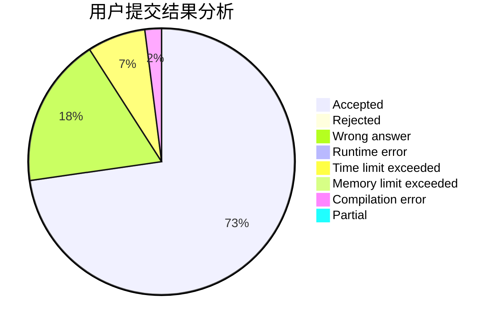
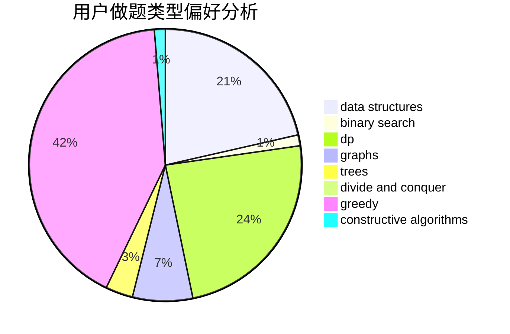

# L1ngYu233

<!-- tabs:start -->

#### **用户提交结果分析**

#### **用户做题类型偏好分析**

#### **用户错题知识点分析**

<!-- tabs:end -->
# 推荐题目
[664A](https://codeforces.com/contest/664/problem/A)		math,
                        number theory		  
[581B](https://codeforces.com/contest/581/problem/B)		implementation,
                        math		  
[699C](https://codeforces.com/contest/699/problem/C)		dsu,graphs,sortings,trees		  
[1013B](https://codeforces.com/contest/1013/problem/B)		greedy		  
[160A](https://codeforces.com/contest/160/problem/A)		greedy,
                        sortings		  
[622B](https://codeforces.com/contest/622/problem/B)		implementation		  
[833C](https://codeforces.com/contest/833/problem/C)		brute force,
                        combinatorics,
                        greedy,
                        math		  
[1207A](https://codeforces.com/contest/1207/problem/A)		brute force,
                        greedy,
                        implementation,
                        math		  
[261C](https://codeforces.com/contest/261/problem/C)		constructive algorithms,
                        dp,
                        math		  
[633H](https://codeforces.com/contest/633/problem/H)		data structures,
                        implementation		  
