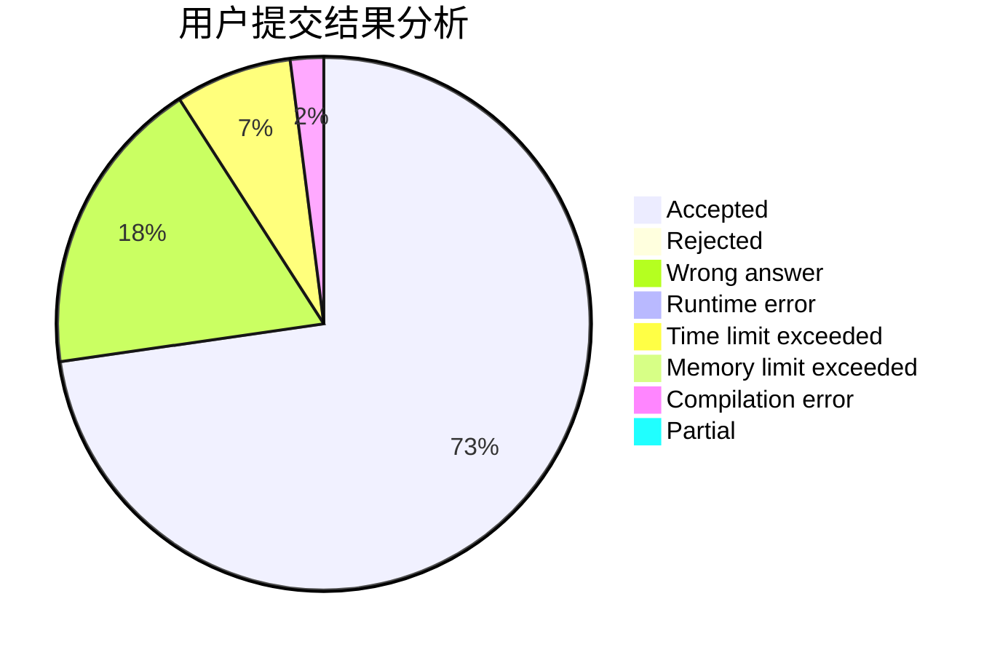
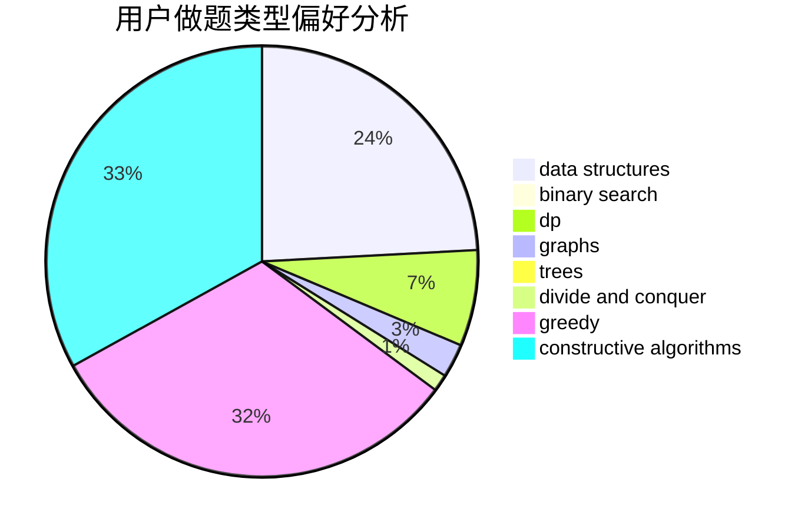

# L1ngYu233

<!-- tabs:start -->

#### **用户提交结果分析**

#### **用户做题类型偏好分析**

#### **用户错题知识点分析**

<!-- tabs:end -->
# 推荐题目
[683B](https://codeforces.com/contest/683/problem/B)		*special problem		  
[601C](https://codeforces.com/contest/601/problem/C)		dp,
                        math,
                        probabilities		  
[716B](https://codeforces.com/contest/716/problem/B)		greedy,
                        two pointers		  
[1013E](https://codeforces.com/contest/1013/problem/E)		dsu,graphs,sortings,trees		  
[183D](https://codeforces.com/contest/183/problem/D)		dp,
                        greedy,
                        probabilities		  
[650B](https://codeforces.com/contest/650/problem/B)		binary search,
                        brute force,
                        dp,
                        two pointers		  
[851C](https://codeforces.com/contest/851/problem/C)		dsu,graphs,sortings,trees		  
[1211A](https://codeforces.com/contest/1211/problem/A)		*special problem,
                        implementation		  
[27A](https://codeforces.com/contest/27/problem/A)		implementation,
                        sortings		  
[666C](https://codeforces.com/contest/666/problem/C)		combinatorics,
                        strings		  
