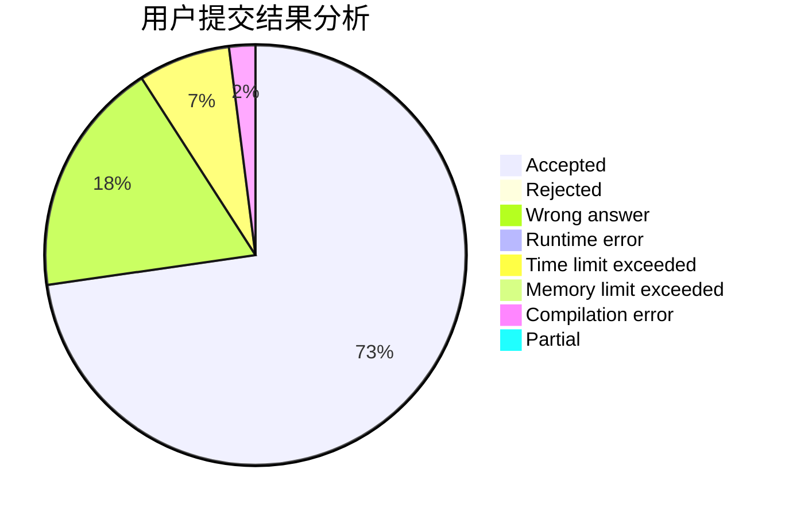
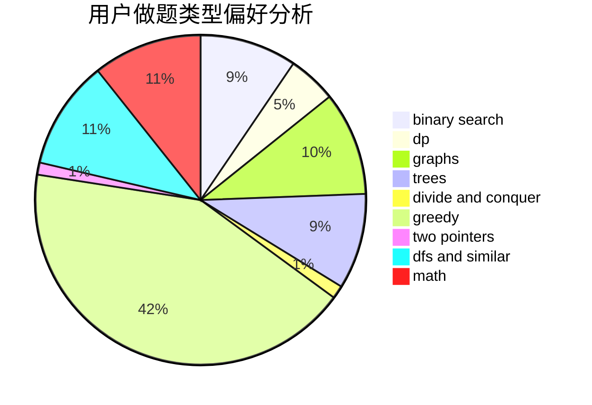

# L1ngYu233

<!-- tabs:start -->

#### **用户提交结果分析**

#### **用户做题类型偏好分析**

<!-- tabs:end -->
# 推荐题目
[683B](https://codeforces.com/contest/683/problem/B)
[601C](https://codeforces.com/contest/601/problem/C)
[716B](https://codeforces.com/contest/716/problem/B)
[1013E](https://codeforces.com/contest/1013/problem/E)
[183D](https://codeforces.com/contest/183/problem/D)
[650B](https://codeforces.com/contest/650/problem/B)
[851C](https://codeforces.com/contest/851/problem/C)
[1211A](https://codeforces.com/contest/1211/problem/A)
[27A](https://codeforces.com/contest/27/problem/A)
[666C](https://codeforces.com/contest/666/problem/C)
