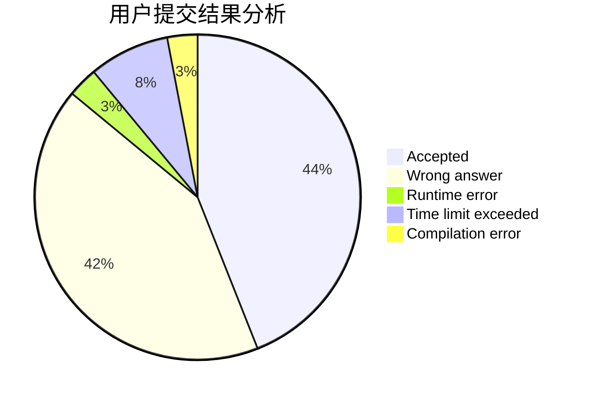
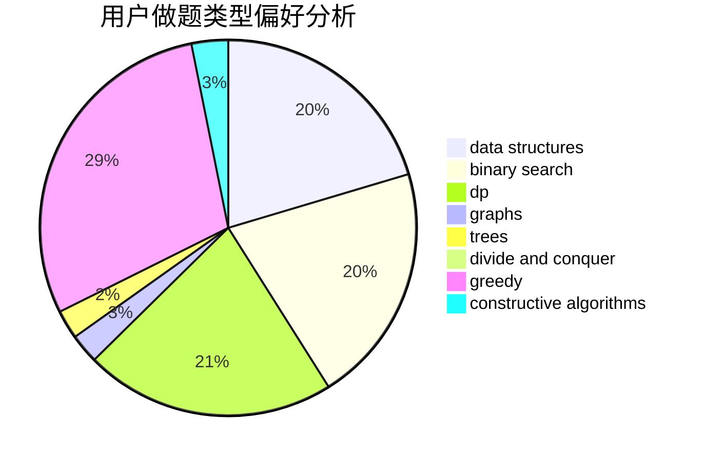
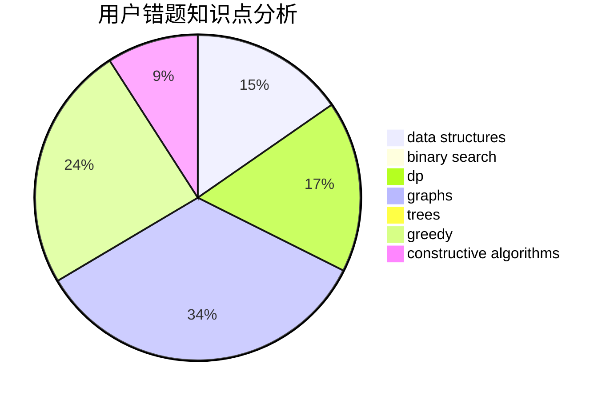

# LAMessi
<!-- tabs:start -->
#### **用户提交结果分析**

#### **用户做题类型偏好分析**

#### **用户错题知识点分析**

<!-- tabs:end -->
# 推荐题目
[Permutation Transformation](http://codeforces.com/problemset/problem/1490/D)		dfs and similar,
                        divide and conquer,
                        implementation		  
[Recover a functional graph](http://codeforces.com/problemset/problem/739/D)		graph matchings		  
[U2](https://codeforces.com/contest/1143/problem/F)		geometry		  
[Taxi](http://codeforces.com/problemset/problem/158/B)		*special problem,
                        greedy,
                        implementation		  
[Arpa and a list of numbers](https://codeforces.com/contest/851/problem/D)		implementation,
                        number theory		  
[Guess the Permutation](http://codeforces.com/problemset/problem/618/B)		constructive algorithms		  
[Queue](http://codeforces.com/problemset/problem/545/D)		greedy,
                        implementation,
                        sortings		  
[Spongebob and Squares](http://codeforces.com/problemset/problem/599/D)		brute force,
                        math		  
[Bus](http://codeforces.com/problemset/problem/864/C)		greedy,
                        implementation,
                        math		  
[A Trivial Problem](http://codeforces.com/problemset/problem/633/B)		brute force,
                        constructive algorithms,
                        math,
                        number theory		  
<!-- tabs:start -->
#### **data structures**
[Beautiful fountains rows](http://codeforces.com/problemset/problem/799/F)		data structures		  
[Subsegments](http://codeforces.com/problemset/problem/69/E)		data structures,
                        implementation		  
[Bombs](http://codeforces.com/problemset/problem/1326/E)		data structures,
                        two pointers		  
[Number of Components](http://codeforces.com/problemset/problem/1151/E)		combinatorics,
                        data structures,
                        dp,
                        math		  
[Perfect Security](https://codeforces.com/contest/947/problem/C)		data structures,
                        greedy,
                        strings,
                        trees		  
[Producing Snow](https://codeforces.com/contest/947/problem/B)		binary search,
                        data structures		  
[Lanterns](http://codeforces.com/problemset/problem/1476/F)		binary search,
                        data structures,
                        dp		  
[A and B and Interesting Substrings](http://codeforces.com/problemset/problem/519/D)		data structures,
                        dp,
                        two pointers		  
[Three strings](http://codeforces.com/problemset/problem/452/E)		data structures,
                        dsu,
                        string suffix structures,
                        strings		  
[Maximum width](http://codeforces.com/problemset/problem/1492/C)		binary search,
                        data structures,
                        dp,
                        greedy,
                        two pointers		  
#### **binary search**
[Game with modulo](https://codeforces.com/contest/1104/problem/D)		binary search,
                        constructive algorithms,
                        interactive		  
[Office Keys](https://codeforces.com/contest/831/problem/D)		binary search,
                        brute force,
                        dp,
                        greedy,
                        sortings		  
[Producing Snow](https://codeforces.com/contest/947/problem/B)		binary search,
                        data structures		  
[Lanterns](http://codeforces.com/problemset/problem/1476/F)		binary search,
                        data structures,
                        dp		  
[Chain Reaction](http://codeforces.com/problemset/problem/607/A)		binary search,
                        dp		  
[Maximum width](http://codeforces.com/problemset/problem/1492/C)		binary search,
                        data structures,
                        dp,
                        greedy,
                        two pointers		  
[Pairs](http://codeforces.com/problemset/problem/1463/D)		binary search,
                        constructive algorithms,
                        greedy,
                        two pointers		  
[Old Floppy Drive](http://codeforces.com/problemset/problem/1490/G)		binary search,
                        data structures,
                        math		  
[Odd Mineral Resource](http://codeforces.com/problemset/problem/1479/D)		binary search,
                        bitmasks,
                        brute force,
                        data structures,
                        probabilities,
                        trees		  
[Complicated Computations](http://codeforces.com/problemset/problem/1436/E)		binary search,
                        data structures,
                        two pointers		  
#### **dp**
[Office Keys](https://codeforces.com/contest/831/problem/D)		binary search,
                        brute force,
                        dp,
                        greedy,
                        sortings		  
[Two Editorials](http://codeforces.com/problemset/problem/1452/E)		brute force,
                        dp,
                        greedy,
                        sortings,
                        two pointers		  
[2-Coloring](http://codeforces.com/problemset/problem/1503/E)		combinatorics,
                        dp,
                        math		  
[Ivan the Fool and the Probability Theory](https://codeforces.com/contest/1248/problem/C)		combinatorics,
                        dp,
                        math		  
[Number of Components](http://codeforces.com/problemset/problem/1151/E)		combinatorics,
                        data structures,
                        dp,
                        math		  
[Boboniu and Bit Operations](http://codeforces.com/problemset/problem/1395/C)		bitmasks,
                        brute force,
                        dp,
                        greedy		  
[Lanterns](http://codeforces.com/problemset/problem/1476/F)		binary search,
                        data structures,
                        dp		  
[Chain Reaction](http://codeforces.com/problemset/problem/607/A)		binary search,
                        dp		  
[A and B and Interesting Substrings](http://codeforces.com/problemset/problem/519/D)		data structures,
                        dp,
                        two pointers		  
[Maximum width](http://codeforces.com/problemset/problem/1492/C)		binary search,
                        data structures,
                        dp,
                        greedy,
                        two pointers		  
#### **graph**
[Recover a functional graph](http://codeforces.com/problemset/problem/739/D)		graph matchings		  
[Minimum Ties](http://codeforces.com/problemset/problem/1487/C)		brute force,
                        constructive algorithms,
                        dfs and similar,
                        graphs,
                        greedy,
                        implementation,
                        math		  
[Chef Monocarp](http://codeforces.com/problemset/problem/1437/C)		dp,
                        flows,
                        graph matchings,
                        greedy,
                        math,
                        sortings		  
[Strange Housing](http://codeforces.com/problemset/problem/1470/D)		constructive algorithms,
                        dfs and similar,
                        graph matchings,
                        graphs,
                        greedy		  
[Longest Simple Cycle](http://codeforces.com/problemset/problem/1476/C)		dp,
                        graphs,
                        greedy		  
[Shortest and Longest LIS](http://codeforces.com/problemset/problem/1304/D)		constructive algorithms,
                        graphs,
                        greedy,
                        two pointers		  
[Ball in Berland](http://codeforces.com/problemset/problem/1475/C)		combinatorics,
                        graphs,
                        math		  
[Kyoya and Train](http://codeforces.com/problemset/problem/553/E)		dp,
                        fft,
                        graphs,
                        math,
                        probabilities		  
[Garden of the Sun](http://codeforces.com/problemset/problem/1495/C)		constructive algorithms,
                        graphs		  
[King's Task](http://codeforces.com/problemset/problem/1510/K)		brute force,
                        graphs,
                        implementation		  
#### **trees**
[Petya and Catacombs](https://codeforces.com/contest/890/problem/C)		dsu,
                        greedy,
                        implementation,
                        trees		  
[Add on a Tree](http://codeforces.com/problemset/problem/1188/A1)		trees		  
[Perfect Security](https://codeforces.com/contest/947/problem/C)		data structures,
                        greedy,
                        strings,
                        trees		  
[Odd Mineral Resource](http://codeforces.com/problemset/problem/1479/D)		binary search,
                        bitmasks,
                        brute force,
                        data structures,
                        probabilities,
                        trees		  
[Yet Another Card Deck](http://codeforces.com/problemset/problem/1511/C)		brute force,
                        data structures,
                        implementation,
                        trees		  
[Diameter Cuts](http://codeforces.com/problemset/problem/1499/F)		combinatorics,
                        dfs and similar,
                        dp,
                        trees		  
[Fib-tree](http://codeforces.com/problemset/problem/1491/E)		brute force,
                        dfs and similar,
                        divide and conquer,
                        number theory,
                        trees		  
[13th Labour of Heracles](http://codeforces.com/problemset/problem/1466/D)		data structures,
                        greedy,
                        sortings,
                        trees		  
[BFS Trees](http://codeforces.com/problemset/problem/1495/D)		combinatorics,
                        dfs and similar,
                        graphs,
                        math,
                        shortest paths,
                        trees		  
[Sum of Prefix Sums](http://codeforces.com/problemset/problem/1303/G)		data structures,
                        divide and conquer,
                        geometry,
                        trees		  
#### **divide and conquer**
[Permutation Transformation](http://codeforces.com/problemset/problem/1490/D)		dfs and similar,
                        divide and conquer,
                        implementation		  
[Lost Numbers](http://codeforces.com/problemset/problem/1167/B)		brute force,
                        divide and conquer,
                        interactive,
                        math		  
[Divide and Summarize](http://codeforces.com/problemset/problem/1461/D)		binary search,
                        brute force,
                        data structures,
                        divide and conquer,
                        implementation,
                        sortings		  
[Song of the Sirens](http://codeforces.com/problemset/problem/1466/G)		combinatorics,
                        divide and conquer,
                        hashing,
                        math,
                        string suffix structures,
                        strings		  
[Skyline Photo](https://codeforces.com/contest/1483/problem/C)		data structures,
                        divide and conquer,
                        dp		  
[Fib-tree](http://codeforces.com/problemset/problem/1491/E)		brute force,
                        dfs and similar,
                        divide and conquer,
                        number theory,
                        trees		  
[Sum of Prefix Sums](http://codeforces.com/problemset/problem/1303/G)		data structures,
                        divide and conquer,
                        geometry,
                        trees		  
[Dogeforces](http://codeforces.com/problemset/problem/1494/D)		constructive algorithms,
                        data structures,
                        dfs and similar,
                        divide and conquer,
                        dsu,
                        greedy,
                        sortings,
                        trees		  
[Logistical Questions](http://codeforces.com/problemset/problem/566/C)		dfs and similar,
                        divide and conquer,
                        trees		  
[Fruit Sequences](http://codeforces.com/problemset/problem/1428/F)		binary search,
                        data structures,
                        divide and conquer,
                        dp,
                        two pointers		  
#### **greedy**
[Taxi](http://codeforces.com/problemset/problem/158/B)		*special problem,
                        greedy,
                        implementation		  
[Queue](http://codeforces.com/problemset/problem/545/D)		greedy,
                        implementation,
                        sortings		  
[Bus](http://codeforces.com/problemset/problem/864/C)		greedy,
                        implementation,
                        math		  
[Polycarp at the Radio](http://codeforces.com/problemset/problem/723/C)		greedy		  
[Office Keys](https://codeforces.com/contest/831/problem/D)		binary search,
                        brute force,
                        dp,
                        greedy,
                        sortings		  
[Weakened Common Divisor](http://codeforces.com/problemset/problem/1025/B)		brute force,
                        greedy,
                        number theory		  
[What Is It?](http://codeforces.com/problemset/problem/1474/E)		constructive algorithms,
                        greedy		  
[Array Product](http://codeforces.com/problemset/problem/1042/C)		constructive algorithms,
                        greedy,
                        math		  
[Petya and Catacombs](https://codeforces.com/contest/890/problem/C)		dsu,
                        greedy,
                        implementation,
                        trees		  
[Complete the Word](http://codeforces.com/problemset/problem/716/B)		greedy,
                        two pointers		  
#### **constructive algorithms**
[Guess the Permutation](http://codeforces.com/problemset/problem/618/B)		constructive algorithms		  
[A Trivial Problem](http://codeforces.com/problemset/problem/633/B)		brute force,
                        constructive algorithms,
                        math,
                        number theory		  
[Removing Columns](https://codeforces.com/contest/497/problem/A)		brute force,
                        constructive algorithms,
                        implementation		  
[Far Relative’s Birthday Cake](http://codeforces.com/problemset/problem/629/A)		brute force,
                        combinatorics,
                        constructive algorithms,
                        implementation		  
[Tram](http://codeforces.com/problemset/problem/746/C)		constructive algorithms,
                        implementation,
                        math		  
[Game with modulo](https://codeforces.com/contest/1104/problem/D)		binary search,
                        constructive algorithms,
                        interactive		  
[New Year's Eve](http://codeforces.com/problemset/problem/912/B)		bitmasks,
                        constructive algorithms,
                        number theory		  
[What Is It?](http://codeforces.com/problemset/problem/1474/E)		constructive algorithms,
                        greedy		  
[Array Product](http://codeforces.com/problemset/problem/1042/C)		constructive algorithms,
                        greedy,
                        math		  
[Easy Chess](http://codeforces.com/problemset/problem/1089/E)		constructive algorithms		  
#### **sortings**
[Queue](http://codeforces.com/problemset/problem/545/D)		greedy,
                        implementation,
                        sortings		  
[Office Keys](https://codeforces.com/contest/831/problem/D)		binary search,
                        brute force,
                        dp,
                        greedy,
                        sortings		  
[The New Year: Meeting Friends](http://codeforces.com/problemset/problem/723/A)		implementation,
                        math,
                        sortings		  
[Two Editorials](http://codeforces.com/problemset/problem/1452/E)		brute force,
                        dp,
                        greedy,
                        sortings,
                        two pointers		  
[Power Sequence](http://codeforces.com/problemset/problem/1397/B)		brute force,
                        math,
                        number theory,
                        sortings		  
[Diamond Miner](https://codeforces.com/contest/1496/problem/C)		geometry,
                        greedy,
                        math,
                        sortings		  
[Meximization](http://codeforces.com/problemset/problem/1497/A)		brute force,
                        data structures,
                        greedy,
                        sortings		  
[Avoiding Zero](http://codeforces.com/problemset/problem/1427/A)		math,
                        sortings		  
[Divide and Summarize](http://codeforces.com/problemset/problem/1461/D)		binary search,
                        brute force,
                        data structures,
                        divide and conquer,
                        implementation,
                        sortings		  
[Chef Monocarp](http://codeforces.com/problemset/problem/1437/C)		dp,
                        flows,
                        graph matchings,
                        greedy,
                        math,
                        sortings		  
<!-- tabs:end -->
