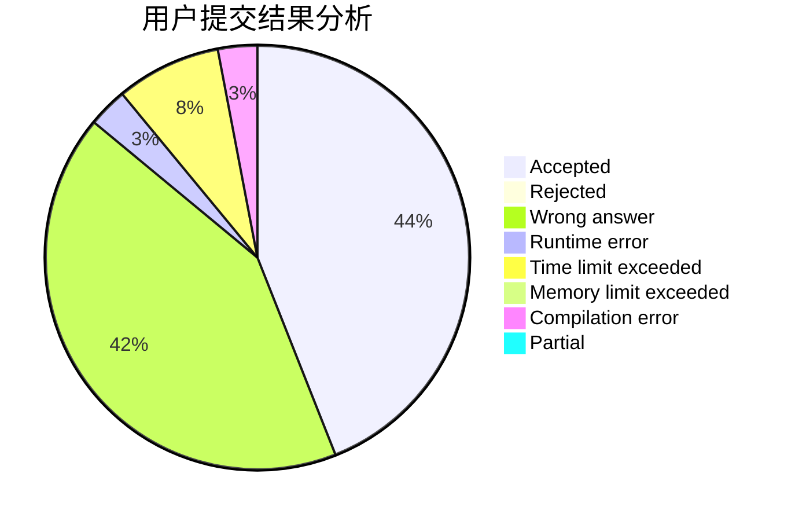
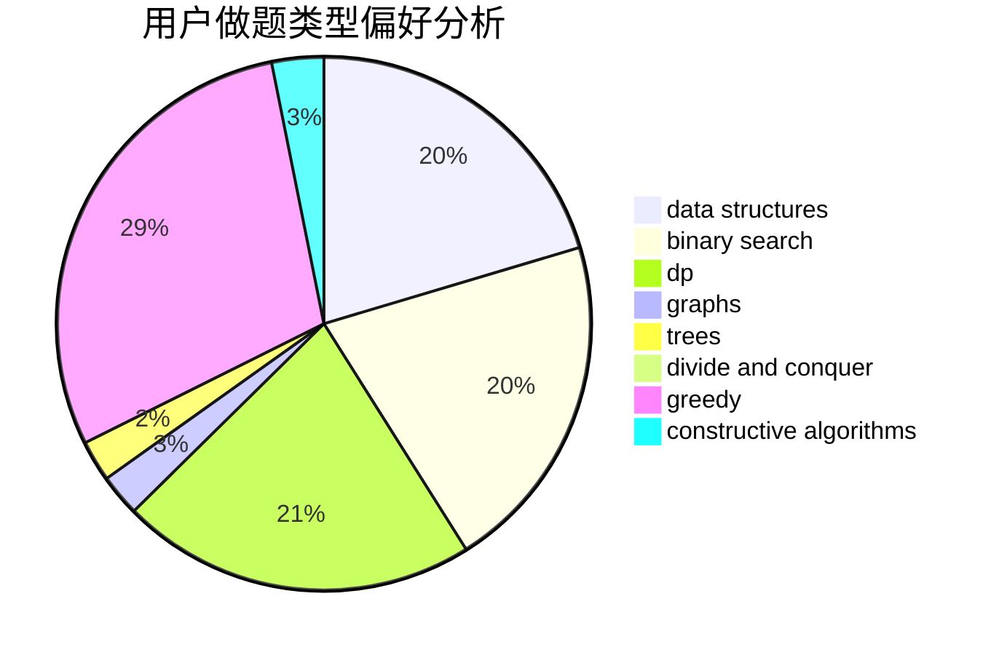
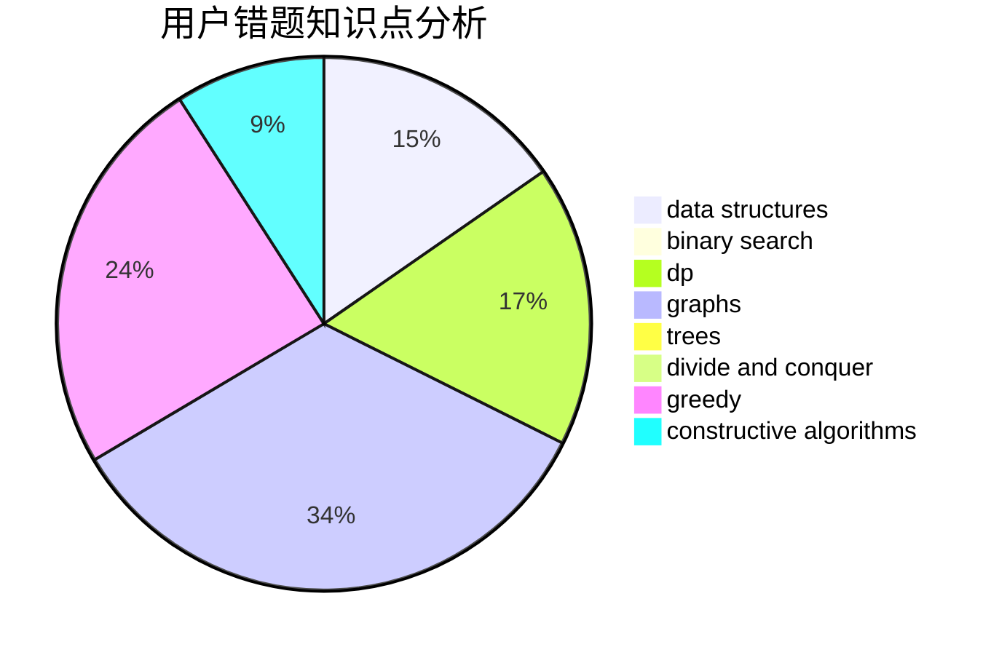

# LAMessi

<!-- tabs:start -->

#### **用户提交结果分析**

#### **用户做题类型偏好分析**

#### **用户错题知识点分析**

<!-- tabs:end -->
# 推荐题目
[618B](https://codeforces.com/contest/618/problem/B)		constructive algorithms		  
[1143F](https://codeforces.com/contest/1143/problem/F)		dsu,graphs,sortings,trees		  
[851D](https://codeforces.com/contest/851/problem/D)		dsu,graphs,sortings,trees		  
[629A](https://codeforces.com/contest/629/problem/A)		brute force,
                        combinatorics,
                        constructive algorithms,
                        implementation		  
[864C](https://codeforces.com/contest/864/problem/C)		greedy,
                        implementation,
                        math		  
[609C](https://codeforces.com/contest/609/problem/C)		implementation,
                        math		  
[545D](https://codeforces.com/contest/545/problem/D)		greedy,
                        implementation,
                        sortings		  
[799F](https://codeforces.com/contest/799/problem/F)		data structures		  
[497A](https://codeforces.com/contest/497/problem/A)		dsu,graphs,sortings,trees		  
[186C](https://codeforces.com/contest/186/problem/C)		dsu,graphs,sortings,trees		  
