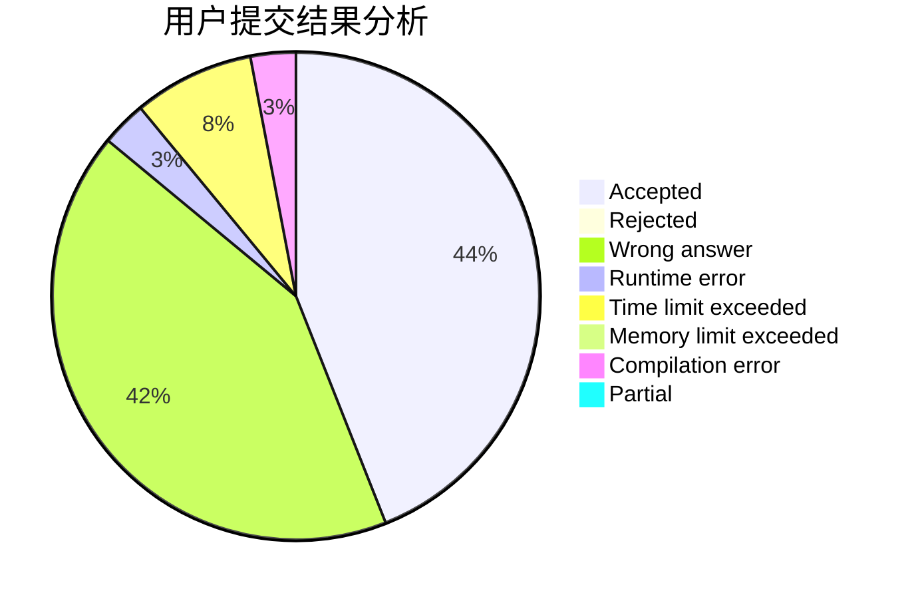
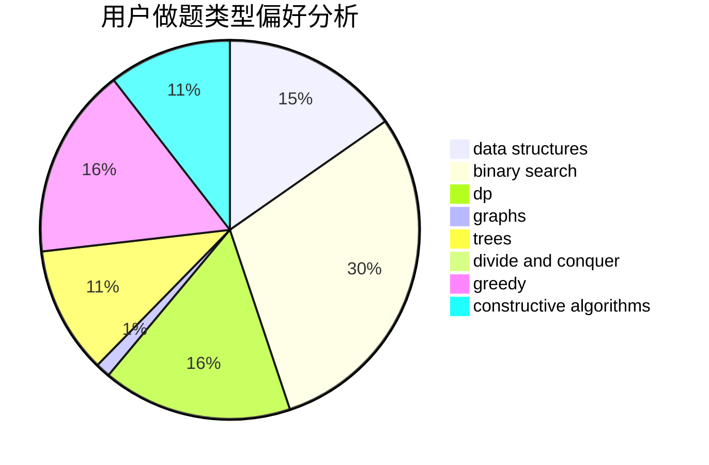
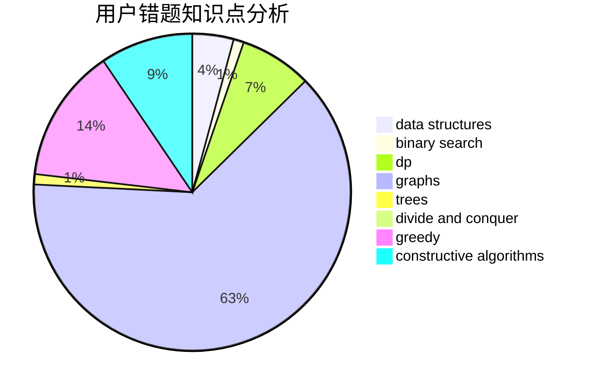

# LAMessi

<!-- tabs:start -->

#### **用户提交结果分析**

#### **用户做题类型偏好分析**

#### **用户错题知识点分析**

<!-- tabs:end -->
# 推荐题目
[638A](https://codeforces.com/contest/638/problem/A)		*special problem,
                        constructive algorithms,
                        math		  
[1146A](https://codeforces.com/contest/1146/problem/A)		implementation,
                        strings		  
[870A](https://codeforces.com/contest/870/problem/A)		brute force,
                        implementation		  
[659A](https://codeforces.com/contest/659/problem/A)		implementation,
                        math		  
[883M](https://codeforces.com/contest/883/problem/M)		greedy,
                        math		  
[628C](https://codeforces.com/contest/628/problem/C)		greedy,
                        strings		  
[570A](https://codeforces.com/contest/570/problem/A)		implementation		  
[813F](https://codeforces.com/contest/813/problem/F)		data structures,
                        dsu,
                        graphs		  
[516B](https://codeforces.com/contest/516/problem/B)		dsu,graphs,sortings,trees		  
[212A](https://codeforces.com/contest/212/problem/A)		flows,
                        graphs		  
