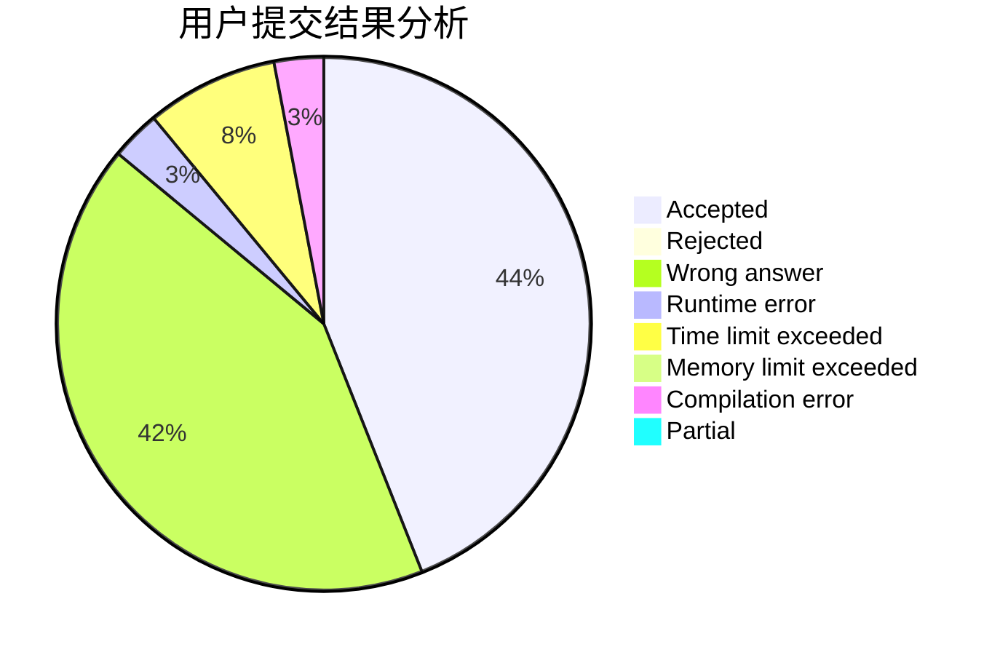
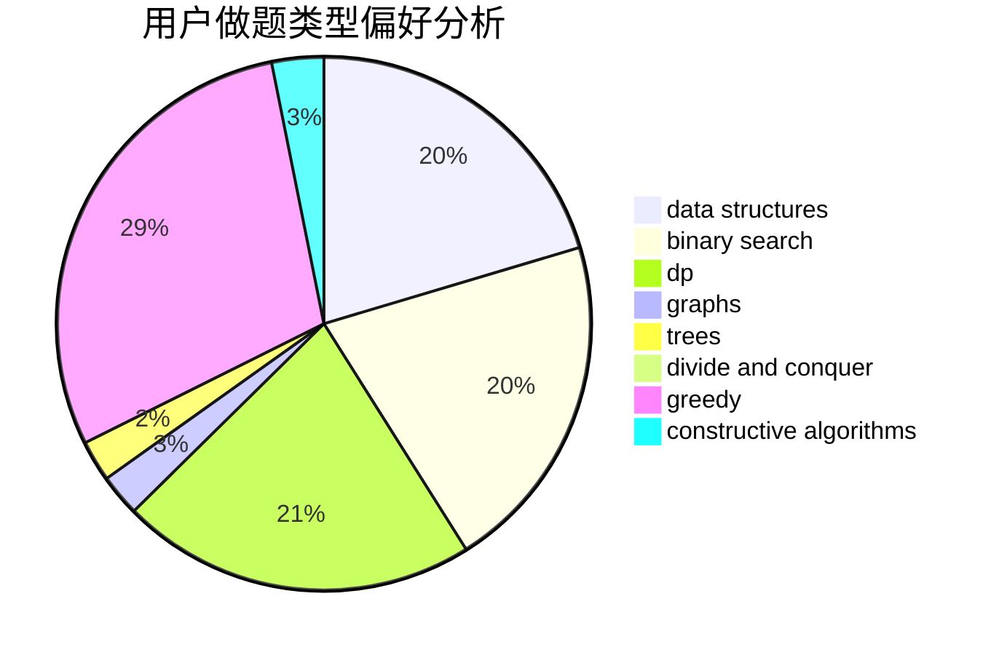
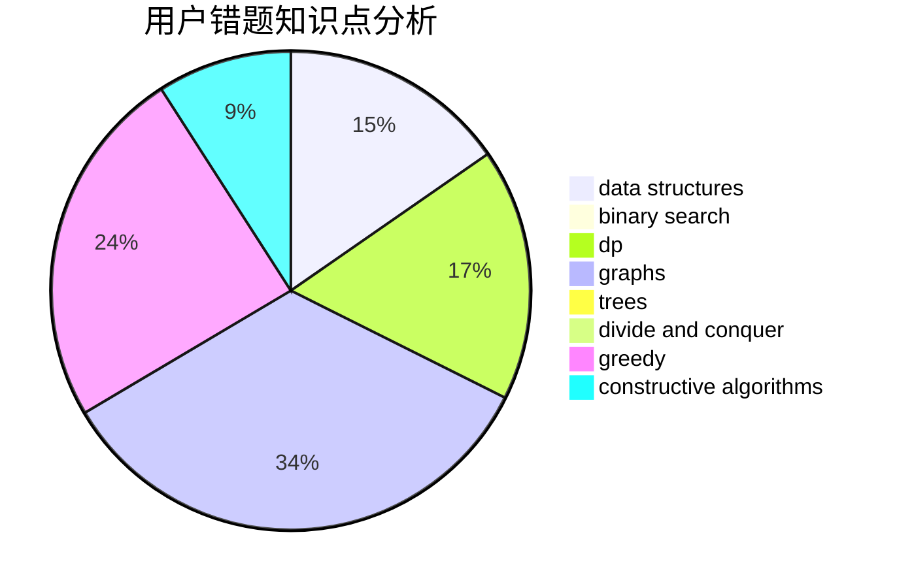

# LAMessi
<!-- tabs:start -->
#### **用户提交结果分析**

#### **用户做题类型偏好分析**

#### **用户错题知识点分析**

<!-- tabs:end -->
# 推荐题目
[Permutation Transformation](http://codeforces.com/problemset/problem/1490/D)		dfs and similar,
                        divide and conquer,
                        implementation		  
[Recover a functional graph](http://codeforces.com/problemset/problem/739/D)		graph matchings		  
[U2](https://codeforces.com/contest/1143/problem/F)		geometry		  
[Taxi](http://codeforces.com/problemset/problem/158/B)		*special problem,
                        greedy,
                        implementation		  
[Arpa and a list of numbers](https://codeforces.com/contest/851/problem/D)		implementation,
                        number theory		  
[Guess the Permutation](http://codeforces.com/problemset/problem/618/B)		constructive algorithms		  
[Queue](http://codeforces.com/problemset/problem/545/D)		greedy,
                        implementation,
                        sortings		  
[Spongebob and Squares](http://codeforces.com/problemset/problem/599/D)		brute force,
                        math		  
[Bus](http://codeforces.com/problemset/problem/864/C)		greedy,
                        implementation,
                        math		  
[A Trivial Problem](http://codeforces.com/problemset/problem/633/B)		brute force,
                        constructive algorithms,
                        math,
                        number theory		  
<!-- tabs:start -->
#### **data structures**
[Permutation Transformation](http://codeforces.com/problemset/problem/799/F)		data structures		  
[Recover a functional graph](http://codeforces.com/problemset/problem/69/E)		data structures,
                        implementation		  
[U2](http://codeforces.com/problemset/problem/1326/E)		data structures,
                        two pointers		  
[Taxi](http://codeforces.com/problemset/problem/1151/E)		combinatorics,
                        data structures,
                        dp,
                        math		  
[Arpa and a list of numbers](https://codeforces.com/contest/947/problem/C)		data structures,
                        greedy,
                        strings,
                        trees		  
[Guess the Permutation](https://codeforces.com/contest/947/problem/B)		binary search,
                        data structures		  
[Queue](http://codeforces.com/problemset/problem/1476/F)		binary search,
                        data structures,
                        dp		  
[Spongebob and Squares](http://codeforces.com/problemset/problem/519/D)		data structures,
                        dp,
                        two pointers		  
[Bus](http://codeforces.com/problemset/problem/452/E)		data structures,
                        dsu,
                        string suffix structures,
                        strings		  
[A Trivial Problem](http://codeforces.com/problemset/problem/1492/C)		binary search,
                        data structures,
                        dp,
                        greedy,
                        two pointers		  
#### **binary search**
[Permutation Transformation](https://codeforces.com/contest/1104/problem/D)		binary search,
                        constructive algorithms,
                        interactive		  
[Recover a functional graph](https://codeforces.com/contest/831/problem/D)		binary search,
                        brute force,
                        dp,
                        greedy,
                        sortings		  
[U2](https://codeforces.com/contest/947/problem/B)		binary search,
                        data structures		  
[Taxi](http://codeforces.com/problemset/problem/1476/F)		binary search,
                        data structures,
                        dp		  
[Arpa and a list of numbers](http://codeforces.com/problemset/problem/607/A)		binary search,
                        dp		  
[Guess the Permutation](http://codeforces.com/problemset/problem/1492/C)		binary search,
                        data structures,
                        dp,
                        greedy,
                        two pointers		  
[Queue](http://codeforces.com/problemset/problem/1463/D)		binary search,
                        constructive algorithms,
                        greedy,
                        two pointers		  
[Spongebob and Squares](http://codeforces.com/problemset/problem/1490/G)		binary search,
                        data structures,
                        math		  
[Bus](http://codeforces.com/problemset/problem/1479/D)		binary search,
                        bitmasks,
                        brute force,
                        data structures,
                        probabilities,
                        trees		  
[A Trivial Problem](http://codeforces.com/problemset/problem/1436/E)		binary search,
                        data structures,
                        two pointers		  
#### **dp**
[Permutation Transformation](https://codeforces.com/contest/831/problem/D)		binary search,
                        brute force,
                        dp,
                        greedy,
                        sortings		  
[Recover a functional graph](http://codeforces.com/problemset/problem/1452/E)		brute force,
                        dp,
                        greedy,
                        sortings,
                        two pointers		  
[U2](http://codeforces.com/problemset/problem/1503/E)		combinatorics,
                        dp,
                        math		  
[Taxi](https://codeforces.com/contest/1248/problem/C)		combinatorics,
                        dp,
                        math		  
[Arpa and a list of numbers](http://codeforces.com/problemset/problem/1151/E)		combinatorics,
                        data structures,
                        dp,
                        math		  
[Guess the Permutation](http://codeforces.com/problemset/problem/1395/C)		bitmasks,
                        brute force,
                        dp,
                        greedy		  
[Queue](http://codeforces.com/problemset/problem/1476/F)		binary search,
                        data structures,
                        dp		  
[Spongebob and Squares](http://codeforces.com/problemset/problem/607/A)		binary search,
                        dp		  
[Bus](http://codeforces.com/problemset/problem/519/D)		data structures,
                        dp,
                        two pointers		  
[A Trivial Problem](http://codeforces.com/problemset/problem/1492/C)		binary search,
                        data structures,
                        dp,
                        greedy,
                        two pointers		  
#### **graph**
[Permutation Transformation](http://codeforces.com/problemset/problem/739/D)		graph matchings		  
[Recover a functional graph](http://codeforces.com/problemset/problem/1487/C)		brute force,
                        constructive algorithms,
                        dfs and similar,
                        graphs,
                        greedy,
                        implementation,
                        math		  
[U2](http://codeforces.com/problemset/problem/1437/C)		dp,
                        flows,
                        graph matchings,
                        greedy,
                        math,
                        sortings		  
[Taxi](http://codeforces.com/problemset/problem/1470/D)		constructive algorithms,
                        dfs and similar,
                        graph matchings,
                        graphs,
                        greedy		  
[Arpa and a list of numbers](http://codeforces.com/problemset/problem/1476/C)		dp,
                        graphs,
                        greedy		  
[Guess the Permutation](http://codeforces.com/problemset/problem/1304/D)		constructive algorithms,
                        graphs,
                        greedy,
                        two pointers		  
[Queue](http://codeforces.com/problemset/problem/1475/C)		combinatorics,
                        graphs,
                        math		  
[Spongebob and Squares](http://codeforces.com/problemset/problem/553/E)		dp,
                        fft,
                        graphs,
                        math,
                        probabilities		  
[Bus](http://codeforces.com/problemset/problem/1495/C)		constructive algorithms,
                        graphs		  
[A Trivial Problem](http://codeforces.com/problemset/problem/1510/K)		brute force,
                        graphs,
                        implementation		  
#### **trees**
[Permutation Transformation](https://codeforces.com/contest/890/problem/C)		dsu,
                        greedy,
                        implementation,
                        trees		  
[Recover a functional graph](http://codeforces.com/problemset/problem/1188/A1)		trees		  
[U2](https://codeforces.com/contest/947/problem/C)		data structures,
                        greedy,
                        strings,
                        trees		  
[Taxi](http://codeforces.com/problemset/problem/1479/D)		binary search,
                        bitmasks,
                        brute force,
                        data structures,
                        probabilities,
                        trees		  
[Arpa and a list of numbers](http://codeforces.com/problemset/problem/1511/C)		brute force,
                        data structures,
                        implementation,
                        trees		  
[Guess the Permutation](http://codeforces.com/problemset/problem/1499/F)		combinatorics,
                        dfs and similar,
                        dp,
                        trees		  
[Queue](http://codeforces.com/problemset/problem/1491/E)		brute force,
                        dfs and similar,
                        divide and conquer,
                        number theory,
                        trees		  
[Spongebob and Squares](http://codeforces.com/problemset/problem/1466/D)		data structures,
                        greedy,
                        sortings,
                        trees		  
[Bus](http://codeforces.com/problemset/problem/1495/D)		combinatorics,
                        dfs and similar,
                        graphs,
                        math,
                        shortest paths,
                        trees		  
[A Trivial Problem](http://codeforces.com/problemset/problem/1303/G)		data structures,
                        divide and conquer,
                        geometry,
                        trees		  
#### **divide and conquer**
[Permutation Transformation](http://codeforces.com/problemset/problem/1490/D)		dfs and similar,
                        divide and conquer,
                        implementation		  
[Recover a functional graph](http://codeforces.com/problemset/problem/1167/B)		brute force,
                        divide and conquer,
                        interactive,
                        math		  
[U2](http://codeforces.com/problemset/problem/1461/D)		binary search,
                        brute force,
                        data structures,
                        divide and conquer,
                        implementation,
                        sortings		  
[Taxi](http://codeforces.com/problemset/problem/1466/G)		combinatorics,
                        divide and conquer,
                        hashing,
                        math,
                        string suffix structures,
                        strings		  
[Arpa and a list of numbers](http://codeforces.com/problemset/problem/1490/D)		dfs and similar,
                        divide and conquer,
                        implementation		  
[Guess the Permutation](https://codeforces.com/contest/1483/problem/C)		data structures,
                        divide and conquer,
                        dp		  
[Queue](http://codeforces.com/problemset/problem/1491/E)		brute force,
                        dfs and similar,
                        divide and conquer,
                        number theory,
                        trees		  
[Spongebob and Squares](http://codeforces.com/problemset/problem/1303/G)		data structures,
                        divide and conquer,
                        geometry,
                        trees		  
[Bus](http://codeforces.com/problemset/problem/1494/D)		constructive algorithms,
                        data structures,
                        dfs and similar,
                        divide and conquer,
                        dsu,
                        greedy,
                        sortings,
                        trees		  
[A Trivial Problem](http://codeforces.com/problemset/problem/1482/E)		data structures,
                        divide and conquer,
                        dp		  
#### **greedy**
[Permutation Transformation](http://codeforces.com/problemset/problem/158/B)		*special problem,
                        greedy,
                        implementation		  
[Recover a functional graph](http://codeforces.com/problemset/problem/545/D)		greedy,
                        implementation,
                        sortings		  
[U2](http://codeforces.com/problemset/problem/864/C)		greedy,
                        implementation,
                        math		  
[Taxi](http://codeforces.com/problemset/problem/723/C)		greedy		  
[Arpa and a list of numbers](https://codeforces.com/contest/831/problem/D)		binary search,
                        brute force,
                        dp,
                        greedy,
                        sortings		  
[Guess the Permutation](http://codeforces.com/problemset/problem/1025/B)		brute force,
                        greedy,
                        number theory		  
[Queue](http://codeforces.com/problemset/problem/1474/E)		constructive algorithms,
                        greedy		  
[Spongebob and Squares](http://codeforces.com/problemset/problem/1042/C)		constructive algorithms,
                        greedy,
                        math		  
[Bus](https://codeforces.com/contest/890/problem/C)		dsu,
                        greedy,
                        implementation,
                        trees		  
[A Trivial Problem](http://codeforces.com/problemset/problem/716/B)		greedy,
                        two pointers		  
#### **constructive algorithms**
[Permutation Transformation](http://codeforces.com/problemset/problem/618/B)		constructive algorithms		  
[Recover a functional graph](http://codeforces.com/problemset/problem/633/B)		brute force,
                        constructive algorithms,
                        math,
                        number theory		  
[U2](https://codeforces.com/contest/497/problem/A)		brute force,
                        constructive algorithms,
                        implementation		  
[Taxi](http://codeforces.com/problemset/problem/629/A)		brute force,
                        combinatorics,
                        constructive algorithms,
                        implementation		  
[Arpa and a list of numbers](http://codeforces.com/problemset/problem/746/C)		constructive algorithms,
                        implementation,
                        math		  
[Guess the Permutation](https://codeforces.com/contest/1104/problem/D)		binary search,
                        constructive algorithms,
                        interactive		  
[Queue](http://codeforces.com/problemset/problem/912/B)		bitmasks,
                        constructive algorithms,
                        number theory		  
[Spongebob and Squares](http://codeforces.com/problemset/problem/1474/E)		constructive algorithms,
                        greedy		  
[Bus](http://codeforces.com/problemset/problem/1042/C)		constructive algorithms,
                        greedy,
                        math		  
[A Trivial Problem](http://codeforces.com/problemset/problem/1089/E)		constructive algorithms		  
#### **sortings**
[Permutation Transformation](http://codeforces.com/problemset/problem/545/D)		greedy,
                        implementation,
                        sortings		  
[Recover a functional graph](https://codeforces.com/contest/831/problem/D)		binary search,
                        brute force,
                        dp,
                        greedy,
                        sortings		  
[U2](http://codeforces.com/problemset/problem/723/A)		implementation,
                        math,
                        sortings		  
[Taxi](http://codeforces.com/problemset/problem/1452/E)		brute force,
                        dp,
                        greedy,
                        sortings,
                        two pointers		  
[Arpa and a list of numbers](http://codeforces.com/problemset/problem/1397/B)		brute force,
                        math,
                        number theory,
                        sortings		  
[Guess the Permutation](https://codeforces.com/contest/1496/problem/C)		geometry,
                        greedy,
                        math,
                        sortings		  
[Queue](http://codeforces.com/problemset/problem/1495/A)		geometry,
                        greedy,
                        math,
                        sortings		  
[Spongebob and Squares](http://codeforces.com/problemset/problem/1497/A)		brute force,
                        data structures,
                        greedy,
                        sortings		  
[Bus](http://codeforces.com/problemset/problem/1427/A)		math,
                        sortings		  
[A Trivial Problem](http://codeforces.com/problemset/problem/1461/D)		binary search,
                        brute force,
                        data structures,
                        divide and conquer,
                        implementation,
                        sortings		  
<!-- tabs:end -->
