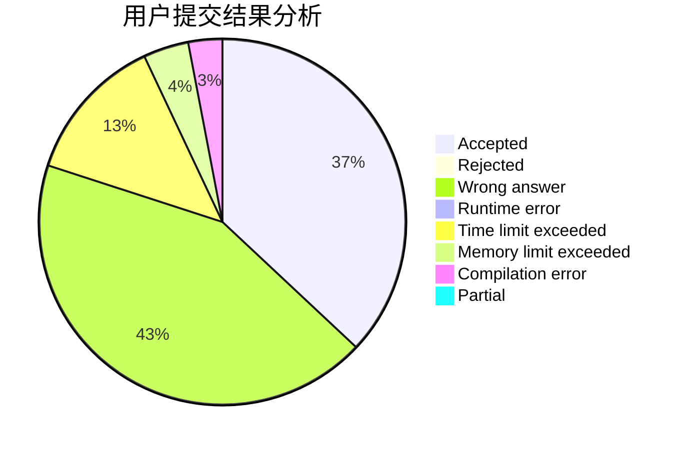
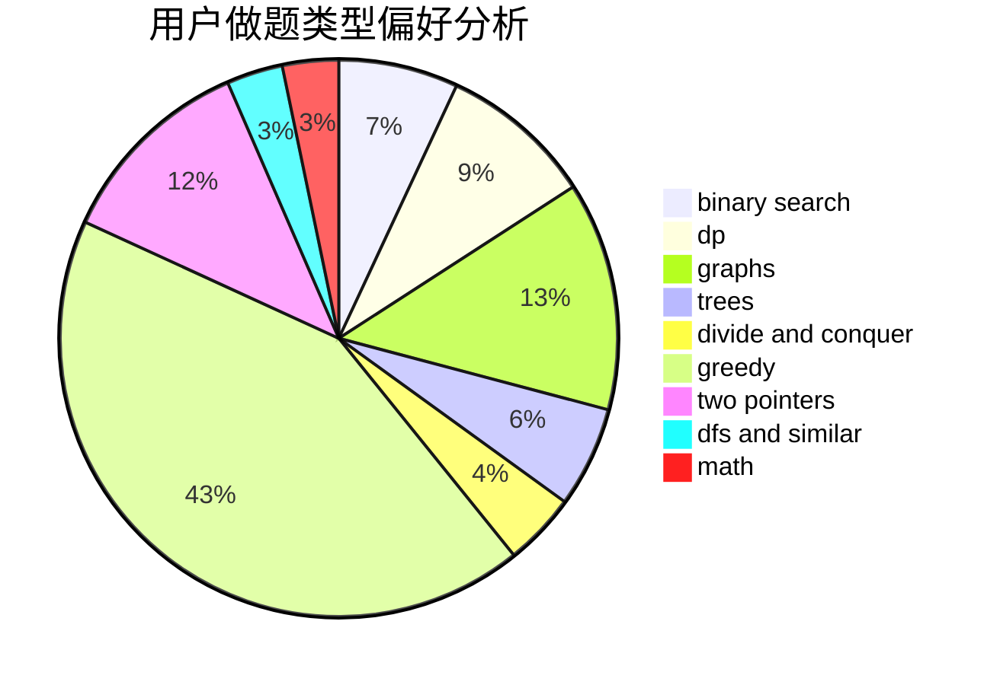

# LBR_

<!-- tabs:start -->

#### **用户提交结果分析**

#### **用户做题类型偏好分析**

<!-- tabs:end -->
# 推荐题目
[1455E](https://codeforces.com/contest/1455/problem/E)
[1228D](https://codeforces.com/contest/1228/problem/D)
[382E](https://codeforces.com/contest/382/problem/E)
[277D](https://codeforces.com/contest/277/problem/D)
[1213F](https://codeforces.com/contest/1213/problem/F)
[827D](https://codeforces.com/contest/827/problem/D)
[940A](https://codeforces.com/contest/940/problem/A)
[1243E](https://codeforces.com/contest/1243/problem/E)
[447A](https://codeforces.com/contest/447/problem/A)
[12622](https://codeforces.com/contest/1262/problem/2)
