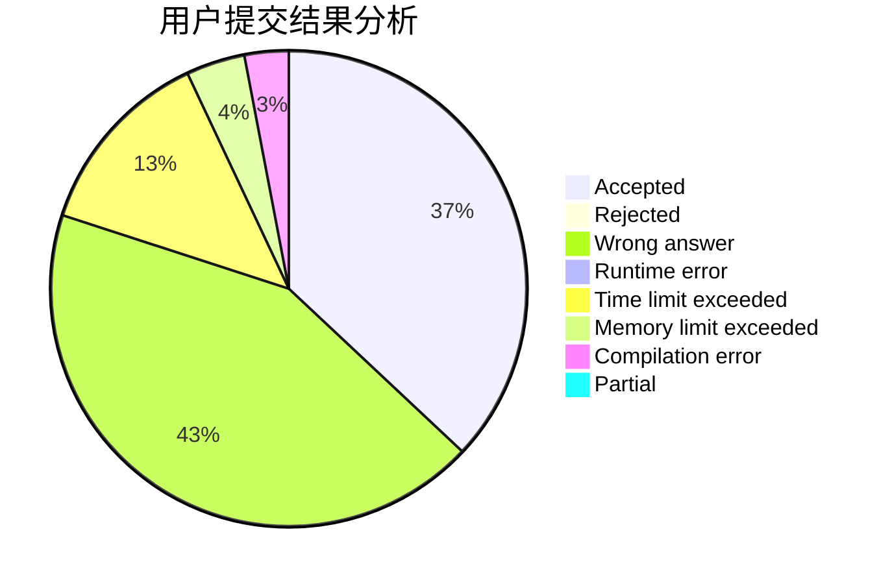
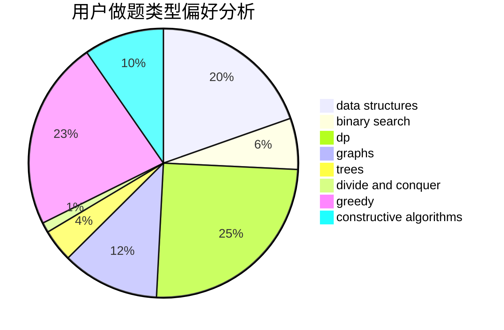
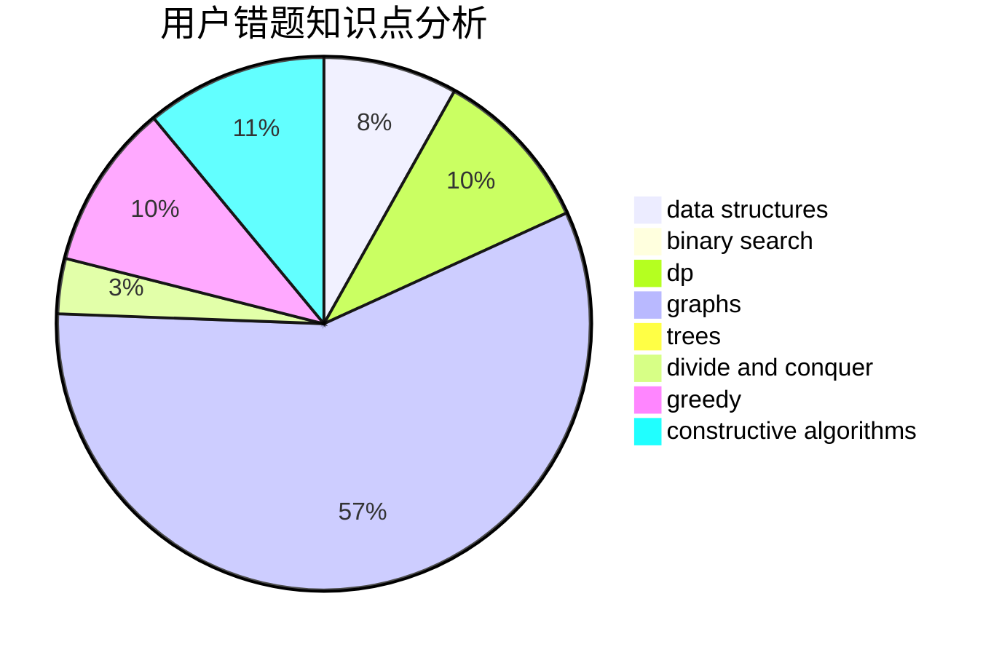

# LBR_

<!-- tabs:start -->

#### **用户提交结果分析**

#### **用户做题类型偏好分析**

#### **用户错题知识点分析**

<!-- tabs:end -->
# 推荐题目
[1446C](https://codeforces.com/contest/1446/problem/C)		binary search,
                        bitmasks,
                        data structures,
                        divide and conquer,
                        dp,
                        trees		  
[1220D](https://codeforces.com/contest/1220/problem/D)		bitmasks,
                        math,
                        number theory		  
[356D](https://codeforces.com/contest/356/problem/D)		bitmasks,
                        constructive algorithms,
                        dp,
                        greedy		  
[25D](https://codeforces.com/contest/25/problem/D)		dsu,
                        graphs,
                        trees		  
[1208B](https://codeforces.com/contest/1208/problem/B)		binary search,
                        brute force,
                        implementation,
                        two pointers		  
[809E](https://codeforces.com/contest/809/problem/E)		divide and conquer,
                        math,
                        number theory,
                        trees		  
[920A](https://codeforces.com/contest/920/problem/A)		implementation		  
[1238E](https://codeforces.com/contest/1238/problem/E)		bitmasks,
                        dp		  
[424B](https://codeforces.com/contest/424/problem/B)		binary search,
                        greedy,
                        implementation,
                        sortings		  
[1254E](https://codeforces.com/contest/1254/problem/E)		combinatorics,
                        dfs and similar,
                        dsu,
                        trees		  
