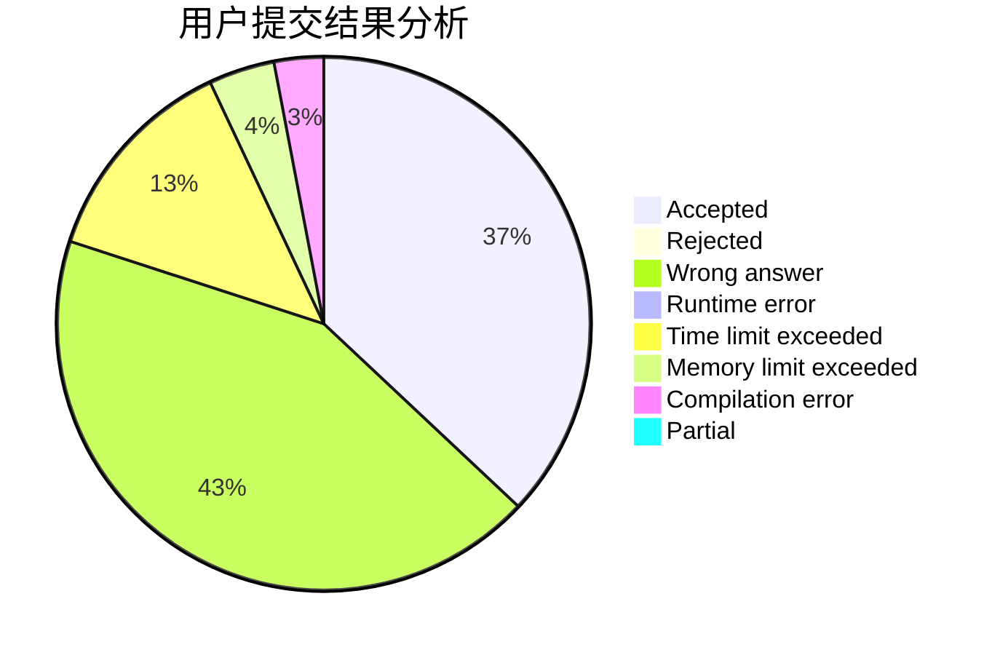
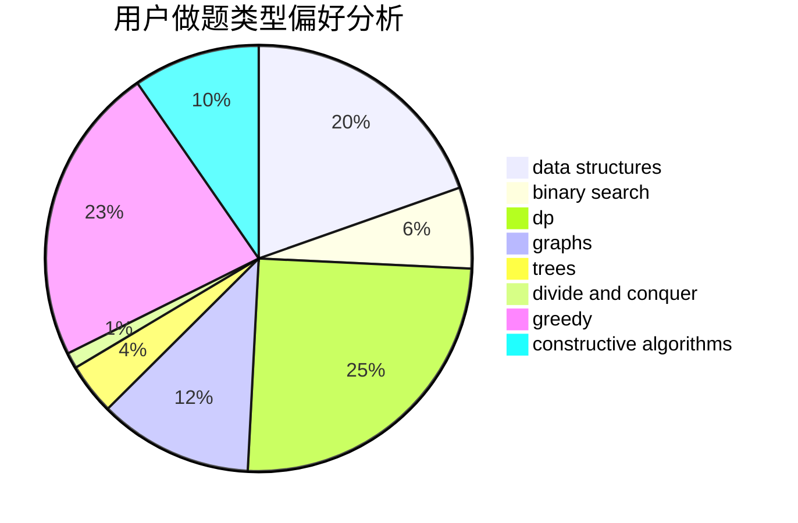
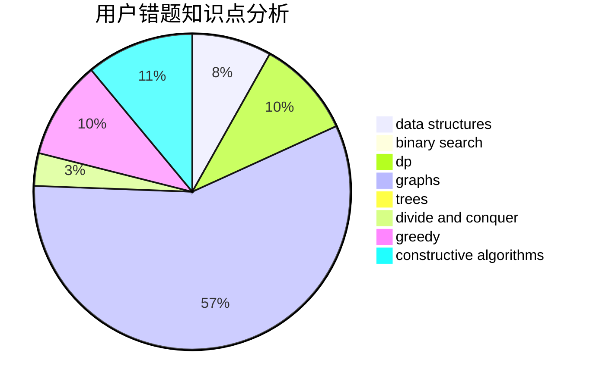

# LBR_
<!-- tabs:start -->
#### **用户提交结果分析**

#### **用户做题类型偏好分析**

#### **用户错题知识点分析**

<!-- tabs:end -->
# 推荐题目
[Omkar and Bed Wars](http://codeforces.com/problemset/problem/1392/D)		dp,
                        greedy		  
[Domino piling](http://codeforces.com/problemset/problem/50/A)		greedy,
                        math		  
[Omkar and Infinity Clock](http://codeforces.com/problemset/problem/1392/B)		implementation,
                        math		  
[Surprise me!](http://codeforces.com/problemset/problem/809/E)		divide and conquer,
                        math,
                        number theory,
                        trees		  
[Bags and Coins](http://codeforces.com/problemset/problem/356/D)		bitmasks,
                        constructive algorithms,
                        dp,
                        greedy		  
[Alex and Julian](http://codeforces.com/problemset/problem/1220/D)		bitmasks,
                        math,
                        number theory		  
[Uniqueness](http://codeforces.com/problemset/problem/1208/B)		binary search,
                        brute force,
                        implementation,
                        two pointers		  
[Keyboard Purchase](http://codeforces.com/problemset/problem/1238/E)		bitmasks,
                        dp		  
[Roads not only in Berland](http://codeforces.com/problemset/problem/25/D)		dsu,
                        graphs,
                        trees		  
[Water The Garden](http://codeforces.com/problemset/problem/920/A)		implementation		  
<!-- tabs:start -->
#### **data structures**
[Omkar and Bed Wars](http://codeforces.com/problemset/problem/56/E)		binary search,
                        data structures,
                        sortings		  
[Domino piling](http://codeforces.com/problemset/problem/1458/D)		data structures,
                        graphs,
                        greedy		  
[Omkar and Infinity Clock](http://codeforces.com/problemset/problem/786/B)		data structures,
                        graphs,
                        shortest paths		  
[Surprise me!](http://codeforces.com/problemset/problem/1446/C)		binary search,
                        bitmasks,
                        data structures,
                        divide and conquer,
                        dp,
                        trees		  
[Bags and Coins](http://codeforces.com/problemset/problem/1386/C)		*special problem,
                        bitmasks,
                        data structures,
                        divide and conquer,
                        dsu		  
[Alex and Julian](http://codeforces.com/problemset/problem/1481/E)		data structures,
                        dp,
                        greedy		  
[Uniqueness](http://codeforces.com/problemset/problem/1492/C)		binary search,
                        data structures,
                        dp,
                        greedy,
                        two pointers		  
[Keyboard Purchase](http://codeforces.com/problemset/problem/1490/G)		binary search,
                        data structures,
                        math		  
[Roads not only in Berland](http://codeforces.com/problemset/problem/1479/D)		binary search,
                        bitmasks,
                        brute force,
                        data structures,
                        probabilities,
                        trees		  
[Water The Garden](http://codeforces.com/problemset/problem/1497/A)		brute force,
                        data structures,
                        greedy,
                        sortings		  
#### **binary search**
[Omkar and Bed Wars](http://codeforces.com/problemset/problem/1208/B)		binary search,
                        brute force,
                        implementation,
                        two pointers		  
[Domino piling](http://codeforces.com/problemset/problem/424/B)		binary search,
                        greedy,
                        implementation,
                        sortings		  
[Omkar and Infinity Clock](http://codeforces.com/problemset/problem/56/E)		binary search,
                        data structures,
                        sortings		  
[Surprise me!](https://codeforces.com/contest/1261/problem/C)		binary search,
                        graphs,
                        graphs,
                        shortest paths		  
[Bags and Coins](http://codeforces.com/problemset/problem/1100/E)		binary search,
                        dfs and similar,
                        graphs		  
[Alex and Julian](http://codeforces.com/problemset/problem/1479/A)		binary search,
                        interactive,
                        ternary search		  
[Uniqueness](http://codeforces.com/problemset/problem/1476/B)		binary search,
                        brute force,
                        greedy,
                        math		  
[Keyboard Purchase](https://codeforces.com/contest/1424/problem/J)		binary search,
                        math,
                        number theory,
                        two pointers		  
[Roads not only in Berland](http://codeforces.com/problemset/problem/1446/C)		binary search,
                        bitmasks,
                        data structures,
                        divide and conquer,
                        dp,
                        trees		  
[Water The Garden](http://codeforces.com/problemset/problem/1492/C)		binary search,
                        data structures,
                        dp,
                        greedy,
                        two pointers		  
#### **dp**
[Omkar and Bed Wars](http://codeforces.com/problemset/problem/1392/D)		dp,
                        greedy		  
[Domino piling](http://codeforces.com/problemset/problem/356/D)		bitmasks,
                        constructive algorithms,
                        dp,
                        greedy		  
[Omkar and Infinity Clock](http://codeforces.com/problemset/problem/1238/E)		bitmasks,
                        dp		  
[Surprise me!](http://codeforces.com/problemset/problem/10/B)		dp,
                        implementation		  
[Bags and Coins](http://codeforces.com/problemset/problem/1430/F)		dp,
                        greedy		  
[Alex and Julian](http://codeforces.com/problemset/problem/212/C)		combinatorics,
                        dp,
                        math		  
[Uniqueness](http://codeforces.com/problemset/problem/592/D)		dfs and similar,
                        dp,
                        graphs,
                        trees		  
[Keyboard Purchase](http://codeforces.com/problemset/problem/1120/D)		dfs and similar,
                        dp,
                        dsu,
                        graphs,
                        greedy,
                        trees		  
[Roads not only in Berland](http://codeforces.com/problemset/problem/1446/C)		binary search,
                        bitmasks,
                        data structures,
                        divide and conquer,
                        dp,
                        trees		  
[Water The Garden](http://codeforces.com/problemset/problem/1481/E)		data structures,
                        dp,
                        greedy		  
#### **graph**
[Omkar and Bed Wars](http://codeforces.com/problemset/problem/25/D)		dsu,
                        graphs,
                        trees		  
[Domino piling](https://codeforces.com/contest/1261/problem/C)		binary search,
                        graphs,
                        graphs,
                        shortest paths		  
[Omkar and Infinity Clock](https://codeforces.com/contest/1071/problem/D)		brute force,
                        graphs,
                        math		  
[Surprise me!](http://codeforces.com/problemset/problem/1100/E)		binary search,
                        dfs and similar,
                        graphs		  
[Bags and Coins](http://codeforces.com/problemset/problem/592/D)		dfs and similar,
                        dp,
                        graphs,
                        trees		  
[Alex and Julian](http://codeforces.com/problemset/problem/1020/B)		brute force,
                        dfs and similar,
                        graphs		  
[Uniqueness](http://codeforces.com/problemset/problem/1458/D)		data structures,
                        graphs,
                        greedy		  
[Keyboard Purchase](http://codeforces.com/problemset/problem/786/B)		data structures,
                        graphs,
                        shortest paths		  
[Roads not only in Berland](http://codeforces.com/problemset/problem/1327/B)		brute force,
                        graphs,
                        greedy		  
[Water The Garden](http://codeforces.com/problemset/problem/1120/D)		dfs and similar,
                        dp,
                        dsu,
                        graphs,
                        greedy,
                        trees		  
#### **trees**
[Omkar and Bed Wars](http://codeforces.com/problemset/problem/809/E)		divide and conquer,
                        math,
                        number theory,
                        trees		  
[Domino piling](http://codeforces.com/problemset/problem/25/D)		dsu,
                        graphs,
                        trees		  
[Omkar and Infinity Clock](http://codeforces.com/problemset/problem/1254/E)		combinatorics,
                        dfs and similar,
                        dsu,
                        trees		  
[Surprise me!](http://codeforces.com/problemset/problem/592/D)		dfs and similar,
                        dp,
                        graphs,
                        trees		  
[Bags and Coins](http://codeforces.com/problemset/problem/1120/D)		dfs and similar,
                        dp,
                        dsu,
                        graphs,
                        greedy,
                        trees		  
[Alex and Julian](http://codeforces.com/problemset/problem/1446/C)		binary search,
                        bitmasks,
                        data structures,
                        divide and conquer,
                        dp,
                        trees		  
[Uniqueness](http://codeforces.com/problemset/problem/1387/B1)		*special problem,
                        dp,
                        greedy,
                        trees		  
[Keyboard Purchase](http://codeforces.com/problemset/problem/1479/D)		binary search,
                        bitmasks,
                        brute force,
                        data structures,
                        probabilities,
                        trees		  
[Roads not only in Berland](http://codeforces.com/problemset/problem/1511/C)		brute force,
                        data structures,
                        implementation,
                        trees		  
[Water The Garden](http://codeforces.com/problemset/problem/1499/F)		combinatorics,
                        dfs and similar,
                        dp,
                        trees		  
#### **divide and conquer**
[Omkar and Bed Wars](http://codeforces.com/problemset/problem/809/E)		divide and conquer,
                        math,
                        number theory,
                        trees		  
[Domino piling](http://codeforces.com/problemset/problem/1446/C)		binary search,
                        bitmasks,
                        data structures,
                        divide and conquer,
                        dp,
                        trees		  
[Omkar and Infinity Clock](http://codeforces.com/problemset/problem/1386/C)		*special problem,
                        bitmasks,
                        data structures,
                        divide and conquer,
                        dsu		  
[Surprise me!](http://codeforces.com/problemset/problem/1461/D)		binary search,
                        brute force,
                        data structures,
                        divide and conquer,
                        implementation,
                        sortings		  
[Bags and Coins](http://codeforces.com/problemset/problem/1466/G)		combinatorics,
                        divide and conquer,
                        hashing,
                        math,
                        string suffix structures,
                        strings		  
[Alex and Julian](http://codeforces.com/problemset/problem/1490/D)		dfs and similar,
                        divide and conquer,
                        implementation		  
[Uniqueness](https://codeforces.com/contest/1483/problem/C)		data structures,
                        divide and conquer,
                        dp		  
[Keyboard Purchase](http://codeforces.com/problemset/problem/1491/E)		brute force,
                        dfs and similar,
                        divide and conquer,
                        number theory,
                        trees		  
[Roads not only in Berland](http://codeforces.com/problemset/problem/1303/G)		data structures,
                        divide and conquer,
                        geometry,
                        trees		  
[Water The Garden](http://codeforces.com/problemset/problem/1494/D)		constructive algorithms,
                        data structures,
                        dfs and similar,
                        divide and conquer,
                        dsu,
                        greedy,
                        sortings,
                        trees		  
#### **greedy**
[Omkar and Bed Wars](http://codeforces.com/problemset/problem/1392/D)		dp,
                        greedy		  
[Domino piling](http://codeforces.com/problemset/problem/50/A)		greedy,
                        math		  
[Omkar and Infinity Clock](http://codeforces.com/problemset/problem/356/D)		bitmasks,
                        constructive algorithms,
                        dp,
                        greedy		  
[Surprise me!](http://codeforces.com/problemset/problem/424/B)		binary search,
                        greedy,
                        implementation,
                        sortings		  
[Bags and Coins](http://codeforces.com/problemset/problem/1430/F)		dp,
                        greedy		  
[Alex and Julian](http://codeforces.com/problemset/problem/1388/B)		greedy,
                        math		  
[Uniqueness](http://codeforces.com/problemset/problem/1458/D)		data structures,
                        graphs,
                        greedy		  
[Keyboard Purchase](http://codeforces.com/problemset/problem/1327/B)		brute force,
                        graphs,
                        greedy		  
[Roads not only in Berland](http://codeforces.com/problemset/problem/1120/D)		dfs and similar,
                        dp,
                        dsu,
                        graphs,
                        greedy,
                        trees		  
[Water The Garden](http://codeforces.com/problemset/problem/1476/B)		binary search,
                        brute force,
                        greedy,
                        math		  
#### **constructive algorithms**
[Omkar and Bed Wars](http://codeforces.com/problemset/problem/356/D)		bitmasks,
                        constructive algorithms,
                        dp,
                        greedy		  
[Domino piling](http://codeforces.com/problemset/problem/1088/D)		bitmasks,
                        constructive algorithms,
                        implementation,
                        interactive		  
[Omkar and Infinity Clock](http://codeforces.com/problemset/problem/1446/E)		constructive algorithms,
                        dfs and similar		  
[Surprise me!](https://codeforces.com/contest/907/problem/D)		brute force,
                        constructive algorithms,
                        math		  
[Bags and Coins](https://codeforces.com/contest/1480/problem/E)		bitmasks,
                        constructive algorithms		  
[Alex and Julian](http://codeforces.com/problemset/problem/831/C)		brute force,
                        constructive algorithms		  
[Uniqueness](http://codeforces.com/problemset/problem/1493/A)		constructive algorithms,
                        greedy		  
[Keyboard Purchase](http://codeforces.com/problemset/problem/1463/D)		binary search,
                        constructive algorithms,
                        greedy,
                        two pointers		  
[Roads not only in Berland](https://codeforces.com/contest/1456/problem/B)		bitmasks,
                        brute force,
                        constructive algorithms		  
[Water The Garden](http://codeforces.com/problemset/problem/1492/D)		bitmasks,
                        constructive algorithms,
                        greedy,
                        math		  
#### **sortings**
[Omkar and Bed Wars](http://codeforces.com/problemset/problem/424/B)		binary search,
                        greedy,
                        implementation,
                        sortings		  
[Domino piling](http://codeforces.com/problemset/problem/1269/B)		brute force,
                        sortings		  
[Omkar and Infinity Clock](http://codeforces.com/problemset/problem/56/E)		binary search,
                        data structures,
                        sortings		  
[Surprise me!](https://codeforces.com/contest/1496/problem/C)		geometry,
                        greedy,
                        math,
                        sortings		  
[Bags and Coins](http://codeforces.com/problemset/problem/1495/A)		geometry,
                        greedy,
                        math,
                        sortings		  
[Alex and Julian](http://codeforces.com/problemset/problem/1497/A)		brute force,
                        data structures,
                        greedy,
                        sortings		  
[Uniqueness](http://codeforces.com/problemset/problem/1427/A)		math,
                        sortings		  
[Keyboard Purchase](http://codeforces.com/problemset/problem/1461/D)		binary search,
                        brute force,
                        data structures,
                        divide and conquer,
                        implementation,
                        sortings		  
[Roads not only in Berland](http://codeforces.com/problemset/problem/1437/C)		dp,
                        flows,
                        graph matchings,
                        greedy,
                        math,
                        sortings		  
[Water The Garden](http://codeforces.com/problemset/problem/1473/A)		greedy,
                        implementation,
                        math,
                        sortings		  
<!-- tabs:end -->
