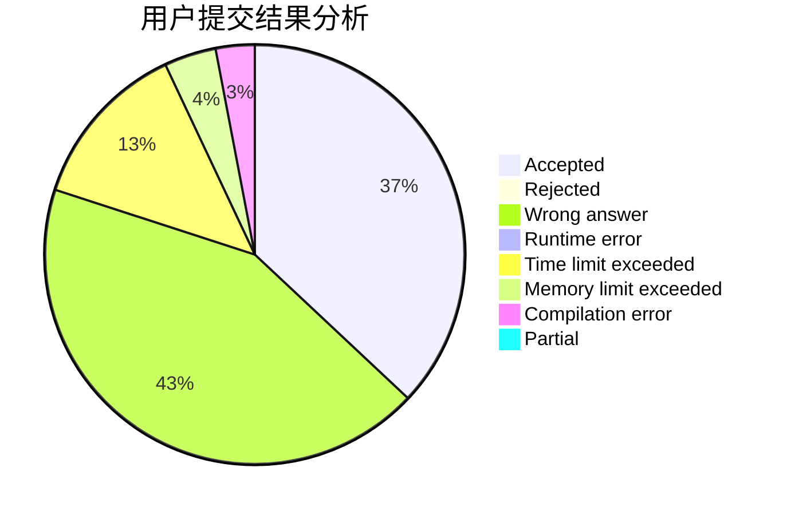
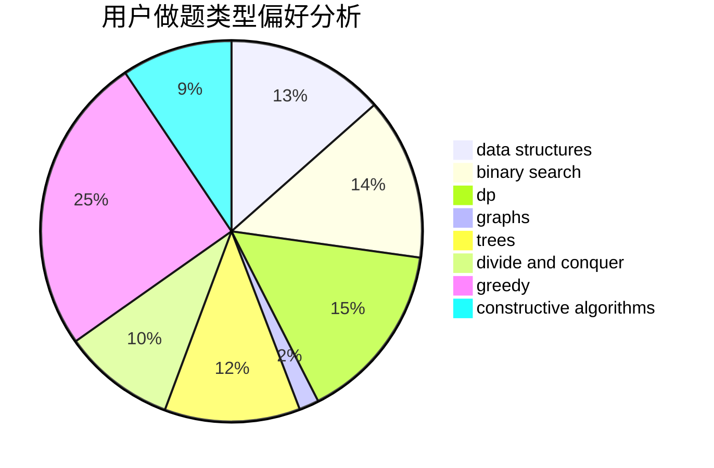
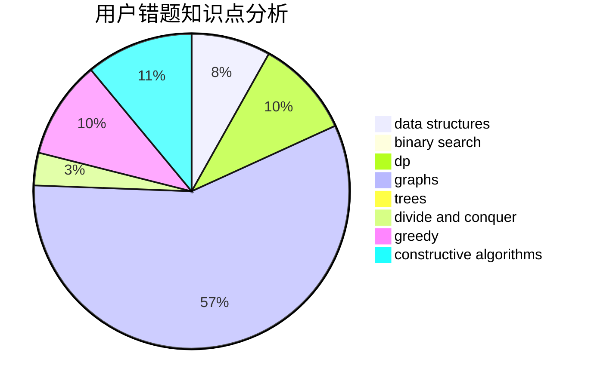

# LBR_

<!-- tabs:start -->

#### **用户提交结果分析**

#### **用户做题类型偏好分析**

#### **用户错题知识点分析**

<!-- tabs:end -->
# 推荐题目
[1455E](https://codeforces.com/contest/1455/problem/E)		brute force,
                        constructive algorithms,
                        flows,
                        geometry,
                        greedy,
                        implementation,
                        math,
                        ternary search		  
[1228D](https://codeforces.com/contest/1228/problem/D)		brute force,
                        constructive algorithms,
                        graphs,
                        hashing,
                        implementation		  
[382E](https://codeforces.com/contest/382/problem/E)		combinatorics,
                        dp		  
[277D](https://codeforces.com/contest/277/problem/D)		dp,
                        probabilities		  
[1213F](https://codeforces.com/contest/1213/problem/F)		data structures,
                        dfs and similar,
                        dsu,
                        graphs,
                        greedy,
                        implementation,
                        strings		  
[827D](https://codeforces.com/contest/827/problem/D)		data structures,
                        dfs and similar,
                        graphs,
                        trees		  
[940A](https://codeforces.com/contest/940/problem/A)		brute force,
                        greedy,
                        sortings		  
[1243E](https://codeforces.com/contest/1243/problem/E)		dsu,graphs,sortings,trees		  
[447A](https://codeforces.com/contest/447/problem/A)		implementation		  
[12622](https://codeforces.com/contest/1262/problem/2)		dsu,graphs,sortings,trees		  
