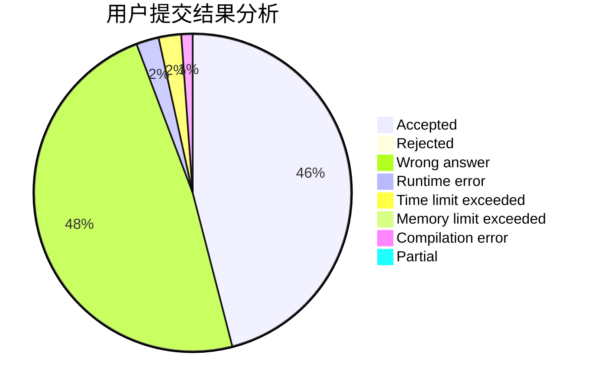
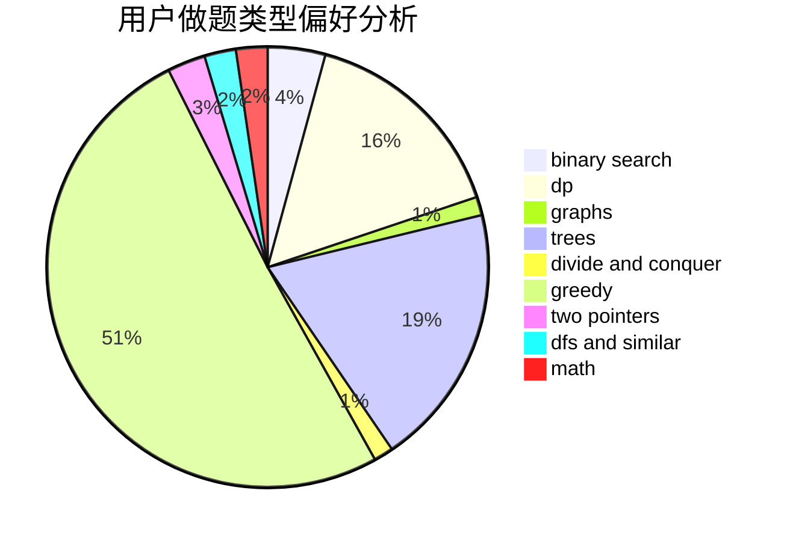

# LHQing

<!-- tabs:start -->

#### **用户提交结果分析**

#### **用户做题类型偏好分析**

<!-- tabs:end -->
# 推荐题目
[603E](https://codeforces.com/contest/603/problem/E)
[45G](https://codeforces.com/contest/45/problem/G)
[763D](https://codeforces.com/contest/763/problem/D)
[860B](https://codeforces.com/contest/860/problem/B)
[581B](https://codeforces.com/contest/581/problem/B)
[672A](https://codeforces.com/contest/672/problem/A)
[1175D](https://codeforces.com/contest/1175/problem/D)
[414C](https://codeforces.com/contest/414/problem/C)
[1369F](https://codeforces.com/contest/1369/problem/F)
[10151](https://codeforces.com/contest/1015/problem/1)
