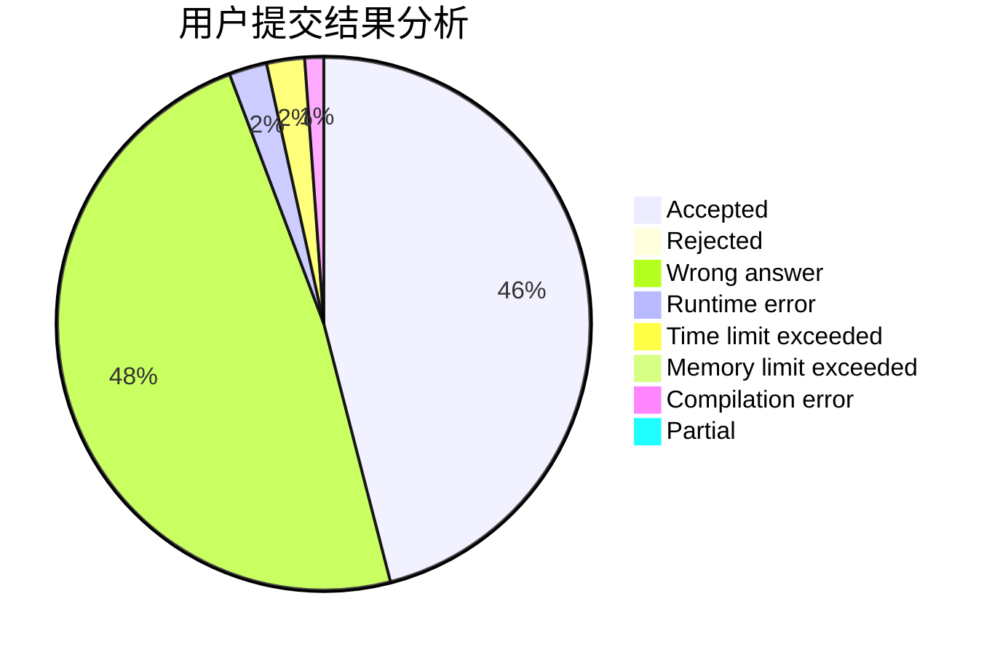
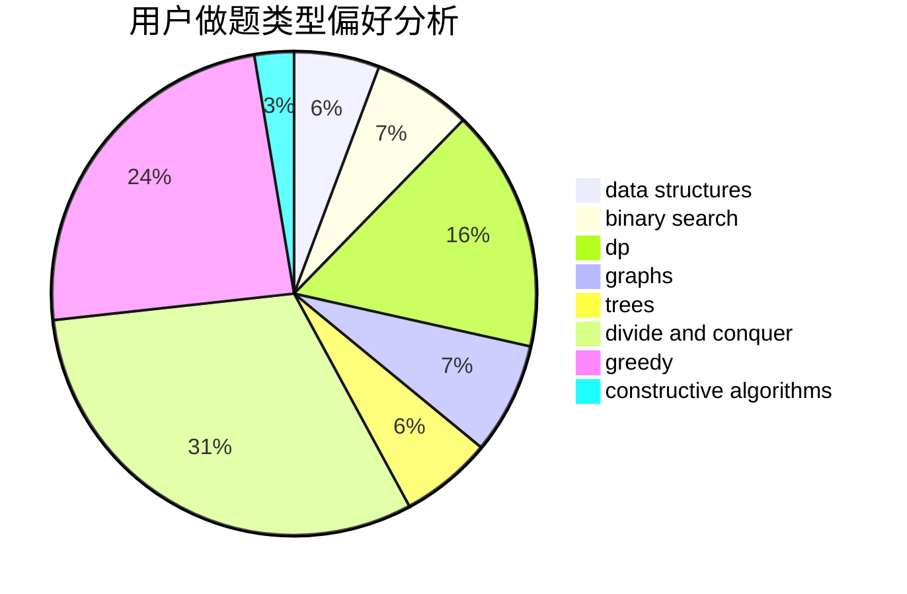
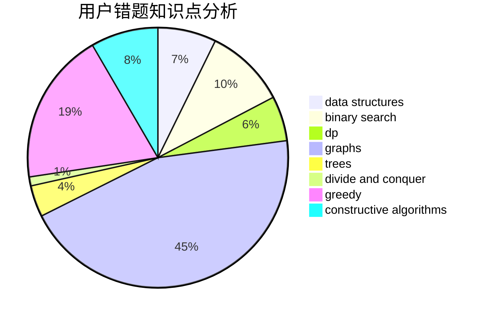

# LHQing

<!-- tabs:start -->

#### **用户提交结果分析**

#### **用户做题类型偏好分析**

#### **用户错题知识点分析**

<!-- tabs:end -->
# 推荐题目
[582D](https://codeforces.com/contest/582/problem/D)		dp,
                        math,
                        number theory		  
[438B](https://codeforces.com/contest/438/problem/B)		dsu,graphs,sortings,trees		  
[743C](https://codeforces.com/contest/743/problem/C)		brute force,
                        constructive algorithms,
                        math,
                        number theory		  
[841B](https://codeforces.com/contest/841/problem/B)		games,
                        math		  
[558D](https://codeforces.com/contest/558/problem/D)		data structures,
                        implementation,
                        sortings		  
[645E](https://codeforces.com/contest/645/problem/E)		dp,
                        greedy,
                        strings		  
[1173A](https://codeforces.com/contest/1173/problem/A)		greedy		  
[383C](https://codeforces.com/contest/383/problem/C)		data structures,
                        dfs and similar,
                        trees		  
[1362A](https://codeforces.com/contest/1362/problem/A)		implementation		  
[1013C](https://codeforces.com/contest/1013/problem/C)		dsu,graphs,sortings,trees		  
