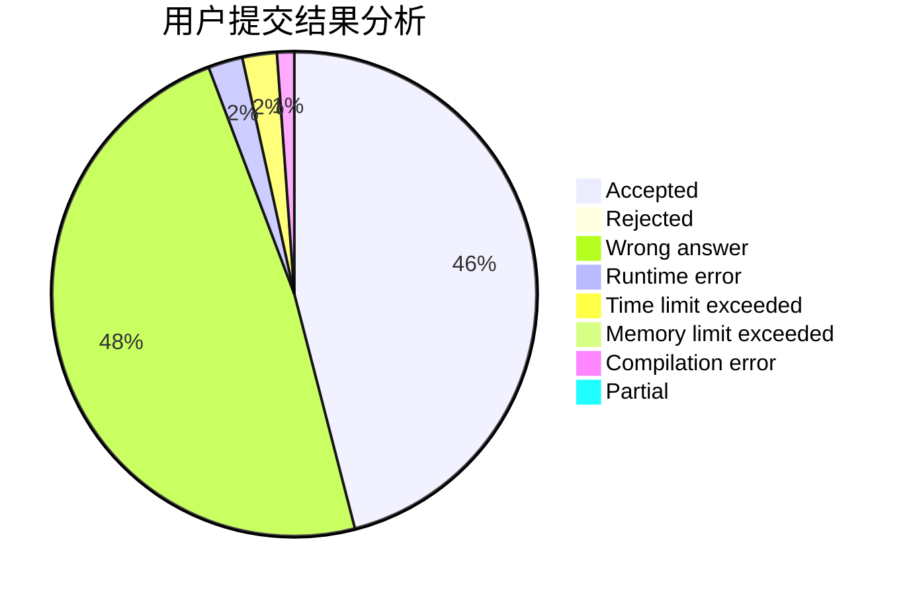
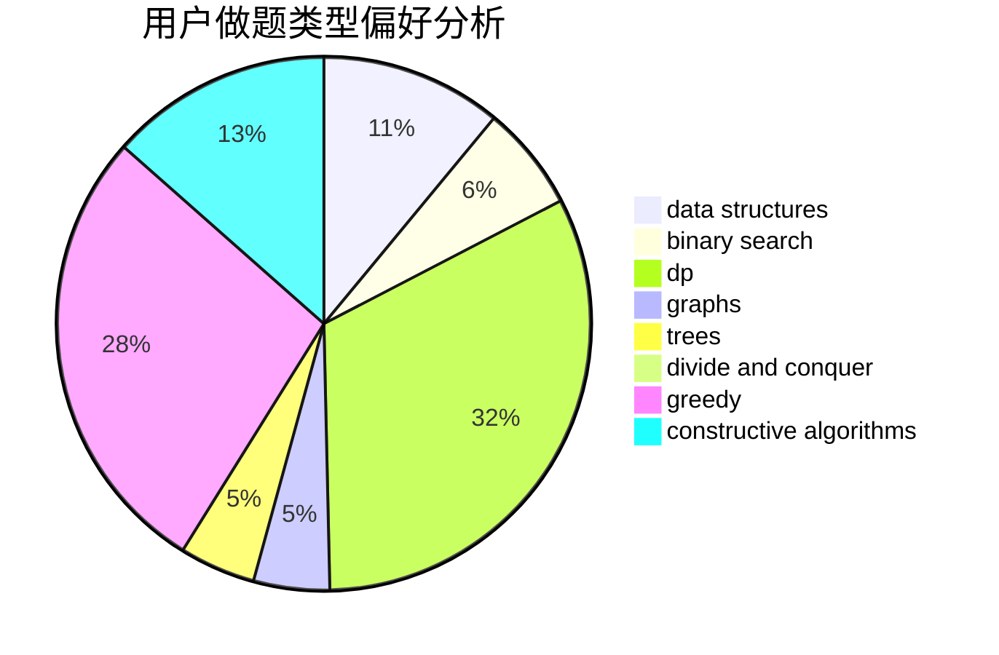
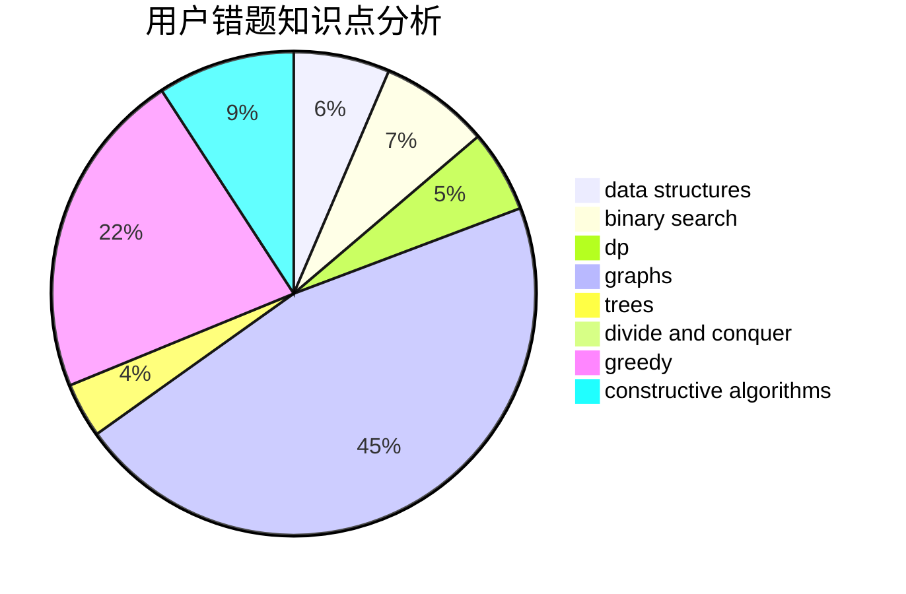

# LHQing

<!-- tabs:start -->

#### **用户提交结果分析**

#### **用户做题类型偏好分析**

#### **用户错题知识点分析**

<!-- tabs:end -->
# 推荐题目
[603E](https://codeforces.com/contest/603/problem/E)		data structures,
                        divide and conquer,
                        dsu,
                        math,
                        trees		  
[45G](https://codeforces.com/contest/45/problem/G)		number theory		  
[763D](https://codeforces.com/contest/763/problem/D)		data structures,
                        graphs,
                        hashing,
                        shortest paths,
                        trees		  
[860B](https://codeforces.com/contest/860/problem/B)		dsu,graphs,sortings,trees		  
[581B](https://codeforces.com/contest/581/problem/B)		implementation,
                        math		  
[672A](https://codeforces.com/contest/672/problem/A)		implementation		  
[1175D](https://codeforces.com/contest/1175/problem/D)		greedy,
                        sortings		  
[414C](https://codeforces.com/contest/414/problem/C)		combinatorics,
                        divide and conquer		  
[1369F](https://codeforces.com/contest/1369/problem/F)		dfs and similar,
                        dp,
                        games		  
[10151](https://codeforces.com/contest/1015/problem/1)		dsu,graphs,sortings,trees		  
