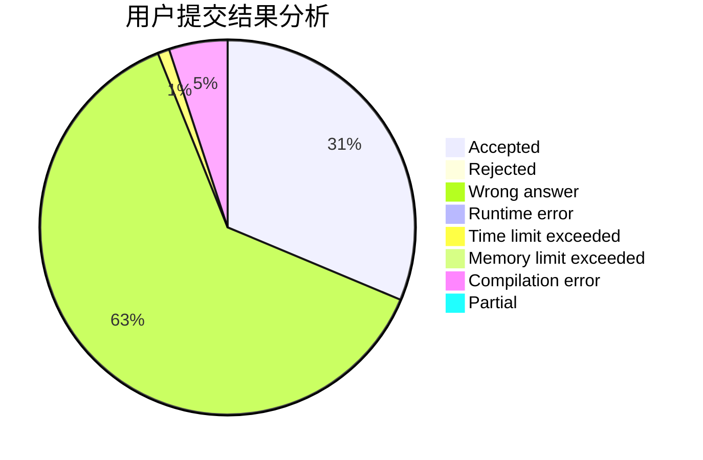
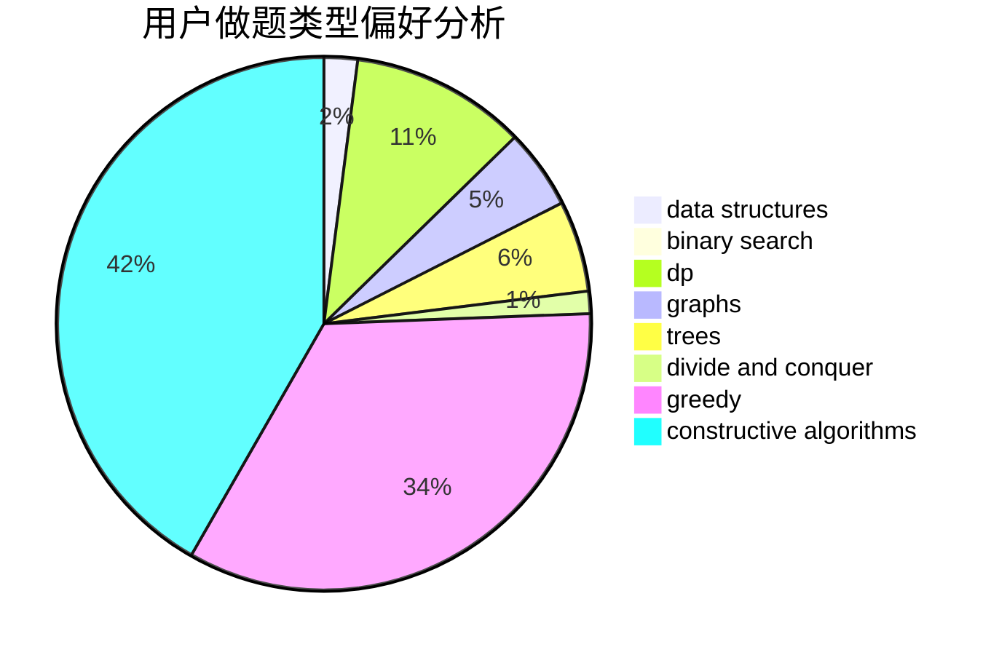
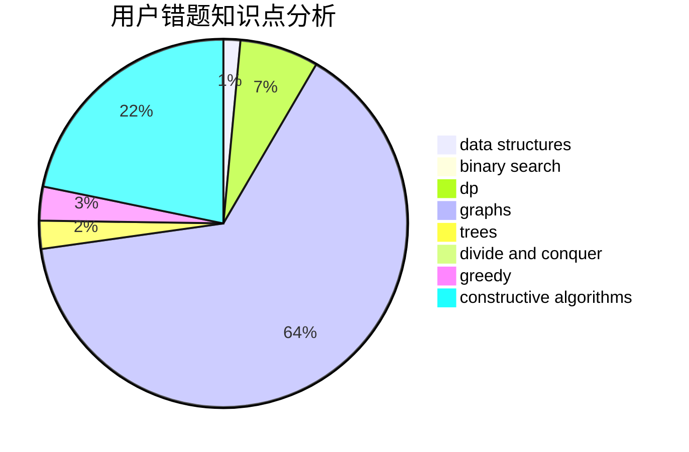

# LIKE0314

<!-- tabs:start -->

#### **用户提交结果分析**

#### **用户做题类型偏好分析**

#### **用户错题知识点分析**

<!-- tabs:end -->
# 推荐题目
[1349A](https://codeforces.com/contest/1349/problem/A)		data structures,
                        math,
                        number theory		  
[733A](https://codeforces.com/contest/733/problem/A)		implementation		  
[858A](https://codeforces.com/contest/858/problem/A)		brute force,
                        math,
                        number theory		  
[780C](https://codeforces.com/contest/780/problem/C)		dfs and similar,
                        graphs,
                        greedy,
                        trees		  
[1291B](https://codeforces.com/contest/1291/problem/B)		greedy,
                        implementation		  
[218B](https://codeforces.com/contest/218/problem/B)		implementation		  
[68A](https://codeforces.com/contest/68/problem/A)		implementation,
                        number theory		  
[300C](https://codeforces.com/contest/300/problem/C)		brute force,
                        combinatorics		  
[13783](https://codeforces.com/contest/1378/problem/3)		dsu,graphs,sortings,trees		  
[228D](https://codeforces.com/contest/228/problem/D)		data structures		  
